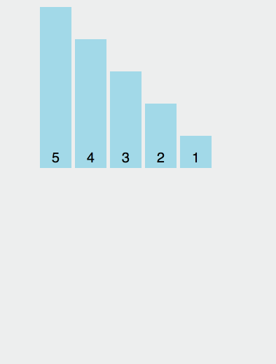

## 定义

乱序的意思就是将数组打乱

## Math.random

一个经常会遇见的写法是使用 Math.random()

```js
var values = [1, 2, 3, 4, 5]

values.sort(function () {
	return Math.random() - 0.5
})

console.log(values)
```

`Math.random() - 0.5` 随机得到一个正数，负数或是 0，如果是负数则升序排列，如果是 0 就是不变，然后不断地升序或者降序，最终得到一个乱序的数组

看起来是个不错的方案，实际上效果却不尽如人意。 写个 demo 测试下:

```js
var times = [0, 0, 0, 0, 0]

for (var i = 0; i < 100000; i++) {
	let arr = [1, 2, 3, 4, 5]

	arr.sort(() => Math.random() - 0.5)

	times[arr[4] - 1]++
}

console.log(times)
```

测试原理是将`[1,2,3,4,5]`乱序 10 万次，计算乱序后的数组最后一个元素是 1、2、3、4、5 的次数分别是多少

一次随机的结果为:

```
[30636, 30906, 20456, 11743, 6259]
```

该结果表示 10 万次中，数组乱序后的最后一个元素 1 的情况共有 30636 次，是 2 的情况是 30906 次，其他以此类推。

会发现最后一个元素为 5 的次数远远低于 1 的次数，所以这个方案是有问题的。

## 插入排序

如果要追究这个问题所在，就必须了解 sort 函数的原理，然而 ECMAScript 只规定了效果，没有规定实现的方式，所以不同浏览器的实现方式还不一样

为了解决这个问题，以 v8 为例，v8 在处理 sort 方法时，当目标数组长度小于 10 时，使用插入排序。反之，使用快速排序和出入排序的混合排序。

:::warning
大佬的这篇文章是 2017 年的，2023 了，源码地址不对了。但是不耽误阅读
:::

以`[1,2,3]`这个数组进行分析，数组长度为 3，此时采用的是插入排序

插入排序的源码：

```js
function InsertionSort(a, from, to) {
	for (var i = from + 1; i < to; i++) {
		var element = a[i]
		for (var j = i - 1; j >= from; j--) {
			var tmp = a[j]
			var order = compareFn(tmp, element)
			if (order > 0) {
				a[j + 1] = tmp
			} else {
				break
			}
		}

		a[j + 1] = element
	}
}
```

其原理在于将第一个元素视为有序序列，遍历数组，将之后的元素依次插入这个构建的有序序列中



## 具体分析

明白了插入排序的原理，来具体分析下`[1,2,3]`这个数组乱序的结果

演示代码为:

```js
var values = [1, 2, 3]

values.sort(function () {
	return Math.random() - 0.5
})
```

注意此时 sort 函数底层时使用插入排序实现，InsertionSort 函数的 from 的值为 0，to 的值为 3

分析过程:

因为插入排序视第一个元素为有序的，所以数组外层排序从`i=1`开始，`a[i]`值为 2，此时内层循环遍历，比较`compare(1,2)`, 因为`Math.random() - 0.5`的结果有 50%的概率小于 0，有 50%的概率大于 0，所以有 50%的概率数组编程`[2,1,3]`，50%的结果不变，数组依然为`[1,2,3]`

假设依然是`[1,2,3]`，再次进行分析，接着遍历， `i=2`, `a[i]`的值为 3，此时内层循环遍历，比较`compare(2,3)`:

有 50%的概率数组不变，依然是`[1,2,3]`，然后遍历结束

有 50%的概率变成`[1,3,2]`,因为还没有找到 3 正确的位置，所以还会进行遍历，所以在这 50%的概率又会进行一次比较，`compare(1,3)`， 有 50%的概率不变，数组为`[1,3,2]`，此时遍历结束，有 50%的概率发生变化，数组变成`[3,1,2]`

综上，在`[1,2,3]`中，有 50%的概率会变成`[1,2,3]`,有 25%的概率变成`[1,3,2]`,有 25%的概率会变成`[3,1,2]`

另外一种情况`[2,1,3]`与值分析类似，将最终的结果汇总成一个表格:

<table style='text-align:center'><thead><tr><th>数组</th><th>i = 1</th><th>i = 2</th><th>总计</th></tr></thead><tbody><tr><td rowspan="6">[1,2,3]<br><br><br></td><td rowspan="3">50% [1, 2, 3]</td><td>50% [1, 2, 3]</td><td>25% [1, 2, 3]</td></tr><tr><td>25% [1, 3, 2]</td><td>12.5% [1, 3, 2]</td></tr><tr><td>25% [3, 1, 2]</td><td>12.5% [3, 1, 2]</td></tr><tr><td rowspan="3">50% [2, 1, 3]</td><td>50% [2, 1, 3]</td><td>25% [2, 1, 3]</td></tr><tr><td>25% [2, 3, 1]</td><td>12.5% [2, 3, 1]</td></tr><tr><td>25% [3, 2, 1]</td><td>12.5% [3, 2, 1]</td></tr></tbody></table>

为了验证这个推算是否准确，写个 demo 测试下

```js
var times = 100000
var res = {}

for (var i = 0; i < times; i++) {
	var arr = [1, 2, 3]
	arr.sort(() => Math.random() - 0.5)

	var key = JSON.stringify(arr)
	res[key] ? res[key]++ : (res[key] = 1)
}

// 为了方便展示，转换成百分比
for (var key in res) {
	res[key] = (res[key] / times) * 100 + "%"
}

console.log(res)
```

这是一次随机的结果:


会发现乱序后，3 还在原位置([1,2,3]和[2,1,3])的概率有接近 50%

所以根本的原因在于插入排序的算法中，当待排序元素跟有序元素进行比较时，一旦确定了位置就不会再跟位置前面的有序元素进行比较，所以乱序就不彻底

如果要实现真正的乱序，就要提到经典的 Fisher-Yates 算法

## Fisher-Yates

这个算法是由 Ronald Fisher 和 Frank Yates 首次提出的,所以叫 Fisher-Yates 算法

看下 JavaScript 的实现

```js
function shuffle(a) {
	var j, x, i
	for (i = a.length; i; i--) {
		j = Math.floor(Math.random() * i)
		x = a[i - 1]
		a[i - 1] = a[j]
		a[j] = x
	}

	return a
}
```

原理很简单，就是遍历数组元素，然后将当前元素与以后随机位置的元素进行交换，从代码中也可以看出，这样乱序的就会更加彻底

如果利用 ES6，代码还可以简化成

```js
function shuffle(a) {
	for (let i = a.length; i; i--) {
		let j = Math.floor(Math.random() * i)
		;[a[i - 1], a[j]] = [a[j], a[i - 1]]
	}
	return a
}
```

再写个 demo 测试一下:

```js
var times = 100000
var res = {}

for (var i = 0; i < times; i++) {
	var arr = shuffle([1, 2, 3])

	var key = JSON.stringify(arr)
	res[key] ? res[key]++ : (res[key] = 1)
}

// 为了方便展示，转换成百分比
for (var key in res) {
	res[key] = (res[key] / times) * 100 + "%"
}

console.log(res)
```

这一次的随机结果:


可以看到几率大概相同，真正的实现了乱序的效果
