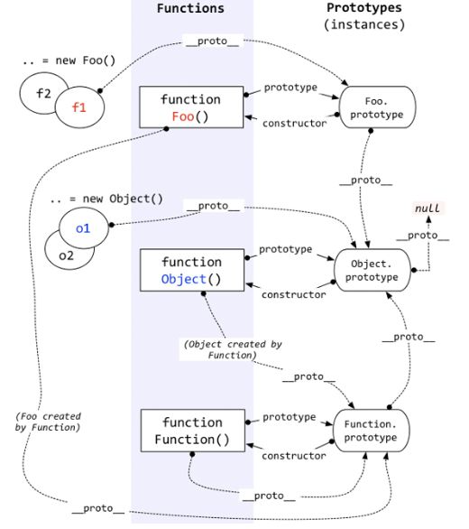

## 四个概念

1. js 分为函数对象和普通对象,这两个对象都有\_\_proto\_\_属性。 只有函数(函数对象)才有 prototype 属性。
2. Object、Function 都是 js 的内置函数,也就是包装类型,类似的还有 Array,String,RegExp,Date,Boolean,Number
3. 属性\_\_proto\_\_是一个对象，有两个属性, constructor 和 \_\_proto\_\_
4. 原型对象 prototype 有一个默认的属性 constructor, 用来记录实例是由哪个构造函数创建



## 两个准则

```js
function Person(name, age) {
	this.name = name
	this.age = age
}

Person.prototype.motherland = "China"

let person01 = new Person("小明", 18)
```

1. `Person.prototype.constructor == Person`
   原型对象(即 Person.prototype)的 constructor 指向构造函数本身

2. `person01.__proto__ == Person.prototype`
   实例(即 person01)的\_\_proto\_\_和原型对象指向同一个地方

```js
// 从上方 function Foo() 开始分析这一张经典之图

function Foo()
let f1 = new Foo();
let f2 = new Foo();

f1.__proto__ = Foo.prototype; // 准则2
f2.__proto__ = Foo.prototype; // 准则2
Foo.prototype.__proto__ = Object.prototype; // 准则2
Object.prototype.__proto__ = null; // 原型链到此结束, 据说是为了防止死循环
Foo.prototype.constructor = Foo; // 准则1
Foo.__proto__ = Function.prototype; // 准则2
Function.prototype.__proto__ = Object.prototype; // 准则2
Object.prototype.__proto__ = null; // 原型链到此为止


//简单总结上面就是 any.__proto__ === xxx.prototype || null

function Object()
let o1 = new Object();
let o2 = new Object();

o1.__proto__ = Object.prototype; // 准则2
o2.__proto__ = Object.prototype; // 准则2
Object.prototype.__proto__ = null; // 原型链结束
Object.prototype.constructor = Object; // 准则1

Object.__proto__ = Function.prototype // 准则2

Function.prototype.__proto__ = Object.prototype; // 准则2
Object.prototype.__proto__ = null; // 原型链结束


function Function()
Function.__proto__ = Function.prototype // 准则2
Function.prototype.constructor = Function; // 准则1

```

## 总结

1. 除了 Object.prototype.\_\_proto\_\_ = nul, 其他内置函数对象的原型对象和自定以构造函数的\_\_proto\_\_都指向 Object.prototype,因为原型对象本身也是普通对象

```js
Object.prototype.__proto__ = null
Array.prototype.__proto__ = Object.prototype
Foo.prototype.__proto__ = Object.prototype
```
