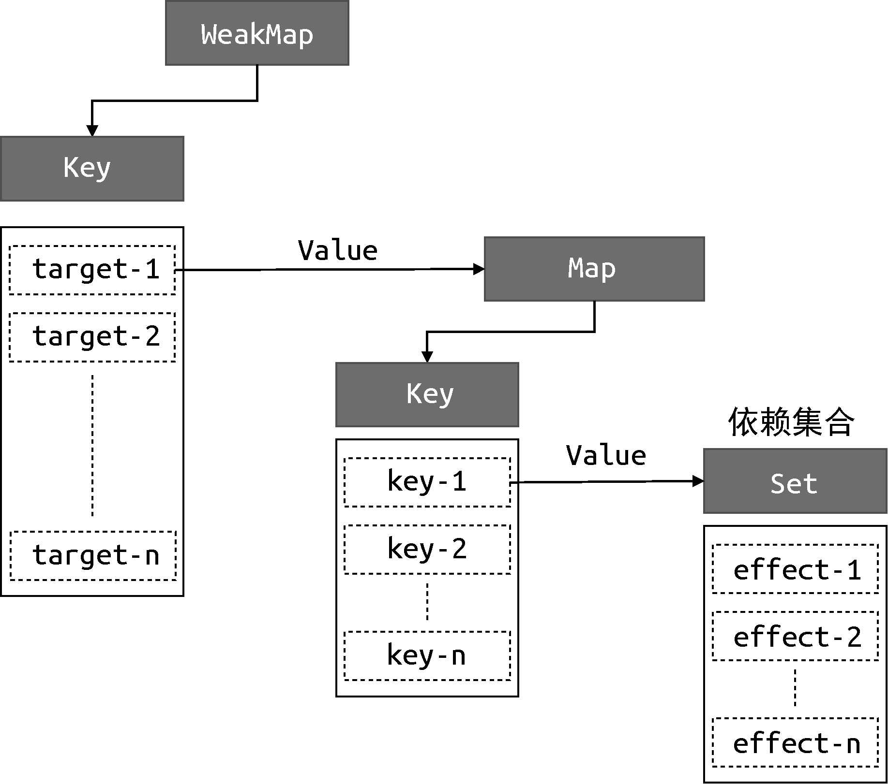

# 前言

响应式系统是 Vue.js 的重要组成部分。mini-vue 的实现要从这里开始

## 响应式数据与副作用函数

副作用函数: 顾名思义，就是会产生副作用的函数

```js
function effect() {
	document.body.innerText = "hello vue3"
}
```

具体解释下，就是 effect 函数执行的时候，会设置 body 的文本内容，但是**除了 effect 函数之外的任何函数都可以读取或者设置 body 的文本内容**。也就是说 effect 函数的执行会直接或间接的影响其他函数的执行，这时就说 effect 函数产生了副作用。 最简单的副作用就是函数内部修改了全局变量。

副作用函数的定义说完，接下来说下响应式数据，假设在一个副作用函数中读取了某个对象的属性:

```js
const obj = {
	text: "hello world"
}
function effect() {
	// effect函数的执行会读取obj.text
	document.body.innerText = obj.text
}
```

上面的代码中，effect 函数中设置了 body.innerText，其值为 obj.text,当 obj.text 的值发生的变化的时候，希望副作用函数 effect 函数会重新执行:

```js
obj.text = "hello vue3"
```

这句代码修改了字段 obj.text 的值，我们希望当值变化后，effect 函数能够自动执行，如果能够实现这个目标， 那么对象 obj 就是响应式数据。那么就需要一种能够监听对象属性变化的手段来让 effect 函数自动执行

## 响应式数据的基本实现

能够监听对象属性的变化有两种:

- vue2 种使用 Object.defineProperty 函数实现
- vue3 种使用 Proxy 实现

这里采用 Proxy 的方式实现

实现思路: 在读取对象属性时，将 effect 函数放入到一个带执行容器中，这样 effect 函数就被保存起来了，在设置这个对象的属性时，将容器中的 effect 函数取出来执行

```js
// 存储副作用函数的容器
const bucket = new Set()

// 原始数据
const data = { data: "hello world" }
// 对原始数据的代理
const proxy = new Proxy(data, {
	// 拦截读取操作
	get(target, key) {
		// 将副作用函数存入到容器中
		bucket.add(effect)
		// 返回属性值
		return target[key]
	},
	// 拦截设置操作
	set(target, key, value) {
		// 设置属性值
		target[key] = value
		// 把副作用函数从容器中取出并执行
		bucket.forEach((fn) => fn())
		// 返回true 代表设置操作成功
		return true
	}
})
```

实现步骤:

1. 创建一个用于存储副作用函数的容器 bucket，用 Set 类型，防止重复存储
2. 接着定义原始数据 data, proxy 是原始数据的代理对象，分别设置了 get 和 set 拦截函数，用于拦截设置和读取操作
3. 当拦截读取操作时，将副作用函数存入到 bucket 中
4. 当拦截设置操作时，遍历 bucket，执行副作用函数

测试代码如下

```js
// 副作用函数
function effect() {
	document.body.innerText = proxy.text
}
// 执行辅佐用函数，触发读取
effect()
// 1 秒后修改响应式数据
setTimeout(() => {
	proxy.text = "hello vue3"
}, 1000)
```

这样响应式数据的基本实现和工作原理就讲完了，但是这个实现还有很多缺陷的

1. 在 get 拦截函数中，直接通过副作用函数名称(effect)来获取副作用函数,硬编码的方式非常不灵活
2. 触发读取需要手动执行

## 完善响应式系统

### 副作用函数注册和收集

上面说到硬编码了副作用函数的的名字，现在来处理这个问题。我们希望匿名副作用函数也能够被收集到容器当中，为了实现这一点，可以提供一个用来注册副作用函数的函数。

```js
// 用一个全局变量存储被注册的副作用函数
let activeEffect

function effect(fn) {
	// 当调用 effect 注册副作用函数时，将副作用函数 fn 赋值给 activeEffect
	activeEffect = fn

	// 执行副作用函数
	fn()
}
```

看下步骤：

1. 定义一个全局变量 activeEffect，初始值是 undefined，用来存储被注册的副作用函数。留着后续收集
2. effect 函数接收一个参数 fn，即要注册副作用函数

如下方式使用 effect 函数:

```js
effect(() => {
	document.body.innerText = proxy.text
})
```

可以看到，使用了一个匿名函数作为 effect 函数的参数。当 effect 函数执行的时候， 首先会把匿名的副作用函数 fn 赋值给全局变量 activeEffect。接着执行被注册匿名副作用函数 fn，这将会触发响应式数据 proxy.text 的读取操作,进而触发代理对象的 get 拦截函数:

```js
const proxy = new Proxy(data, {
	get(target, key) {
		if (activeEffect) {
			bucket.add(activeEffect)
		}

		return target[key]
	},
	set(target, key, value) {
		target[key] = value
		bucket.forEach((fn) => fn())
		return true
	}
})
```

如上代码所示， 由于副作用函数已经存储到了 activeEffect 中， 所以 get 拦截函数函数把 activeEffect 收集到容器当中， 这样我们就解决了响应式系统依赖副作用函数名称的问题

但是上面的代码还有其他的问题，代码如下:

```js
effect(() => {
	console.log("effect run") // 会执行两次
	document.body.innerText = proxy.text
})

setTimeout(() => {
	proxy.notExist = "hello vue3"
}, 1000)
```

在我们的设想中， 匿名副作用函数内部与 proxy.text 建立了关系，期望 proxy.text 每次发生变化的时候使匿名副作用函数执行。但是目前的情况是设置了一个不存在的属性 notExist 也会导致匿名副作用函数执行。

问题出现在 get 和 set 拦截函数当中，**副作用函数的存储和执行并没有与对象的属性之间建立联系**， 所以我们的存储副作用函数的容器的数据结构也应该发生改变, 来让副作用函数与被操作的字段之间建立联系。

### 收集容器的数据结构

观察下面的代码

```js
effect(function effectFn() {
	document.body.innerText = proxy.text
})
```

在这段代码中存在三个角色:

- 被操作(读取)的代理对象 proxy
- 被操作(读取)的字段名 text
- 使用 effect 函数注册的副作用函数 effectFn

如果用 target 来表示一个代理对象所代理的原始对象， 用 key 来表示被操作的字段名， 用 effectFn 来表示被注册的副作用函数， 那么可以为这三个角色建立关系如下:

```js
 target
     └── key
         └── effectFn
```

这是一种树形结构， 下面举几个例子进行补充说明

```js
effect(function effectFn1() {
	proxy.text
})
effect(function effectFn2() {
	proxy.text
})
```

那么关系如下:

```js
 target
     └── text
         └── effectFn1
         └── effectFn2
```

如果一个副作用函数中读取了同一个对象的两个不同属性

```js
effect(function effectFn() {
	proxy.text1
	proxy.text2
})
```

那么关系如下:

```js
 target
     └── text1
         └── effectFn
     └── text2
         └── effectFn
```

如果在不同的副作用函数中读取了两个不同对象的不同属性

```js
effect(function effectFn1() {
	proxy1.text1
})
effect(function effectFn2() {
	proxy2.text2
})
```

那么关系如下:

```js
 target1
     └── text1
         └── effectFn1
 target2
     └── text2
         └── effectFn2
```

通过上面的几种情况分析， 这是一种树形数据结构， 这个联系建立起来之后，就可以解决前面提到的问题了。 那上面的例子来说， 如果设置了 proxy.text2 的值，就只会导致 effectFn2 的执行，并不会导致 effectFn1 函数重新执行

接下来就要重新实现收集容器的数据结构了， 首先需要使用 WeakMap 代替 Set 作为容器的数据结构

```js
// 存储副作用函数的容器
const bucket = new WeakMap()
```

然后修改 get/set 拦截函数的代码

```js
const proxy = new Proxy(data, {
	// 拦截读取操作
	get(target, key) {
		// 没有 activeEffect 直接 return
		if (!activeEffect) return

		// 从容器中取得 depsMap, 它是一个Map类型: key -> effects
		let depsMap = bucket.get(target)

		// 如果不存在， 那么新建一个 Map 并与 target 关联
		if (!depsMap) {
			bucket.set(target, (depsMap = new Map()))
		}

		// 再根据 key 从 depsMap 中取得 deps, 它是一个Set类型
		// deps 中存储与 key 相关联的副作用函数集合
		let deps = depsMap.get(key)

		// 如果 deps 不存在， 同样新建一个 Set 并与 key 关联
		if (!deps) {
			depsMap.set(key, (deps = new Set()))
		}

		// 最后将当前激活的副作用函数添加到集合当中, 完成最终的树形结构
		deps.add(activeEffect)

		// 返回属性值
		return target[key]
	},
	// 拦截设置操作
	set(target, key, value) {
		// 设置属性值
		target[key] = value

		// 根据 target 从容器中取得depsMap
		const depsMap = bucket.get(target)

		if (!depsMap) return true

		// 根据 key 取得所有的副作用函数 effects
		const effects = depsMap.get(key)

		// 执行副作用函数
		effects && effects.forEach((fn) => fn())

		return true
	}
})
```

从这段代码可以看出构建数据结构的方式， 分别使用了 WeakMap、Map 和 Set:

- WeakMap 由 target -> Map 构成
- Map 由 Key -> Set 构成

其中 WeakMap 的键是原始对象 target，WeakMap 的值是一个 Map 实例， 而 Map 的键是原始对象 target 的 key，Map 的值一个由副作用函数组成的 Set

它们的关系如下图所示



为了方便描述， 把图中的 Set 数据结构所存储的副作用函数结合称为 key 的**依赖集合**

### 为什么使用 WeakMap

为什么使用 WeakMap 作为存储副作用函数与对象之间联系的数据结构呢， 看下面的代码:

```js
const map = new Map()
const weakMap = new WeakMap()

;(function () {
	const foo = { foo: 1 }
	const bar = { bar: 2 }

	map.set(foo, 1)
	weakMap.set(bar, 2)
})()
```

看下实现步骤:

1. 定义了 map 和 weakMap 常量，分别对应 Map 和 WeakMap 的实例
2. 使用立即执行函数(IIFE), 将函数内部的 foo 和 bar 分别作为 map 和 weakMap 的 key 进行存储

代码很简单，但是执行过程发生了区别: 在函数执行完毕后，

对于对象 foo:

由于 map 仍然引用这 foo，垃圾回收器不会将它从内存中移除， 仍然可以通过 map.keys 打印出对象 foo

对于对象 bar:

由于 WeakMap 的 key 是弱引用，所以垃圾回收器会把 bar 从内存中移除, weakMap 中的 bar 也会消失， 这样就不能通过 weakMap 的 key 打印出 bar

所以 WeakMap 经常用于存储那些只有 key 所引用的对象存在时才有价值的信息，例如上面的场景中， 如果 target 对象没有任何引用了， 说明用户侧不再需要它了， 这时垃圾回收器会完成回收任务。但如果使用 Map 来代替 WeakMap，那么用户侧的代码对 target 没有任何引用， 这个 target 也不会被回收，最终导致内存溢出

### 代码封装

这样一个比较完善的响应式系统完成， 后续会在这个基础上继续添加功能， 由于 get 拦截函数内部编写了对副作用函数的依赖收集的逻辑，set 拦截函数内部编写了对副作用函数的出发操作，应该把部分的代码抽离抽离出来， 依赖收集函数称为 track 函数, 依赖触发称为 trigger 函数, 代码如下:

```js
const proxy = new Proxy(data, {
	get(target, key) {
		// 将 副作用函数 activeEffect 存储到容器当中
		track(target, key)
		// 返回属性值
		return target[key]
	},
	set(target, key, value) {
		// 设置属性值
		target[key] = value

		// 将副作用函数从容器中取出并执行
		trigger(target, key)

		return true
	}
})

function track(target, key) {
	if (!activeEffect) return

	let depsMap = bucket.get(target)

	if (!depsMap) {
		bucket.set(target, (depsMap = new Map()))
	}

	let deps = depsMap.get(key)

	if (!deps) {
		depsMap.set(key, (deps = new Set()))
	}

	deps.add(activeEffect)
}

function trigger(target, key) {
	const depsMap = bucket.get(target)

	if (!depsMap) return

	const effects = depsMap.get(key)

	effects && effects.forEach((fn) => fn())
}
```
