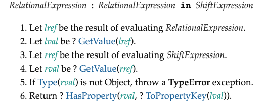
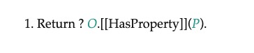
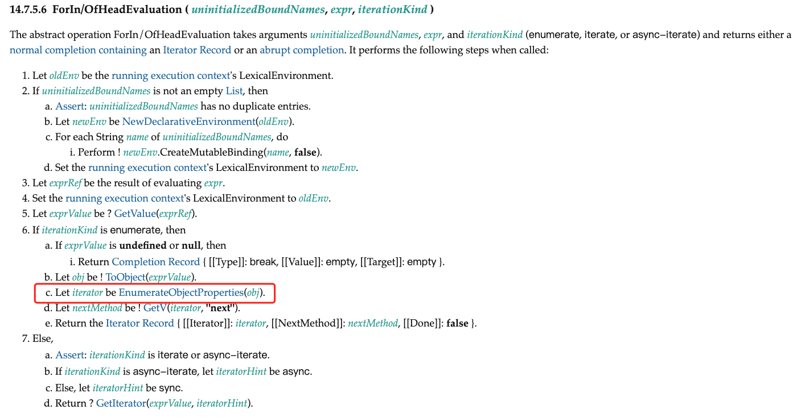
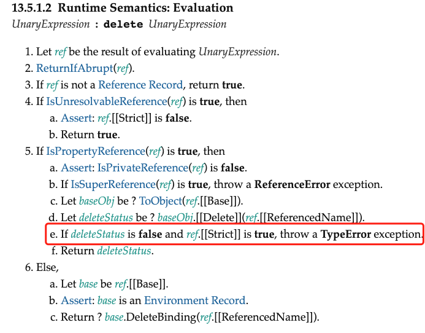

## 读取操作

从这一节开始，我们将着手实现响应式数据。前面我们使用 get 拦截函数去拦截对属性的读取操作。但在响应系统中，"读取"是一个很宽泛的概念，例如使用 in 操作符检查对象上是否具有给定的 key 也属于"读取"操作，例如下面的代码所示:

```js
effect(() => {
	"foo" in obj
})
```

这本上也是在进行"读取"操作。响应系统应该拦截一切读取操作，以便当数据变化时能够正确地触发响应。下面列出了对一个普通对象的所有可能的读取操作。

- 访问属性: obj.foo
- 判断对象或原型上是否存在给定的 key: key in obj
- 使用 for...in 循环遍历对象: for (const key in obj){}

### 属性读取 obj.foo

接下来，我们逐步讨论如何拦截这些读取操作。首先是对于属性的读取，例如 obj.foo,我们知道可以通过 get 拦截函数实现:

```js
const obj = { foo: 1 }
const p = new Proxy(obj, {
	get(target, key, receiver) {
		// 建立联系
		track(target, key)
		// 返回属性值
		return Reflect.get(target, key, receiver)
	}
})
```

### key in obj

对于 in 操作，应该如何拦截呢？ 我们可以看查看表 5-3，尝试寻找与 in 操作符对应的拦截函数，但表 5-3 中没有与 in 操作符相关的内容。这时我们就需要查看关于 in 操作符的相关规范。在 ECMA-262 规范的 13.10.1 节中，明确定义了 in 操作符的运行时逻辑，如图所示:



in 操作符的运行时逻辑描述如下:

1. 让 lref 的值为 RelationExpression 的执行结果
2. 让 lval 的值为 ？GetValue(lref)
3. 让 rref 的值为 ShiftExpression 的执行结果
4. 让 rval 的值为 ？GetValue(rref)
5. 如果 Type(rval)不是对象，则抛出 TypeError 异常
6. 返回 ？HasProperty(rval, ? ToPropertyKey(lval))

关键点在第 6 步，可以翻新啊，in 操作符的运算结果是通过调用一个叫做 HasProperty 的抽象方法得到的。关于 HasProperty 抽象方法，可以在 ECMA-262 规范的 7.3.12 节中找到，它的操作符如图所示。



图中描述内容如下:

1. 返回 ? O.[[HasProperty]]\(P)

在第一步中，可以看到 HasProperty 抽象方法的返回值是通过调用对象的内部方法[[HasProperty]]得到的。而[[HasProperty]]内部方法可以在表 5-3 中找到，它对应的拦截函数名叫 has，因此我们可以通过 has 拦截函数实现对 in 操作符的代理:

```js
const obj = { foo: 1 }
const p = new Proxy(obj, {
	has(target, key) {
		track(target, key)
		return Reflect.has(target, key)
	}
})
```

这样，当我们在副作用函数中通过 in 操作符操作响应式数据时，就能够建立依赖关系:

```js
effect(() => {
	"foo" in p // 将会建立依赖关系
})
```

### for...in

再来看看那如何拦截 for...in 循环。同样，我们能够拦截的所有方法都在表 5-3 中，而表 5-3 列出的是一个对象的所有基本语义方法，也就是说，任何操作其实都是由这些基本语义方法及其组合实现的，for...in 循环也不例外。为了搞清楚 for...in 循环依赖那些基本语义方法，还需要看规范。

由于这部分规范内容较多，因此这里只截取关键不烦。在规范的 14.7.5.6 节中定义了 for...in 头部的执行规则，如图所示。



图中第 6 步描述的内容如下:

6.  如果 iterationKind 是**枚举**(enumberate),则

    a. 如果 exprValue 是 undefined 或 null, 那么

        i. 返回 Completion {[[Type]]: break, [[Value]]: empty, [[Target]]: empty}

    b. 让 obj 的值为 ! ToObject(exprValue)
    c. 让 iterator 的值为 ？EnumerateObjectProperties(obj)
    d. 让 nextMethod 的值为 ! GetV(iterator, "next")
    e. 返回 Record `{[[Iterator]]: iterator, [[NextMethod]]: nextMethod, [[Done]]: false}`

仔细观察第 6 步的第 c 子步骤:

让 iterator 的值为 ？EnumerateObjectProperties(obj)。

其中的关键点在于 EnumerateObjectProperties(obj)。这里的 EnumerateObjectProperties 是一个抽象方法，该方法返回一个迭代器对象，规范 14.7.5.9 节给出了满足该抽象方法的示例实现，如下面的代码所示:

```js
function* EnumerateObjectProperties(obj) {
	const visited = new Set()
	for (const key of Reflect.ownKeys(obj)) {
		if (typeof key === "symbol") continue
		const desc = Reflect.getOwnPropertyDescriptor(obj, key)
		if (desc) {
			visited.add(key)
			if (desc.enumerable) yield key
		}
	}
	const proto = Reflect.getPrototypeOf(obj)
	if (proto === null) return
	for (const protoKey of EnumberateObjectProperties(proto)) {
		if (!visited.has(protoKey)) yield protoKey
	}
}
```

可以看到，这个方法是一个 generator 函数，接收一个参数 obj。实际上，obj 就是被 for...in 循环遍历的对象，其关键点在于使用 Reflect.ownKeys(obj)来获取只属于对象自身拥有的键。有了这个现在，如何兰家 for...in 循环的答案已经很明显了，我们可以使用 ownKeys 拦截函数来拦截 Reflect.ownKeys 操作:

```js
const obj = { foo: 1 }
const ITERATE_KEY = Symbol()

const p = new Proxy(obj, {
	ownKeys(target) {
		// 将副作用函数与 ITERATE_KEY 关联
		track(target, ITERATE_KEY)

		return Reflect.ownKeys(target)
	}
})
```

如上面的代码所示，拦截 ownKeys 操作即可间接拦截 for...in 循环。但相信大家已经注意到了，我们在使用 track 函数进行追踪的时候，将 ITERATE_KEY 作为追踪的 key，为什么这么做呢？ 这是因为 ownKeys 拦截函数与 get/set 拦截函数不同，在 get/set 中，我们可以得到具体操作的 key，但是在 ownKeys 中，我们只能拿到目标对象 target。这也很符合直觉，因为在读写属性值时，总是能够明确地知道当前正在操作哪一个属性，所以只需要在该属性与副作用函数之间建立联系即可。而 ownKeys 用来获取一个对象的所有属于自己的键值，这个操作明显不与任何具体的键进行绑定，因此我们只能够构造唯一的 key 作为标识，即 ITERATE_KEY。

既然追踪的是 ITERATE_KEY，那么相应地，在触发响应的时候也应该触发它才行:

```js
trigger(target, ITERATE_KEY)
```

但是在什么情况下，对数据的操作需要触发与 ITERATE_KEY 相关联的副作用函数呢？ 为了搞清楚这个问题，我们用一段代码来说明。假设副作用函数有一段 for...in 循环:

```js
const obj = { foo: 1 }
const p = new Proxy(obj, {
	/* ... */
})

effect(() => {
	for (const key in p) {
		console.log(key) // foo
	}
})
```

副作用函数执行后，会与 ITERATE_KEY 之间建立响应联系，接下来我们尝试为对象 p 添加新的属性 bar:

```js
p.bar = 2
```

由于对象 p 原本只有 foo 属性，因此 for...in 循环只会执行一次。现在为它添加了新的属性 bar，所以.for...in 循环就会由执行一次变成执行两次。也就是说，当为对象添加新属性时，会对 for...in 循环产生影响，所以需要触发与 ITERATE_KEY 想关联的副作用函数重新执行。但目前的实现还做不到这一点。当我们为对象 p 添加新的属性 bar 时，并没有触发副作用函数重新执行，这是为什么呢？我们来看一下现在的 set 拦截函数实现:

```js
const p = new Proxy(obj, {
	// 拦截设置操作
	set(target, key, newVal, recevier) {
		// 设置属性
		const res = Reflect.set(target, key, newVal, receiver)
		// 把副作用函数从桶里取出并执行
		trigger(target, key)
		return res
	}
	// 省略其他拦截函数
})
```

当对对象 p 添加新的 bar 属性时，会触发 set 拦截函数执行。此时 set 拦截函数接收到 key 就是字符串'bar'，因此最终调用 trigger 函数时也只是触发了与'bar'相关联的副作用函数重新执行。但根据前文介绍，我们知道 for...in 循环是在副作用函数与 ITERATE_KEY 之间建立联系，这和'bar'一点儿关系都没有，因此当我们尝试执行 p.bar = 2 操作时，并不能正确地触发响应。

弄清楚了问题在哪里，解决方案也就随之而来了。当添加属性时，我们将那些与 ITERATE_KEY 相关联的副作用函数也取出来执行就可以了:

```js
function trigger(target, key) {
	const depsMap = bucket.get(target)
	if (!depsMap) return
	// 取得与 key 相关联的副作用函数
	const effects = depsMap.get(key)
	// 取得与 ITERATE_KEY 相关联的副作用函数
	const iterateEffects = depsMap.get(ITERATE_KEY)

	const effectsToRun = new Set()
	// 将与 key 相关联的副作用函数添加到 effectsToRun
	effects &&
		effects.forEach((effectFn) => {
			if (effectFn != activeEffect) {
				effectsToRun.add(effectFn)
			}
		})
	// 将与 ITERATE_KEY 相关联的副作用函数添加到 effectsToRun
	iterateEffects &&
		iterateEffects.forEach((effectFn) => {
			if (effectFn != activeEffect) {
				effectsToRun.add(effectFn)
			}
		})

	effectsToRun.forEach((effectFn) => {
		if (effectFn.options.scheduler) {
			effectFn.options.scheduler(effectFn)
		} else {
			effectFn()
		}
	})
}
```

如以上代码所示，当 trigger 函数执行时，除了把那些直接与具体操作的 key 相关联的副作用函数取出来之外，还要把那些与 ITERATE_KEY 相关联的副作用函数取出来执行。

这么做对于添加新的属性来说没什么问题，但如果仅仅修改已有的属性的值，而不是添加新属性，那么问题就来了，看如下代码:

```js
const obj = { foo: 1 }
const p = new Proxy(obj, {
	/* ... */
})

effect(() => {
	for (const key in p) {
		console.log(key) // foo
	}
})
```

当我们修改 p.foo 的值时:

```js
p.foo = 2
```

与添加新属性不同，修改属性不会对 for...in 循环产生影响。因为无论怎么修改一个属性的值，对.for...in 循环来说都只会循环一次。所以在这种情况下，我们不需要触发副作用函数重新执行，否则会造成不必要的性能开销。然而无论添加新属性，还是修改已有的属性，其基本语义都是`[[Set]]`，我们都是通过 set 拦截函数来实现拦截的，如一下代码所示:

```js
const p = new Proxy(obj, {
	// 拦截设置操作
	set(target, key, newVal, receiver) {
		// 设置属性值
		const res = Reflect.set(target, key, newVal, receiver)
		// 把副作用函数从捅里取出并执行
		trigger(target, key)

		return res
	}
	// 省略其他拦截函数
})
```

所以要想解决上述问题，当设置属性操作发生时，就需要我们在 set 拦截函数内能够区分操作类型，到底是添加新属性还是设置已有属性:

```js
const p = new Proxy(obj, {
	// 拦截设置操作
	set(target, key, newVal, receiver) {
		// 如果属性不存在，则说明是添加新属性，否则是设置已有属性
		const type = Object.prototype.hasOwnProperty.call(target, key) ? "SET" : "ADD"

		// 设置属性值
		const res = Reflect.set(target, key, newVal, receiver)

		// 将 type 作为第三个参数传递给 trigger 函数
		trigger(target, key, type)

		return res
	}
	// 省略其他拦截函数
})
```

如以上代码所示，我们优先使用 Object.prototype.hasOwnProperty 检查当前操作的属性是否已经存在于目标对象上，如果存在，则说明当前操作类型为'SET'，即修改属性值；否则认为当前操作类型为'ADD',即添加新属性，最后，我们把类型结果 type 作为第三个参数传递给 trigger 函数。

在 trigger 函数内就可以通过类型 type 来区分当前的操作类型，并且只有当操作类型 type 为'ADD'时，才会触发与 ITERATE_KEY 相关联的副作用函数重新执行，这样就避免了不必要的性能消耗:

```js
function trigger(target, key, type) {
	const depsMap = bucket.get(target)
	if (!depsMap) return
	const effects = depsMap.get(key)

	const effectsToRun = new Set()

	effects &&
		effects.forEach((effectFn) => {
			if (effectFn !== activeEffect) {
				effectsToRun.add(effectFn)
			}
		})

	console.log(type, key)

	// 只有当操作类型为 'ADD' 时，才会触发与 ITERATE_KEY 相关联的副作用函数重新执行
	if (type === "ADD") {
		const iterateEffects = depsMap.get(ITERATE_KEY)
		iterateEffects &&
			iterateEffects.forEach((effectFn) => {
				if (effectFn !== activeEffect) {
					effectsToRun.add(effectFn)
				}
			})
	}

	effectToRun.forEach((effectFn) => {
		if (effectFn.options.scheduler) {
			effectFn.options.scheduler()
		} else {
			effectFn()
		}
	})
}
```

通常我们会将操作类型封装为一个枚举值，例如:

```js
const TriggerType = {
	SET: "SET",
	ADD: "ADD"
}
```

这样无论是对后期代码的维护，还是对代码的清晰度，都是非常有帮助的。

### 删除操作

关于对象的代理，还剩下最后一项工作需要做，即删除属性操作的代理:

```js
delete p.foo
```

如何代理 delete 操作符呢？ 还是看规范，规范的 13.5.1.2 节中明确定义了 delete 操作符的行为，如图所示。



图中的第 5 步描述内容如下:

5. 如果 `IsPropertyReference(ref)`是 true, 那么

   a. 断言: `IsPrivateReference(ref)` 是 false

   b. 如果 `IsSuperReference(ref)` 也是 true， 则抛出 ReferenceError 异常

   c. 让 baseObj 的值为 `?ToObject(ref,[[Base]])`

   d. 让 deleteStatus 的值为 `?baseObj.[[Delete]](ref.[[RefereneceName]])`

   e. 如果 deleteStatus 的值为 false 并且`ref.[[Strict]]`的值时 true，则抛出异常 TypeError 异常

   f. 返回 deleteStatus

由 第 5 步的 d 子步骤可知，delete 操作符的行为依赖[[Delete]]内部方法。接着查表 5-3 可知，该内部方法可以使用 deleteProperty 拦截:

```js
const p = new Proxy(obj, {
	deleteProperty(target, key) {
		// 检查被操作的属性是否时对象自己的属性
		const hadKey = Object.prototype.hasOwnProperty.call(target, key)
		// 使用 Reflect.deleteProperty  完成属性删除
		const res = Reflect.deleteProperty(target, key)

		if (res && hadKey) {
			// 只有当删除的属性是对象自己的属性并且成功删除时，才触发更新
			trigger(target, key, "Delete")
		}

		return res
	}
})
```

如以上代码所示， 首先检查被删除的属性是否属于对象自身，然后调用 Reflect.deleteProperty 函数完成属性的删除工作，只有当这两步的结果都满足条件时，才调用 trigger 函数触发副作用函数重新执行。需要注意的是，在调用 trigger 函数时，我们传递了新的操作类型'DELETE'。由于删除操作会使得对象的键变少，它会影响 for...in 循环的次数，因此当操作类型为'DELETE'时，我们也应该触发那些与 ITERATE_KEY 相关联的副作用函数重新执行:

```js
function trigger(target, key, type) {
	const depsMap = bucket.get(target)
	if (!depsMap) return
	const effects = depsMap.get(key)

	const effectsToRun = new Set()

	effects &&
		effects.forEach((effectFn) => {
			if (effectFn !== activeEffect) {
				effectsToRun.add(effectFn)
			}
		})

	// 只有当操作类型为 'ADD' 或 'DELETE' 时，才会触发与 ITERATE_KEY 相关联的副作用函数重新执行
	if (type === "ADD" || type === "DELETE") {
		const iterateEffects = depsMap.get(ITERATE_KEY)
		iterateEffects &&
			iterateEffects.forEach((effectFn) => {
				if (effectFn !== activeEffect) {
					effectsToRun.add(effectFn)
				}
			})
	}

	effectToRun.forEach((effectFn) => {
		if (effectFn.options.scheduler) {
			effectFn.options.scheduler()
		} else {
			effectFn()
		}
	})
}
```

在这段代码中，我们添加了 type ==='DELETE'判断，使得删除出行操作能够触发与 ITERATE_KEY 相关联的副作用函数重新执行。
