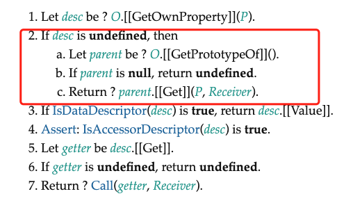
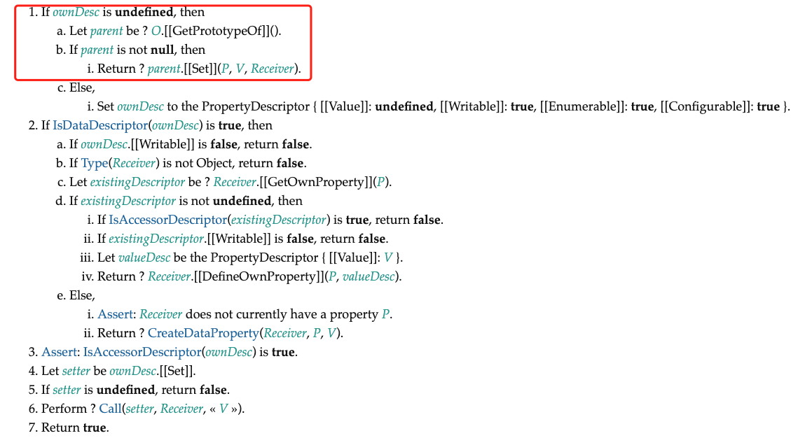

## 前言

上一节中，我们从规范的角度详细介绍了如何代理对象，在这个过程中，处理了很多边界条件。例如，我们需要明确知道操作的类型'ADD'还是'SET'，亦或是其他操作类型，从而正确地触发响应。但是想要合理地触发响应，还有许多工作要做。

## 当值不发生变化，不需要触发响应

```js
const obj = { foo: 1 }
const p = new Proxy(obj, {
	/* ... */
})

effect(() => {
	console.log(p.foo)
})

// 设置 p.foo 的值，但值没有变化
p.foo = 1
```

如上面代码所示，p.foo 的初始值为 1，当为 p.foo 设置新的值时，如果值没有发生变化，则不需要触发响应。为了满足需求，我们需要修改 set 拦截函数的代码，在调用 trigger 函数触发响应之前，需要检查值是否真的发生了变化:

```js
const p = new Proxy(obj, {
	set(target, key, newVal, receiver) {
		// 先获取旧值
		const oldVal = target[key]

		const type = Object.prototype.hasOwnProperty.call(target, key) ? "SET" : "ADD"

		const res = Reflect.set(target, key, newVal, receiver)

		// 比较新值与旧值，只要当不全等的时候才触发响应
		if (oldVal !== newVal) {
			trigger(target, key, type)
		}

		return res
	}
})
```

如上面的代码所示，我们在 set 拦截函数内首先获取旧值 oldVal,接着比较新值与旧值，只有当他们不全等的时候才触发响应。现在，如果我们再次测试本节开头的例子，会发现重新设置相同的值已经不会触发响应了。

然而，仅仅进行全等比较是有缺陷的，这体现在对 NaN 的处理上。我们知道 NaN 与 NaN 进行全等比较总会得到 false:

```js
NaN === NaN // false
NaN !== NaN // true
```

换句话说，如果 p.foo 的初始值是 NaN，并且后续又为其设置了 NaN 作为新值，那么仅仅进行全等比较的缺点就暴露了:

```js
const obj = { foo: NaN }
const p = new Proxy(obj, {
	/* ... */
})

effect(() => {
	console.log(p.foo)
})

// 仍然会触发响应， 因为NaN !== NaN 为 true
p.foo = NaN
```

这仍然会触发响应，并导致不必要的更新。为了解决这个问题，我们需要再加一个条件，即在新值和旧值不全等的情况下，要保证他们都不是 NaN:

```js
const p = new Proxy(obj, {
	set(target, key, newVal, receiver) {
		// 先获取旧值
		const oldVal = target[key]

		const type = Object.prototype.hasOwnProperty.call(target, key) ? "SET" : "ADD"

		const res = Reflect.set(target, key, newVal, receiver)

		// 比较新值与旧值，只要当不全等的时候才触发响应, 并且不都是 NaN 的时候才触发响应
		if (oldVal !== newVal && (oldVal === oldVal || newVal === newVal)) {
			trigger(target, key, type)
		}

		return res
	}
})
```

这样我们就解决了 NaN 的问题。

## 原型继承属性导致的不必要更新

但想要合理地触发响应，仅仅处理关于 NaN 的问题还不够。接下来，我们讨论一种从原型上继承属性的情况。为了后续方便讲解，我们需要封装一个 reactive 函数，该函数接收一个对象作为参数，并返回为其创建的响应式数据:

```js
function reactive(obj) {
	return new Proxy(obj, {
		// 省略前面讲解的拦截函数
	})
}
```

可以看到，reactive 函数只对 Proxy 进行了一层封装。接下来，我们基于 reactive 创建一个例子:

```js
const obj = {}
const proto = { bar: 1 }
const child = reactive(obj)
const parent = reactive(proto)
// 使用 parent 作为 child 的原型
Object.setPrototypeOf(child, parent)

effect(() => {
	console.log(child.bar) // 1
})

// 修改 child.bar 的值
child.bar = 2 // 会导致副作用函数重新执行两次
```

观察如上代码，我们定义了空对象 obj 和对象 proto，分别为二者创建了对应的响应式数据 child 和 parent，并且使用 Object.setPrototypeOf 方法将 parent 设置为 child 的原型。接着，在副作用函数内访问 child.bar 的值。从代码中可以看出，child 本身并没有 bar 属性，因此当访问 child.bar 时，值是从原型上继承来的。但无论如何，既然 child 是响应式数据，那么它与副作用函数之间就会建立联系，因此当我们执行 child.bar = 2 时，期望副作用函数会重新执行。但如果尝试运行上面的代码，会发现副作用函数不仅执行了，还执行了两次，这会造成不必要的更新。

为了搞清楚问题的原因，我们需要逐步分析整个过程。当在副作用函数中读取 child.bar 的值时，会触发 child 代理对象的 get 拦截函数。我们知道在拦截函数内时使用 Reflect.get(target,key,receiver)来得到最终的结果的，对应到上例，这句话相当于:

```js
Reflect.get(obj, "bar", receiver)
```

这其实实现了通过 obj.bar 来访问属性值的默认行为。也就是说，引擎内部是通过调用 obj 对象所不出的[[Get]]内部方法来得到最终结果的，因此我们有必要查看规范 10.1.8.1 节来了解[[Get]]内部方法的执行流程，如图所示



其中第三步描述内容如下:

3. 如果 desc 是 undefined， 那么
   a. 让 parent 的值为`? O.[[GetPrototypeOf]]()`

   b. 如果 parent 是 null， 则返回 undefined

   c. 返回 `? Parent.[[Get]](P, receiver)`

在第 3 步中，我们能够了解到非常关键的信息，即如果对象自身不存在该属性，那么会获取对象的原型，并调用原型的 [[Get]] 方法得到最终结果。对应上上例中，当读取 child.bar 属性值时，由于 child 代理的对象 obj 自身没有 bar 属性，因此会获取对象 obj 的原型，也就是 parent 对象，所以最终得到的实际上是 parent.bar 的值。但是不要忘了，parent 本身也是响应式数据，因此在副作用函数中访问 parent.bar 的值时，会导致副作用函数被收集，从而建立了响应联系。所以我们能够得出一个结论，即 child.bar 和 parent.bar 都与副作用函数建立了响应联系。

但这仍然解释不了为什么当设置 child.bar 的值时，会连续触发两次副作用函数执行，所以接下来我们需要看看当设置操作发生时的具体执行流程。我们知道，当执行 child.bar = 2 时，会调用 child 代理对象的 set 拦截函数。同样，在 set 拦截函数内，我们使用 Reflect.set(target,key,newVal,receiver)来完成默认的设置行为，即引擎会调用 obj 对象部署的 [[Set]]内部方法，根据规范的 10.1.9.2 节可知 [[Set]]内部方法的执行流程，如图所示。



其中第 1 步所描述的内容如下:

1.  如果 ownDesc 是 undefined,那么

    a. 让 parent 的值为`O.[[GetPrototypeOf]]()`

    b. 如果 parent 不是 null,那么

            i. 返回 ? parent.[[Set]](P,V,Receiver)

    c. 否则

            i. 将 ownDesc 设置为 {[[Value]]: undefined,, [[Writable]]: true, [[Enumerable]]: true, [[Configurable]]: true}

由第 1 步可是，如果设置的属性不存在于对象上，那么会取得其原型，并调用原型的[[Set]]方法，也就是 parent 的[[Set]]内部方法。由于 parent 是代理对象，所以这就相当于执行了它的 set 拦截函数。换句话说，虽然我们操作的是 child.bar，但这也会导致 parent 代理对象的 set 拦截函数被执行。前面我们分析过，当读取 child.bar 的值时，副作用函数不仅会被 child.bar 收集，也会被 parent.bar 收集。所以当 parent 代理对象的 set 拦截函数执行时，就会触发副作用函数重新执行，这就是为什么修改 child.bar 的值会导致副作用函数重新执行两次。

接下来，我们需要思考解决方案。思路很简单，既然执行两次，那么只需要屏蔽其中一次不就可以了吗？我们把由 parent.bar 触发的那次副作用函数的重新执行屏蔽。怎么屏蔽呢？ 我们知道，两次更新是由于 set 拦截函数被处罚了两次导致的，所有只要我们能够在 set 拦截函数内区分这两次更新就可以了。当我们设置 child.bar 的值时，会执行 child 代理对象的 set 拦截函数:

```js
// child 的 set 拦截函数
set(target,key,newVal,receiver) {
    // target 是原始对象 obj
    // receiver 是代理对象 child
}
```

此时 target 是原始对象 obj,receiver 是代理对象 child,我们发现 receiver 其实就是 target 的代理对象。

但由于 obj 上不存在 bar 属性，所以会取得 obj 的原型 parent，并执行 parent 代理对象的 set 拦截函数:

```js
// parent 的 set 拦截函数
set(target,key,value,receiver) {
    // target 是原始对象 proto
    // receiver 仍是代理对象 child
}
```

我们发现，当 parent 搭理对象的 set 拦截函数执行时，此时 target 是原始对象 proto,而 receiver 仍然是代理对象 child，而**不再是 target 的代理对象**。通过这个特点，我们可以看到 target 和 receiver 的区别。由于我们最初设置的是 child.bar 的值，所以无论在什么情况下，receiver 都是 child，而 target 则是变化的。根据这个区别，我们很容易想到解决办法，只需要判断 receiver 是否是 target 的代理对象即可。只有当 receiver 是 target 的代理对象时才触发更新，这样就能屏蔽又原型引起的更新了。

所以接下来的问题变成了如何确定 receiver 是不是 target 的代理对象，这需要我们为 get 拦截函数添加一个能力，如以下代码所示:

```js
function reactive(obj) {
	return new Proxy(obj, {
		get(target, key, receiver) {
			// 代理对象可以通过 raw 属性访问原始数据
			if (key === "raw") {
				return target
			}

			track(target, key)

			return Reflect.get(target, key, receiver)
		}

		// 省略其他拦截函数
	})
}
```

我们增加了一段代码，它实现的功能是，代理对象可以通过 raw 属性读取原始数据，例如:

```js
child.raw === obj // true
parent.raw === proto // true
```

有了它，我们就能够在 set 拦截函数中判断 receiver 是不是 target 的代理对象了:

```js
function reactive(obj) {
	return new Proxy(obj, {
		set(target, key, newVal, receiver) {
			const oldVal = target[key]

			const type = Object.prototype.hasOwnProperty.call(target, call) ? "SET" : "ADD"

			const res = Reflect.set(target, key, newVal, receiver)

			// target === receiver.raw 说明 receiver 就是 target 的代理对象
			if (target === receiver.raw) {
				if (oldVal !== newVal && (oldVal === oldVal || newVal === newVal)) {
					trigger(target, key, type)
				}
			}

			return res
		}

		// 省略其他拦截函数
	})
}
```

如以上代码所示，我们新增了一个判断条件，只有当 receiver 是 target 的代理对象时才触发更新，这样就屏蔽由原型引起的更新，从而避免不必要的更新操作。
