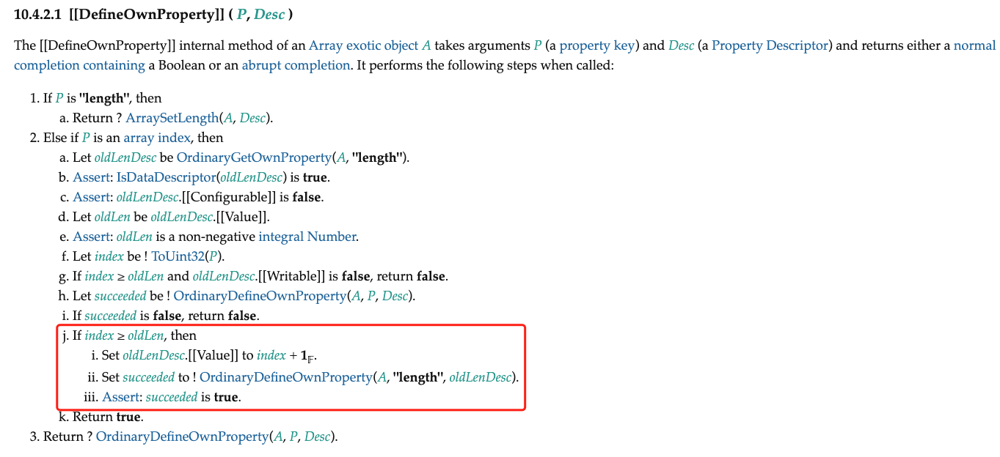
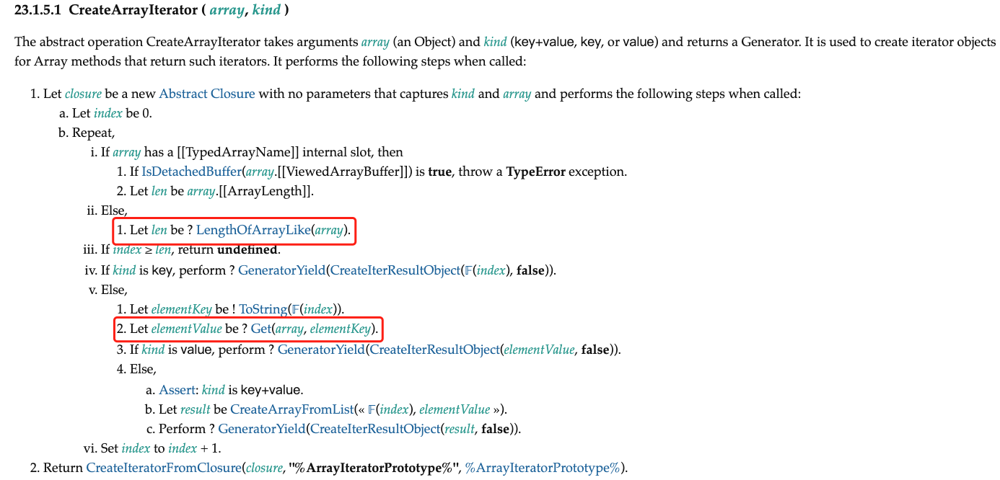
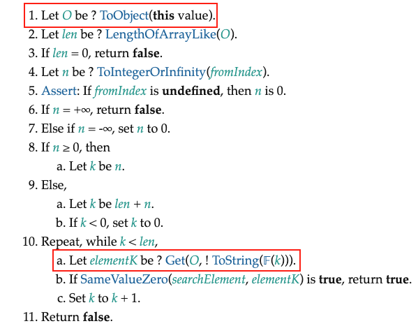
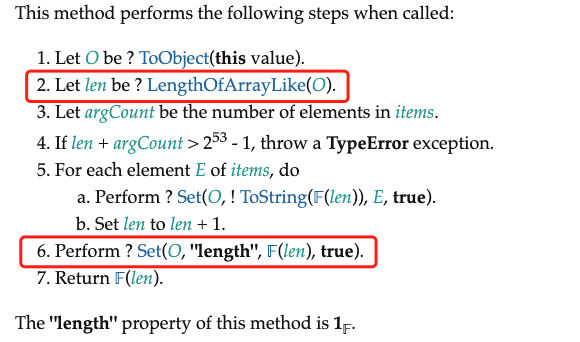

## 前言

从本节开始，我们讲解如何代理数组。实际上，在 JavaScript 中，数组只是一个特殊的对象而已，因此想要更好地实现对数组的代理，就有必要了解相比普通对象，数组到底有何特殊之处。

## 数组属性的"读取"和"设置"操作

在第十二篇中，我们深入讲解了 JavaScript 中的对象。我么你找，在 JavaScript 中有两种对象: 常规对象和异质对象。我们还讨论了两者的差异。而本节中我们要介绍的数组就是一个异质对象，这是因为数组对象的[[DefineOwnProperty]]内部方法与常规对象不同。换句话说，数组对象除了[[DefineOwnProperty]]这个内部方法之外，其他内部方法的逻辑都与常规对象相同。因此，当实现对数组的代理时，用于代理普通对象的大部分代码可以继续使用，如下所示:

```js
const arr = reactive(["foo"])

effect(() => {
	console.log(arr[0]) // 'foo'
})

arr[0] = "bar" // 能够触发响应
```

上面这段代码能够按照预期工作。实际上，当我们通过索引读取或这是数组元素值时，代理对象的 get/set 拦截函数也会执行，因此我们从不需要做任何额外的工作，就能够让数组索引的读取和设置操作时响应式的了。

但对数组的操作与普通对象的操作仍然存在不同，下面总结了所有对数组元素或属性的"读取"操作。

- 通过索引访问数组元素值: arr[0]
- 访问数组的长度: arr.length
- 把数组作为对象， 使用 for...in 循环遍历
- 使用 for...of 迭代遍历数组
- 数组的原型方法，如 concat/join/every/some/find/findIndex/includes 等，以及其他所有不改变原数组的原型方法。

可以看到，对数组的读取操作要比普通对象丰富很多。我们在来看看对数组元素和属性的"设置操作"有哪些。

- 通过索引修改数组元素质: arr[1] = 3
- 修改数组长度: arr.length = 3
- 数组的栈方法: push/pop/shift/unshift
- 修改原数组的原型方法: splice/fill/sort 等

除了通过数组索引修改数组元素值这种基本操作之外，数组本身还有很多会修改原数组的原型方法。调用这些方法也属于对数组的操作，有些方法的操作语义是"读取",而有些方法的操作语义是"设置"。因此，当这些操作发生时，也应该正确地建立响应联系或触发响应。

从上面列出的这些对数组的操作来看，似乎代理数组的难度要比代理普通对象的难度大很多。但事实并非如此，这是因为数组本身也是对象，只不过他是异质对象罢了，它与常规对象的差异并不大。因此大部分用来代理常规对象的代码对于数组也是生效的。接下来，我们就从通过索引读取或设置数组的元素值说起。

## 数组的索引与 length

拿本节开头的例子来说，当通过数组的索引访问元素的值时，已经能够建立相应联系了:

```js
const arr = reactive(["foo"])

effect(() => {
	console.log(arr[0]) // 'foo'
})

arr[0] = "bar" // 触发响应
```

但通过索引设置数组的元素值与设置对象的属性值仍然存在根本上的不同，这是因为数组对象部署的内部方法[[DefineOwnProperty]]不同于规对象。实际上，当我们通过索引设置数组元素的值时，会执行数组对象所部署额内部方法[[Set]],这一步与设置常规对象的属性值一样。根据规范可知，内部方法[[Set]]其实依赖于[[DefineOwnProperty]],到了这里就提现了出了差异。数组对象的所部署的内部方法[[DefineOwnProperty]]的逻辑定义在规范的 10.4.2.1 节，如图所示。



图中第二步的 j 子步骤描述的内容如下。

j. 如果 index >= oldLen, 那么

        i. 将 oldLenDesc.[[Value]] 设置为 index + 1
        ii. 让 succeeded 的值为 OrdinaryDefineOwnProperty(A,"length",oldLenDesc)
        iii. 断言: succeeded 是 true

可以看到，规范中明确说明，如果设置的索引值大于数组当前的长度，那么要更新数组的 length 属性。所以当通过索引设置元素值时，可能会隐式地修改 length 的属性值。因此在触发响应时，也应该触发与 length 相关联的副作用函数重新执行，如下面的代码所示：

```js
const arr = reactive(["foo"]) // 数组的原长度为 1

effect(() => {
	console.log(arr.length) // 1
})

// 设置索引 1 的值，会导致数组的长度变为 2
arr[1] = "bar"
```

在这段代码中，数组的原长度为 1，并且在副作用函数中访问了 length 属性。然后设置数组索引为 1 的元素值，这会导致数组长度变为 2，因此应该触发副作用函数重新执行。但目前的实现还做不到这一点，为了实现目标，我们需要修改 set 拦截函数，如下面的代码所示:

```js
function createReactive(obj, isShallow = false, isReadonly = false) {
	return new Proxy(obj, {
		// 拦截设置操作
		set(target, key, newVal, receiver) {
			if (isReadonly) {
                console.warn(`属性 ${ key} 是只读的`)
                return true
			}

            const oldVal = target[key]
            // 如果代理目标时数组， 则检测被设置的索引值是否小于数组长度,
            // 如果是，则视作 SET 操作， 否则是 ADD 操作
            // 如果属性不存在，则说明是在添加新的属性，否者是设置已有属性
            const type = Array.isArray(target)
            ? Number(key) < target.length : 'SET' : 'ADD'
            : Object.prototype.hasOwnProperty.call(target,key) ? 'SET' : 'ADD'

            const res = Reflect.set(target,key,newVal,receiver)
            if(target === receiver.raw) {
                if(oldVal !== newVal && (oldVal === oldVal || newVal === newVal)) {
                    trigger(target,key,type)
                }
            }

            return true
		}
        // 省略其他拦截函数
	})
}
```

我们在判断操作类型时，新增了对数组类型的判断。如果代理的目标对象是数组，那么对于操作类型的判断会有所区别。即被设置的索引值如果小于数组长度，就视作 SET 操作，因为它不会改变数组长度；如果设置的索引值大于数组长度，则视作 ADD 操作，因为这会隐式地改变数组的 length 属性值。有了这些信息，我们就可以在 trigger 函数中正确的触发与数组对象的 length 属性相关联的副作用函数重新执行了:

```js
function trigger(target, key, type) {
	const depsMap = bucket.get(target)
	if (!depsMap) return

	// 省略部分内容
	// 当操作类型为 ADD 并且目标对象是数组时，应该取出并执行那些与 length 属性相关联的副作用函数
	if (type === "ADD" && Array.isArray(target)) {
		// 取出 与 length 相关联的副作用函数
		const lengthEffects = deps.get("length")
		// 将这些副作用函数添加到 effectsToRun 中，带执行
		lengthEffects &&
			lengthEffects.forEach((effectFn) => {
				if (effectFn !== activeEffect) {
					effectsToRun.add(effectFn)
				}
			})
	}

	effectsToRun.forEach((effectFn) => {
		if (effectFn.options.scheduler) {
			effectFn.options.scheduler(effectFn)
		} else {
			effectFn()
		}
	})
}
```

但是反过来，其实修改数组的 length 属性也会隐式地影响数组元素，例如:

```js
const arr = reactive(["foo"])

effect(() => {
	// 访问数组的第 0 个元素
	console.log(arr[0]) // foo
})

// 将数组的长度修改为 0， 导致第 0 个元素被删除，因此应该触发响应
arr.length = 0
```

如上面代码所示，在副作用函数内访问了数组的第 0 个元素，接着将数组的 length 属性修改为 0.我们知道这会隐式地影响数组元素，即所有元素都被删除，所以应该触发副作用函数重新执行。然而并非所有对 length 属性的修改都会影响数组中的已有元素，拿上例来说，如果我们将 length 属性设置为 100，这并不会影响第 0 个元素，所以也就不需要触发副作用函数重新执行。这让我们意识到，当修改 length 属性时，只有那些索引值大于或等于新的 length 属性值的元素才需要触发响应。但无论如何，目前的实现还做不到这一点，为了实现目标，我们需要修改 set 拦截函数。在调用 trigger 函数触发响应时，应该把新的属性值传递过去:

```js
function createReactive(obj, isShallow = false, isReadonly = false) {
	return new Proxy(obj, {
		// 拦截设置操作
		set(target, key, newVal, receiver) {
			if (isReadonly) {
                console.warn(`属性 ${ key} 是只读的`)
                return true
			}

            const oldVal = target[key]

            const type = Array.isArray(target)
            ? Number(key) < target.length : 'SET' : 'ADD'
            : Object.prototype.hasOwnProperty.call(target,key) ? 'SET' : 'ADD'

            const res = Reflect.set(target,key,newVal,receiver)
            if(target === receiver.raw) {
                if(oldVal !== newVal && (oldVal === oldVal || newVal === newVal)) {
                    // 增加第四个参数，即触发响应的新值
                    trigger(target,key,type,newVal)
                }
            }

            return true
		}
        // 省略其他拦截函数
	})
}
```

接着，我们还需要修改 trigger 函数:

```js
function trigger(target, key, type, newVal) {
	const depsMap = bucket.get(target)
	if (!depsMap) return
	// 省略其他代码
	// 如果操作目标时数组，并修改住的length属性
	if (Array.isArray(target) && key === "length") {
		// 对于索引值大于或等于新的 length 值的元素
		// 需要把所有相关联的副作用函数取出并添加到 effectToRun 中待执行
		depsMap.forEach((effects, key) => {
			if (key >= newVal) {
				effects.forEach((effectFn) => {
					if (effectFn !== activeEffect) {
						effectsToRun.add(effectFn)
					}
				})
			}
		})
	}

	effectToRun.forEach((effectFn) => {
		if (effectFn.options.scheduler) {
			effectFn.options.scheduler(effectFn)
		} else {
			effectFn()
		}
	})
}
```

如上面的代码所示， 为 trigger 函数增加了第四个参数，即触发响应时的新值。在本例中，新值指的是新的 length 属性值，它代表新的数组长度。接着，我们判断操作的目标是否是数组，如果是，则需要找到所有索引值大于或等于新的 length 值的元素，然后把与他们相关联的副作用函数取出并执行。

## 遍历数组

既然数组也是对象， 就意味着同样可以使用 for...in 循环遍历:

```js
const arr = reactive(["foo"])

effect(() => {
	for (const key in arr) {
		console.log(key) // 0
	}
})
```

这里有必要指出一点，我们应该尽量避免使用 for...in 循环遍历数组。但既然在语法上是可行的，那么当然也需要考虑。前面我们提到，数组对象和常规对象的不同仅在[[DefineOwnProperty]]这个内部方法上，也就是说，使用 for...in 循环遍历数组与遍历常规对象并无差异，因此同样可以使用 ownKeys 拦截函数进行拦截。下面是我们之前实现的 ownKeys 拦截函数:

```js
function createReactive(obj, isShallow = false, isReadonly = false) {
	return new Proxy(obj, {
		// 省略其他拦截函数
		ownKeys(target) {
			track(target, ITERATE_KEY)
			return Reflect.ownKeys(target)
		}
	})
}
```

这段代码取自前文，当初我们为了追踪对普通对象的 for...in 操作，人为创造了 ITERATE_KEY 作为追踪的 key。但这是为了代理普通对象而考虑的，对于一个普通对象来说，只有当添加或删除属性时才会影响 for...in 循环的结果。所以当添加或删除属性发生时，我们需要取出与 ITERATE_KEY 相关联的副作用函数重新执行。不过，对于数组来说情况有所不同，我们看看哪些操作会影响 for...in 循环对数组的遍历。

- 添加新元素: arr[100] = 'bar'
- 修改数组长度: arr.length = 0

其实，无论是为数组添加新元素，还是直接修改数组的长度，本质上都是因为修改了数组的 length 属性。一旦数组的 length 属性被修改，那么 for...in 循环对数组的遍历结果就会改变，所以在这种情况下我们应该触发响应。很自然的，我们可以在 ownKeys 拦截函数内，判断当前操作目标 target 是否是数组，如果是，则使用 length 作为 key 去建立相应联系:

```js
function createReactive(obj, isShallow = false, isReadonly = false) {
	return new Proxy(obj, {
		// 省略其他拦截函数
		ownKeys(target) {
			// 如果操作目标 target 是数组， 则使用length属性作为 key 并建立相应联系
			track(target, Array.isArray(target) ? "length" : ITERATE_KEY)
			return Reflect.ownKeys(target)
		}
	})
}
```

这样无论是为数组添加新元素，还是直接修改 length 属性，都能够正确地触发响应了:

```js
const arr = reactive(["foo"])

effect(() => {
	for (const key in arr) {
		console.log(key)
	}
})

arr[1] = "bar" // 能够触发副作用函数重新执行
arr.length = 0 // 能够触发副作用函数重新执行
```

讲解使用了 for...in 遍历数组，接下来我们再看呐看使用 for...of 遍历数组的情况。与 for...in 不同，for...of 是用来遍历可迭代对象(iterable object)的，因此我们需要先搞清楚什么是可迭代对象。ES2015 为 JavaScript 定义了**迭代协议**（iteration protocol）,它不是新的语法，而是一种协议。具体来说，一个对象能否被迭代，取决于该对象或者该对象的原型是否实现了@@iterator 方法。这里的@@[name]标志在 ECMAScript 规范里用来代指 JavaScript 内建的 symbols 值，例如 @@iterator 指的就是 Symbol.iterator 这个值。如果对象实现了 Symbol.iterator 方法，那么这个对象就是可以迭代的，例如:

```js
const obj = {
	val: 0,
	[Symbol.iterator]() {
		return {
			next() {
				return {
					value: obj.val++,
					done: obj.val > 10 ? true : false
				}
			}
		}
	}
}
```

该对象实现了 Symbol.iterator 方法，因此可以使用 for...of 循环遍历它:

```js
for (const value of obj) {
	console.log(value) // 0 到 9
}
```

数组内建了 Symbol.iterator 方法的实现，我们可以做一个实验:

```js
const arr = [1, 2, 3, 4, 5]
// 获取并调用数组内建的迭代器方法
const itr = arr[Symbol.iterator]()

console.log(itr.next()) // {value: 1, done: false}
console.log(itr.next()) // {value: 2, done: false}
console.log(itr.next()) // {value: 3, done: false}
console.log(itr.next()) // {value: 4, done: false}
console.log(itr.next()) // {value: 5, done: false}
console.log(itr.next()) // {value: undefined, done: false}
```

可以看到，我们能够通过将 Symbol.iterator 作为键，获取数组内建的迭代器方法。然后手动执行迭代器的 next 函数，这样也可以得到期望的结果。这也是默认情况下数组可以使用 for...of 遍历的原因:

```js
const arr = [1, 2, 3, 4, 5]

for (const val of arr) {
	console.log(val) // 1, 2, 3, 4, 5
}
```

实际上，想要实现对数组进行 for...of 遍历操作的拦截，关键点在于找到 for...of 操作依赖的基本语义。在规范的 23.1.5.1 节中定义了数组迭代器的执行流程，如果所示。



图中第 1 步的 b 子步骤所描述内容如下。

b. 重复以下步骤

i. 如果 array 有 [[TypedArrayName]]内部槽，那么

    	1. 如果 IsDetachedBuffer(array.[[ViewedArrayBuffer]])是true，则抛出TypeError 异常。
    	2. 让 len 的值为 array.[[ArrayLength]]

ii. 否则

    	1. 让 len 的值为 LengthOfArrayLike(array)

iii. 如果 index > len, 则返回 undefined

iv. 如果 kind 是 key， 则执行 ? GeneratorYield(CreateIterResultObject(F(index),false))

v. 否则

    	1. 让 elementKey的值为 !ToString(𝔽(index))
    	2. 让 elementValue 的值为 ?Get(array,elementKey)
    	3. 如果 kind 是 value， 执行 ? GeneratorYield(CreateIterResultObject(elementValue,false))
    	4. 否则
    		a. 断言: kind 是 key + value
    		b. 让 result 是 ? CreateArrayFromList(« 𝔽(index), elementValue »)
    		c. 执行 ? GeneratorYield(CreateIterResultObject(elementValue, false))

vi. 将 index 设置为 index + 1

可以看到，数组迭代器的执行会读取数组的 length 属性。如果迭代的是数组的元素值，还会读取数组的索引。其实我们可以给出一个数组迭代器的模拟实现:

```js
const arr = [1, 2, 3, 4, 5]

arr[Symbol.iterator] = function () {
	const target = this
	const len = target.length
	let index = 0

	return {
		next() {
			return {
				value: index < len ? target[index] : undefined,
				done: index++ >= len
			}
		}
	}
}
```

如上面的代码所示，我们用自定义的实现覆盖了数组内建的迭代器方法，但它仍然能够正常工作。

这个例子表明，迭代数组时， 只需要在副作用函数与数组的长度和索引之间建立响应联系，就能够实现响应式的 for...of 迭代:

```js
const arr = reactive([1, 2, 3, 4, 5])

effect(() => {
	for (const val of arr) {
		console.log(val)
	}
})

arr[1] = "bar" // 能够触发响应
arr.length = 0 // 能够触发响应
```

可以看到，不需要增加任何代码就能够使其正确地工作。这是因为只要数组的长度和元素值发生百变，副作用函数自然会重新执行。

这里不得不提的一点，数组的 values 方法的返回值实际上就是数组内建的迭代器，我们可以验证这一点:

```js
console.log(Array.prototype.values === Array.prototype[Symbol.iterator]) // true
```

换句话说，在不增加任何代码的情况下，我们也能够让数组的迭代器方法正确的工作:

```js
const arr = reactive([1, 2, 3, 4, 5])

effect(() => {
	for (const val of arr.values()) {
		console.log(val)
	}
})

arr[1] = "bar" // 能够触发响应
arr.length = 0 // 能够触发响应
```

最后需要指出的是，无论是使用 for...of 循环，还是调用 values 等方法，它们都会读取数组的 Symbol.iterator 属性。该属性是一个 symbol 值，为了避免发生意外的错误，以及性能上的考虑，我们不应该在副作用函数与 Symbol.iterator 这类的 symbol 值之间建立响应联系，因此需要修改 get 拦截函数，如以下代码所示:

```js
function createReactive(obj, isShallow = false, isReadonly = false) {
	return new Proxy(obj, {
		// 拦截读取操作
		get(target, key, receiver) {
			console.log("get: ", key)

			if (key === "raw") {
				return target
			}

			// 添加判断， 如果 key 的类型是 symbol,则不进行追踪
			if(!isReadonly && typeof !== 'symbol') {
				track(target,key)
			}

			const res = Reflect.get(target,key,receiver)

			if(isShallow) {
				return res
			}

			if(typeof res === 'object' && res !== null) {
				return isReadonly ? readonly(res): reactive(res)
			}

			return res
		}
	})
}
```

在调用 track 函数进行追踪之前， 需要添加一个判断条件，即只有当 key 的类型不是 symbol 时才进行追踪，这样就避免了上述问题。

## 数组的查找方法

通过上一节的介绍我们意识到，数组的方法内部其实都依赖了对象的基本语义。所以大多数情况下，我们不需要做特殊处理即可让这些方法按预期工作，例如:

```js
const arr = reactive([1, 2])

effect(() => {
	console.log(arr.includes(1)) // 初始打印 true
})

arr[0] = 3 // 副作用函数重新执行，并打印 false
```

这是因为 includes 方法为了找到给定的值，它内部会访问数组的 length 属性以及数组的索引，因此当我们修改了某个索引指向的元素值后能够触发响应。

然而 includes 方法并不总是按照预期工作，举个例子:

```js
const obj = {}
const arr = reactive([obj])

console.log(arr.includes(arr[0])) // false
```

如上面的代码所示。 我们首先定义一个 obj，并将其作为数组的第一个元素，然后调用 reactive 函数为其创建一个响应式对象，接着尝试调用 includes 方法在数组中进行查找，看看其中是否包含第一个元素。很显然，这个操作应该返回 true,但如果你尝试运行这段代码，会发现它返回了 false。

为什么会这样呢？ 这需要我们去查阅语言规范，看看 includes 方法的执行流程是怎样的。规范的 23.1.3.16 节给出了 includes 方法的执行流程，如图所示。



图中展示了 includes 方法的执行流程，我们重点关注第 1 步和第 10 步。其中第 1 步所描述的内容如下。

1. 让 O 的值为 ?ToObject(this value)
2. 重复, while 循环(条件 K< len),

   a. 让 elementK 的值为 ? Get(O, !ToString(𝔽(k)))的结果。

   b. 如果 SameValueZero(searchElement, elementK) 是 true， 则返回 true。

   c. 将 K 这是为 K + 1

这里注意第 1 步，让 O 的值为 ?ToObject(this value),这里的 this 是谁呢？ 在 arr.includes(arr[0])语句中，arr 是代理对象，所以 includes 函数执行时的 this 指向的是代理对象，即 arr。接着我们看第 10.a 步，可以看到 includes 方法会通过索引读取数组元素的值，但这是这里的 O 是代理对象 arr。我们知道，通过代理对象来访问元素值时，如果值仍然是可以被代理，那么得到的就是一个新的代理对象而非原始对象。下面这段 get 拦截函数内的代码可以证明这一点:

```js
if (typeof res === "object" && res !== null) {
	// 如果可以被代理， 则返回代理对象
	return isReadonly ? readonly(res) : reactive(res)
}
```

知道这些后，我们再回头看这句代码: arr.includes(arr[0])。其中,arr[0]得到的是一个代理对象，而在 includes 方法内部也会通过 arr 访问数组元素，从而也得到一个代理对象，问题是两个代理对象是不同的。这是因为每次调用 reactive 函数时都会创建一个新的代理对象:

```js
function reactive(obj) {
	// 每次调用 reactive 时， 都会创建新的代理对象
	return createReactive(obj)
}
```

即使参数 obj 是相同的，每次调用 reactive 函数时，也都会创建新的代理对象。这个问题的解决方案如下所示:

```js
// 定义一个 Map 实例， 存储原始对象到代理对象的映射
const reactiveMap = new Map()

function reactive(obj) {
	// 优先通过原始对象 obj 寻找之前创建的代理对象，如果找到了，直接返回已有的代理对象
	const existProxy = reactiveMap.get(obj)
	if (exitProxy) return existProxy

	// 否则，创建新的代理对象
	const proxy = createReactive(obj)

	// 存储到 Map 中，从而避免重复创建
	reactiveMap.set(obj, proxy)

	return proxy
}
```

在上面这段代码中， 我们定义了 reactiveMap，用来存储原始对象到代理对象的映射。每次调用 reactive 函数创建代理对象之前，优先检查是否已经存在相应的代理对象，如果存在，则直接返回已有的代理对象，这样就避免了为同一个原始对象多次创建代理对象的问题。接下来，我们再次运行本节开头的例子:

```js
const obj = {}
const arr = reactive([obj])

console.log(arr.includes(arr[0])) // true
```

可以发现，此时的行为已经符合预期了。
然而，还不能高兴得太早，再来看下面的代码:

```js
const obj = {}
const arr = reactive([obj])

console.log(arr.includes(obj)) // false
```

在上面这段代码中， 我们直接把原始对象作为参数传递给 includes 方法，这是很符合直觉的行为。而从用户的角度来看，自己明明把 obj 作为数组的一个元素了，为什么在数组中却仍然找不到 obj 对象呢？其实原因很简单，因为 includes 内部的 this 指向的是代理对象 arr，并且在获取元素时得到的值也是代理对象，所以拿原始对象 obj 去查找肯定找不到，因此返回 false。为此，我们需要重写数组的 includes 方法并实现自定义的行为，才能解决这个问题。首先，我们来看看如何重写 includes 方法，如下面的代码所示:

```js
const arrayInstrumentations = {
	includes: function () {
		/* ... */
	}
}

function createReactiveObj(obj, isShallow = false, isReadonly = false) {
	return new Proxy(obj, {
		// 拦截读取操作
		get(target, key, receiver) {
			console.log("get:", key)
			if (key === "raw") {
				return target
			}

			// 如果操作的目标对象是数组，并且 key 存在于 arrayInstrumentations 上，
			// 那么返回定义在 arrayInstrumentations 上的值
			if (Array.isArray(target) && arrayInstrumentations.hasOwnProperty(key)) {
				return Reflect.get(arrayInstrumentations, key, receiver)
			}

			if (!isReadonly && typeof key !== "symbol") {
				track(target, key)
			}

			const res = Reflect.get(target, key, receiver)

			if (isShallow) {
				return res
			}

			if (typeof res === "obj" && res !== null) {
				return isReadonly ? readonly(res) : reactive(res)
			}

			return res
		}
	})
}
```

在上面这段代码中，我们修改了 get 拦截函数，目的是重写数组的 includes 方法。具体怎么做呢？ 我们知道，arr.includes 可以理解为读取代理对象 arr 的 includes 属性，这就会触发 get 拦截函数，在该函数内检查 target 是否是数组，如果是数组并且读取的键值存在于 arrayInstrumentations 上，则返回定义在 arrayInstrumentations 对象上相应的值。也就是说，当执行 arr.includes 时，实际执行的是定义在 arrayInstrumentations 上的 includes 函数，这样就实现了重写。

接下来，我们就可以自定义 includes 函数了:

```js
const originMethod = Array.prototype.includes

const arrayInstrumentations = {
	includes: function (...args) {
		// this 是代理对象， 先在代理对象中查找，将结果存储到 res 中
		let res = originMethod.apply(this, args)

		if (res === false) {
			// res 为 false 说明没找到， 通过 this.raw 那到原始数组， 再去其中查找并更新值
			res = originMethod.apply(this.raw, args)
		}

		// 返回最终结果
		return res
	}
}
```

如上面这段代码所示， 其中 includes 方法内的 this 指向的是代理对象， 我们先在代理对象中进行查找，这其实是实现了 arr.include(obj)的默认行为。如果找不到，通过 this.raw 那到原始数组,再去其中查找，最后返回结果，这样就解决了上述问题。运行如下测试代码:

```js
const obj = {}
const arr = reactive([obj])

console.log(arr.includes(obj)) // true
```

可以发现，现在代码的行为已经符合预期了。

除了 includes 方法之外， 还需要做类似处理的数组方法有 indexOf 和 lastIndexOf，因为它们都属于根据给定的值返回查找结果的方法。完整的代码如下:

```js
const arrayInstrumentations = {}

;["includes", "indexOf", "lastIndexOf"].forEach((method) => {
	const originMethod = Array.prototype[method]
	arrayInstrumentations[method] = function (...args) {
		// this 是代理对象， 先在代理对象中查找，将结果存储到 res 中
		let res = originMethod.apply(this, args)

		if (res === false || res === -1) {
			// res 为 false 说明没找到， 通过 this.raw 那到原始数组， 再去其中查找并更新 res 值
			res = originMethod.apply(this.raw, args)
		}
		// 返回最终结果
		return res
	}
})
```

## 隐式修改数组长度的原型方法

本节中我们讲解如何处理那些会隐式修改数组长度的方法，主要指的是数组的栈方法， 例如 push/pop/shift/unshift。除此之外，splice 方法也会隐式地的修改数组长度，我们可以查阅规范来证实这一点。以 push 方法为例，规范的 23.1.3.23 节定义了 push 方法的执行流程，如图所示。



当调用 push 方法并传递 0 个或多个参数时，会执行一下步骤。

1. 让 O 的值为 ? ToObject(this value)
2. 让 len 的值为 ? LengthOfArrayLike(O)
3. 让 argCount 的值为 items 的元素数量
4. 如果 len + argCount > $2^{53}$ - 1, 则抛出 TypeError 异常
5. 对于 items 中的每一个元素 E:

   a. 执行 ？Set(O, !ToString(𝔽(len)), E, true)

   b. 将 len 这是为 len + 1

6. 执行 ？Set(O, "length", 𝔽(len),true)
7. 返回 𝔽(len)

由第 2 步和第 6 步可知，当调用数组的 push 方法想数组添加元素时，既会读取数组的 length 属性值，也会设置数组的 length 属性值。则会导致两个独立的副作用函数互相影响。以下面代码为例:

```js
const arr = reactive([])

// 第一个副作用函数
effect(() => {
	arr.push(1)
})

// 第二个副作用函数
effect(() => {
	arr.push(1)
})
```

如果你尝试在浏览器中运行上面这段代码，会得到栈溢出的错误(Maximum call stack size exceeded)。

为什么会这样呢？ 我们来详细分析上面这段代码的执行过程。

- 第一个副作用函数执行。在该函数内，调用 arr.push 方法向数组添加了一个元素。我们知道，调用数组的 push 方法会间接的读取数组的 length 属性。所以，当第一个副作用函数执行完毕后，会与 length 属性建立响应联系。
- 接着，第二个副作用函数执行。 同样， 它也会与 length 属性建立响应联系。但不要忘记，调用 arr.push 方法不仅会间接读取数组的 length 属性，还会间接设置 length 的属性的值。
- 第二个函数内的 arr.push 方法的调用设置了数组的 length 属性值。于是，响应系统尝试把与 length 属性相关联的副作用函数全部取出并执行，其中就包括第一个副作用函数。问题就出现在这里，可以发现，第二个副作用函数还未执行完毕，就要再次执行第一个副作用函数了。
- 第一个副作用函数再次执行。同样，这会间接设置数组的 length 属性。于是，响应系统又要尝试把所有与 length 属性相关联的副作用函数取出并执行，其中就包含第二个副作用函数。
- 如此循环往复，最终导致调用栈溢出。

问题的原因是 push 方法的调用会间接读取 length 属性。所以，只要我们“屏蔽”对 length 属性的读取，从而避免在它与副作用函数之间建立响应联系，问题就迎刃而解了。这个思路是正确的，因为数组的 push 方法在语义上是修改操作，而非读取操作，所以避免建立响应联系不会产生其他副作用。有了解决思路后，我们尝试实现它，这需要重写数组的 push 方法，如下面的代码所示：

```js
// 一个标记变量， 代表是否进行追踪。 默认值为 true， 即允许追踪
let shouldTrack = true

// 重写数组的 push 方法
;["push"].forEach((method) => {
	// 取得原始 push 方法
	const originMethod = Array.prototype[method]
	// 重写
	arrayInstrumentations[method] = function (...args) {
		// 在调用原始方法之前禁止追踪
		shouldTrack = false
		// push 方法的默认行为
		let res = originMethod.apply(this, args)
		// 在调用原始方法之后， 恢复原来的行为，即允许追踪
		shouldTrack = true
		return res
	}
})
```

在这段代码中，我们定义了一个标记变量 shouldTrack, 它是一个布尔值，代表是否允许追踪。接着，我们重写了数组的 push 方法，利用了前文介绍的 arrayInstrumentations 对象。重写后的 push 方法保留了默认行为，只不过在执行默认行为之前，先将标记变量 shouldTrack 的值设置为 false，即禁止追踪。当 push 方法的默认行为执行完毕之后，再将标记变量 shouldTrack 的值还原为 true，代表允许追踪。最后，我们还需要修改 track 函数，如下面代码所示:

```js
function track(target, key) {
	// 当禁止追踪时， 直接返回
	if (!activeEffect || !shouldTrack) return
	// 省略部分代码
}
```

可以看到，当标记变量 shouldTrack 的值为 false 时，即禁止追踪时，track 函数会直接返回。这样，当 push 方法间接读取 length 属性时，由于此时是禁止追踪状态，所以 length 属性与副作用函数之间不会建立响应联系。这样就实现了前文给出的方案。我们再次尝试运行下面这段测试代码:

```js
const arr = reactive([])

// 第一个副作用函数
effect(() => {
	arr.push(1)
})

// 第二个副作用函数
effect(() => {
	arr.push(1)
})
```

会发现它能够正确地工作，并且不会导致栈溢出

除了 push 方法之外，pop、shift、unshift 以及 splice 等方法都需要做类似的处理。完整的代码如下:

```js
// 一个标记变量， 代表是否进行追踪。 默认值为 true， 即允许追踪
let shouldTrack = true

// 重写数组的 push、pop、shift、unshift 以及 splice 方法
;["push", "pop", "shift", "unshift", "splice"].forEach((method) => {
	// 取得原始 push 方法
	const originMethod = Array.prototype[method]
	// 重写
	arrayInstrumentations[method] = function (...args) {
		// 在调用原始方法之前禁止追踪
		shouldTrack = false
		// push 方法的默认行为
		let res = originMethod.apply(this, args)
		// 在调用原始方法之后， 恢复原来的行为，即允许追踪
		shouldTrack = true
		return res
	}
})
```
