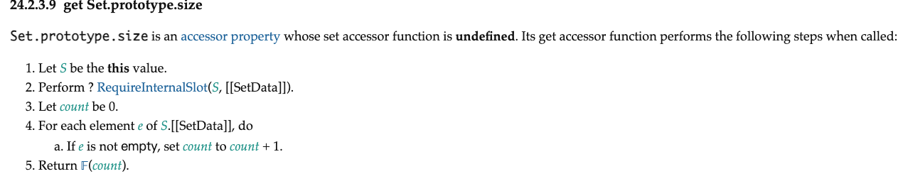

## 前言

从本节开始，我们将介绍集合类型数据的响应式方案。集合类型包括 Map/Set 以及 WeakMap/WeakSet.使用 Proxy 代理集合类型的数据不用与代理普通对象，因为集合类型数据的操作与普通对象存在很大的不同。下面总结了 Set 和 Map 这两个数据类型的原型属性和方法。

Set 类型的原型属性和方法如下。

- size: 返回集合中元素的数量
- add(value): 向集合中添加给定的值
- clear(): 清空结合
- delete(value): 从集合中删除给定的值
- has(value): 判断集合中是否存在给定的值
- keys(): 返回一个迭代器对象。可用于 for...of 循环，迭代器对象产生的值为集合中的元素值
- values(): 对于 Set 集合来说，keys()与 values()等价
- entries(): 返回一个迭代器对象。迭代过程中为集合中的每一个元素产生一个数组值[value, value]
- forEach(callback[, thisArg]): forEach 函数会遍历集合中的所有元素，并对每一个元素调用 callback 函数。forEach 函数接收可选的第二个参数 thisArg,用于指定 callback 函数执行时 this 值

Map 类型的原型属性和方法如下。

- size: 返回 Map 数据中的键值对数量
- clear(): 清空 Map
- delete(key): 删除指定 key 的键值对
- has(key): 判断 Map 中是否存在指定 key 的键值对
- get(key): 读取指定 key 的键值对
- set(key,value): 为 Map 设置新的键值对
- keys(): 返回一个迭代器对象。迭代过程中会产生键值对的 key 值
- values(): 返回一个迭代器对象。迭代过程中会产生键值对的 value 值
- entires(): 返回一个迭代器对象。迭代过程中会产生由[key, value]组成的数组值
- forEach(callback[, thisArg]): forEach 函数会遍历 Map 数据的所有键值对，并对每一个键值对调用 callback 函数。forEach 函数接收可选的第二个参数 thisArg,用于指定 callback 函数执行时的 this 值

观察上述列表可以发现，Map 和 Set 这两个数据类型的操作方法相似。它们之间最大的不同体现在，Set 类型使用 add(value)方法添加元素，而 Map 类型使用 set(key, value)方法设置键值对，并且 Map 类型可以使用 get(key)方法读取相应的值。既然两者如此相似，那么是不是意味着我们可以用相同的处理办法来实现对他们的代理呢？没错，接下来，我们就深入探讨如何实现对 Set 和 Map 类型数据的代理。

## 如何代理 Set 和 Map

前面讲到， Set 和 Map 类型的数据有特定的属性和方法用来操作自身。这一点与普通对象不同，如下面的代码所示:

```js
// 普通对象的读取和设置操作
const obj = { foo: 1 }
obj.foo // 读取属性
obj.foo = 2 // 设置属性

// 用get/set方法操作 Map 数据
const map = new Map()
map.set("key", 1) // 设置数据
map.get("key") // 读取数据
```

正是因为这些差异的存在，我们不能想代理普通对象那样代理 Set 和 Map 类型的数据。但整体思路不变，即当读取发生时，应该调用 track 函数建立响应联系；当设置操作发生时，应该调用 trigger 函数触发响应，例如:

```js
const proxy = reactive(new Map([["key", 1]]))

effect(() => {
	console.log(proxy.get("key")) // 读取键为 key 的值
})

proxy.set("key", 2) // 修改键为 key 的值，应该触发响应
```

当然，这段代码展示的效果是我们最终要实现的目标。但在动手之前，我们有必要先了解关于使用 Proxy 代理 Set 或 Map 类型数据的注意事项。

先来看一段代码，如下：

```js
const s = new Set([1, 2, 3])
const p = new Proxy(s, {})

console.log(p.size) // 报错 TypeError: Method get Set.prototype.size called on incompatible receiver
```

在这段代码中，我们首先定义了一个 Set 类型的数据 s，接着为它创建一个代理对象 p。由于代理的目标对象是 Set 类型，因此我们可以通过读取它的 p.size 属性获取元素的数量。但不幸的是，我们得到了一个错误。错误信息的大意是“在不兼容 receiver 上调用了 get Set.prototype.size 方法”。由此我们大概能猜到，size 属性应该是一个访问器属性，所以它作为方法被调用了。通过规范 24.2.3.9 查阅可以证实这一点,如图所示。



Set.prototype.size 是一个访问器属性，它的 set 访问器函数是 undefined，它的 get 访问器函数会执行以下步骤。

1. 让 S 的值为 this
2. 执行 ? RequireInternalSlot(S, [[SetData]])
3. 让 count 的值为 0
4. 对于 S.[[SetData]]中的每个元素 e，执行:

   a. 如果 e 不是空的，则将 count 设置为 count + 1

5. 返回 𝔽(count)

由此可知， Set.prototype.size 是一个访问器属性。这里的关键点在于第 1 步和第 2 步。根据第 1 步的描述: 让 S 的值为 this。这里的 this 是谁呢？
由于我们通过是通过代理对象 p 来访问 size 属性的，所以 this 就是代理对象 p。接着在第 2 步中，调用抽象方法 RequireInternalSlot(S, [[SetData]])来检查 S 是否存在内部槽[[SetData]]。很显然，代理对象 S 不存在[[SetData]]这个内部槽，于是会抛出一个错误，也就是前面例子中得到的错误。

为了修复这个问题，我们需要修正访问器属性的 getter 函数执行时的 this 指向，如下面的代码所示:

```js
const s = new Set([1, 2, 3])
const p = new Proxy(s, {
	get(target, key, receiver) {
		if (key === "size") {
			// 如果读取的是 size 属性
			// 通过指定第三个参数 receiver 为原始对象 target 从而修复问题
			return Reflect.get(target, key, target)
		}
		// 读取其他属性的的默认行为
		return Reflect.get(target, key, receiver)
	}
})

console.log(s.size) // 3
```

上面这段代码中，我们在创建代理对象时增加了 get 拦截函数。然后检查读取的属性名称是不是 size，如果是，则在调用 Reflect.get 函数时指定第三个参数为原始 Set 对象，这样访问器属性 size 的 getter 函数在执行时，其 this 指向的就是原始 Set 对象而非代理对象了。由于原始 Set 对象上存在[[SetData]]内部槽，因此程序得以正确运行。

接着，我们再来尝试从 Set 中删除数据，如下面的代码所示:

```js
const s = new Set([1, 2, 3])
const p = new Proxy(s, {
	get(target, key, receiver) {
		if (key === "size") {
			return Reflect.get(target, key, target)
		}
		// 读取其他属性的的默认行为
		return Reflect.get(target, key, receiver)
	}
})

// 调用 delete方法删除值为 1 的元素
// 会得到错误 TypeError: Method Set.prototype.delete called on incompatible receiver [object Object]
p.delete(1)
```

可以看到，调用 P.delete 方法时会得到一个错误，这个错误与前文讲解的访问 p.size 属性时发生的错误非常相似。为了搞清楚问题的原因，我们需要详细分析当调用 p.delete(1)方法时都发生了什么。

实际上，访问 p.size 与访问 p.delete 是不同的。这是因为 size 是属性，是一个访问器属性，而 delete 是一个方法。当访问 p.size 时，访问器属性的 getter 函数会立即执行。此时我们可以用过修改 receiver 来改变 getter 函数的 this 指向。而当访问 p.delete 时，delete 方法并没有执行，真正使其执行的语句是 p.delete(1)这句函数调用。因此，无论怎么修改 receiver，delete 方法执行时的 this 都会指向代理对象 p,而不会指向原始 Set 对象。想要修复这个问题也不难，只需要把 delete 方法与原始数据对象绑定即可，如以下代码:

```js
const s = new Set([1, 2, 3])
const p = new Proxy(s, {
	get(target, key, receiver) {
		if (key === "size") {
			return Reflect.get(target, key, target)
		}
		// 将方法与原始数据对象 target 比绑定后返回
		return target[key].bind(target)
	}
})

// 调用 delete方法删除值为 1 的元素, 正确执行
p.delete(1)
```

在上面这段代码中，我们使用 target[key].bind(target)代替了 Reflect.get(target,key,receiver)。可以看到，我们使用 bind 函数将用于操作数据的方法与原始数据对象 target 做了绑定。这样当 p.delete(1)语句执行时，delete 函数的 this 总是指向原始数据对象而非代理对象，于是代码能够正确执行。

最后，为了后续讲解方便以及代码的可扩展性，我们将 new Proxy 也封装到前文介绍的 createReactive 函数中:

```js
const reactiveMap = new Map()
// reactive 函数与之前相比并没有变化
function reactive(obj) {
	const existProxy = reactiveMap.get(obj)
	if (existProxy) return existProxy
	const proxy = createReactive(obj)

	reactiveMap.set(obj, proxy)

	return proxy
}
// 在 createReactive 里封装了用于代理 Set/Map 类型数据的逻辑
function createReactive(obj, isShallow = false, isReadonly = false) {
	return new Proxy(obj, {
		get(target, key, receiver) {
			if (key === "size") {
				return Reflect.get(target, key, target)
			}

			return target[key].bind(target)
		}
	})
}
```

这样，我们就可以很简单地创建代理数据了:

```js
const p = reactive(new Set([1, 2, 3]))
console.log(p.size) // 3
```

## 建立响应联系

了解了为 Set 和 Map 类型数据创建代理时的注意事项之后，我们就可以着手实现 Set 类型数据的响应式方案了。其实思路并不复杂，以下面的代码为例:

```js
const p = reactive(new Set([1, 2, 3]))

effect(() => {
	// 在副作用函数中访问 size 属性
	console.log(p.size)
})

// 添加值为 1 的元素， 应该触发响应
p.add(1)
```

这段代码展示了响应式 Set 类型数据的工作方式。首先，在副作用函数内访问了 p.size 属性；接着，调用 p.add 函数向集合中添加数据。由于这个行为会间接改变集合的 size 属性值，所以我们期望副作用函数会重新执行。为了实现这个目标，我们需要在访问 size 属性时调用 track 函数进行依赖追踪，然后在 add 方法执行时调用 trigger 函数触发响应。下面的代码展示了如何进行依赖追踪:

```js
function createReactive(obj, isShallow = false, isReadonly = false) {
	return new Proxy(obj, {
		get(target, key, receiver) {
			if (key === "size") {
				// 调用 track 函数建立响应联系
				track(target, ITERATE_KEY)
				return Reflect.get(target, key, target)
			}

			return target[key].bind(target)
		}
	})
}
```

可以看到，当读取 size 属性时，只需要调用 track 函数建立响应联系即可。这里需要注意的是，响应联系需要建立在 ITERATE_KEY 与副作用函数之间，这是因为任何新增、删除操作都会影响 size 属性。接着，我们来看如何触发响应。当调用 add 方法向集合中添加新元素时，应该怎么触发响应呢？很显然，这需要我们实现一个自定义的 add 方法才行，如以下代码所示:

```js
// 定义一个对象, 将自定义的add方法定义到该对象下
const mutableInstrumentations = {
	add(key) {
		/* ... */
	}
}

function createReactive(obj, isShallow = false, isReadonly = false) {
	return new Proxy(obj, {
		get(target, key, receiver) {
			// 如果读取的是 raw 属性， 则返回原始数据 target
			if (key === "raw") return target
			if (key === "size") {
				track(target, ITERATE_KEY)
				return Reflect.get(target, key, target)
			}

			// 返回定义在 mutableInstrumentations 对象下的方法
			return mutableInstrumentations[key]
		}
	})
}
```

首先，定义一个对象 mutableInstrumentations，我们会将所有自定义实现的方法都定义到该对象下，例如 mutableInstrumentations.add 方法。然后，在 get 拦截函数内返回定义在 mutableInstrumentations 对象中的方法。这样，当通过 p.add 获取方法时，得到的就是我们自定义的 mutableInstrumentations.add 方法了。有了自定义实现的方法后，就可以在其中调用 trigger 函数触发响应了:

```js
const mutableInstrumentations = {
	add(key) {
		// this 仍然指向的是代理对象， 通过 raw 属性获取原始数据对象
		const target = this.raw
		// 通过原始数据对象执行 add 方法添加具体的值
		// 注意，这里不再需要 .bind了，因为是直接通过 target 调用并执行的
		const res = target.add(key)
		// 调用 trigger 函数触发响应， 并指定操作类型为 ADD
		trigger(target, key, "ADD")
		// 返回操作结果
		return res
	}
}
```

如上面的代码所示，自定义的 add 函数内的 this 仍然指向代理对象，所以需要通过 this.raw 获取原始数据对象。有了原始数据对象后，就可以通过它调用 target.add 方法，这样就不再需要 .bind 绑定了。待添加操作完成后，调用 trigger 函数触发响应。需要注意的是，我们指定了操作类型为 ADD，这一点很重要。还记得 trigger 函数的实现？我们来回顾一下，如下面的代码片段所示:

```js
function trigger(target, key, type, newVal) {
	const depsMap = bucket.get(target)
	if (!depsMap) return
	const effects = depsMap.get(key)

	// 省略无关内容

	// 当操作类型 type 为 ADD 时，会取出与 ITERATE_KEY 相关联的副作用函数并执行
	if (type === "ADD" || type === "DELETE") {
		const iterateEffects = depsMap.get(ITERATE_KEY)
		iterateEffects &&
			iterateEffects.forEach((effectFn) => {
				if (effectFn !== activeEffect) {
					effectsToRun.add(effectFn)
				}
			})
	}

	effectsToRun.forEach((effectFn) => {
		if (effectFn.options.scheduler) {
			effectFn.options.scheduler(effectFn)
		} else {
			effectFn()
		}
	})
}
```

当操作类型时 ADD 或 Delete 时，会取出与 ITERATE_KEY 相关联的副作用函数并执行，这样就可以触发通过访问 size 属性所收集的副作用函数来执行了。

当然，如果调用 add 方法添加的元素已经存在于 Set 集合中了，就不要再触发响应了，这样做对性能更加友好，因此，我们可以对代码做如下优化:

```js
const mutableInstrumentations = {
	add(key) {
		// this 仍然指向的是代理对象， 通过 raw 属性获取原始数据对象
		const target = this.raw
		// 先判断值是否已经存在
		const hadKey = target.has(key)
		// 通过原始数据对象执行 add 方法添加具体的值
		// 注意，这里不再需要 .bind了，因为是直接通过 target 调用并执行的
		const res = target.add(key)
		// 调用 trigger 函数触发响应， 并指定操作类型为 ADD
		// 只有在值不存在的情况下，才需要触发响应
		if (!hadKey) {
			trigger(target, key, "ADD")
		}
		// 返回操作结果
		return res
	}
}
```

在上面这段代码中， 我们先调用 target.has 方法判断值是否已经存在，只有在值不存在的情况才需要触发响应。

在此基础上，我们可以按照类似的思路轻松地实现 delete 方法:

```js
const mutableInstrumentations = {
	delete(key) {
		// this 仍然指向的是代理对象， 通过 raw 属性获取原始数据对象
		const target = this.raw
		// 先判断值是否已经存在
		const hadKey = target.has(key)
		// 通过原始数据对象执行 delete 方法删除具体的值
		// 注意，这里不再需要 .bind了，因为是直接通过 target 调用并执行的
		const res = target.delete(key)
		// 调用 trigger 函数触发响应， 并指定操作类型为 DELETE
		// 只有在要删除的值存在的情况下，才需要触发响应
		if (hadKey) {
			trigger(target, key, "DELETE")
		}
		// 返回操作结果
		return res
	}
}
```

如上面代码所示，与 add 方法的区别在于，delete 方法只有在要删除的元素在集合中存在时，才需要触发响应，这一点恰好与 add 方法相反。

## 避免污染原始数据

本节中，我们借助 Map 类型的 set 和 get 这两个方法来讲解什么是“避免污染原始数据”及其原因。

Map 数据类型拥有 get 和 set 这两个方法，当调用 get 方法读取数据时，需要调用 track 函数追踪也依赖建立响应联系；当调用 set 方法设置数据时，需要调用 trigger 方法触发响应。如下面的代码所示:

```js
const p = reactive(new Map([["key", 1]]))

effect(() => {
	console.log(p.get("key"))
})

p.set("key", 2) // 触发响应
```

其实想要实现上面这段代码所展示的功能并不难，因为我们已经有了实现 add、delete 等方法的经验。下面是 get 方法的具体实现:

```js
const mutableInstrumentations = {
	get(key) {
		// 获取原始对象
		const target = this.raw
		// 判断读取的 key 是否存在
		const had = target.has(key)
		// 追踪依赖 建立响应联系
		track(target, key)
		// 如果存在，则返回结果。 这里要注意的是， 如果得到的结果 res 仍然是可代理的数据，
		// 则要返回使用 reactive 包装后的响应式数据
		if (had) {
			const res = target.get(key)
			return typeof res === "object" ? reactive(res) : res
		}
	}
}
```

如上面的代码及注释所示， 整体思路非常清晰。这里有一点需要注意， 在非浅响应的情况下， 如果得到的数据仍然可以被代理，那么要调用 reactive(res)将数据转换成响应式数据后返回。在浅响应模式下，就不需要这一步了。 由于前文 讲解过如何实现浅响应，因此这里不再详细讨论。

接着，我们来讨论 set 方法的实现。 简单来说，当 set 方法被调用时，需要调用 trigger 方法触发响应。只不过在触发响应的时候，需要区分操作类型时 SET 还是 ADD，如下面的代码所示:

```js
const mutableInstrumentations = {
	set(key, value) {
		const target = this.raw
		const had = target.has(key)
		// 获取旧值
		const oldValue = target.get(key)
		// 设置新值
		target.set(key, value)
		// 如果不存在， 则说明是 ADD 类型的操作， 意味着新增
		if (!had) {
			trigger(target, key, "ADD")
		} else if (oldValue !== value || (oldValue === oldValue && value === value)) {
			// 如果存在，并且值变了， 则是 SET类型的操作，意味着修改
			trigger(target, key, "SET")
		}
	}
}
```

这段代码的关键点在于，我们需要判断设置的 key 是否存在，以便区分不同的操作类型。我们知道，对于 SET 类型和 ADD 类型的操作来说，它们最终触发的副作用函数是不同的。因为 ADD 类型会对数据的 size 属性产生影响，所以任何依赖 size 属性的副作用函数都需要在 ADD 类型的操作发生时重新执行。

上面给出的 set 函数的实现能够正常工作，但它仍然存在问题，即 set 方法会污染原始数据。这是什么意思呢？ 来看下面的代码:

```js
// 原始 Map 对象 m
const m = new Map()
// p1 是 m 的代理对象
const p1 = reactive(m)
// p2 是另外一个代理对象
const p2 = reactive(new Map())
// 为 p1 设置一个键值对， 值是代理对象 p2
p1.set("p2", p2)

effect(() => {
	// 注意，这里我们通过原始数据 m 访问 p2
	console.log(m.get("p2").size)
})

// 注意，这里我们通过原始数据 m 为 p2 设置一个键值对 foo => 1
m.get("p2").set("foo", 1)
```

在这段代码中，我们首先创建了一个原始 Map 对象 m，p1 是对象 m 的代理对象，接着创建另外一个代理对象 p2，并将其作为值设置给 p1，即 p1.set('p2',p2)。接下来问题出现了，在副作用函数中，我们通过原始数据 m 来读数据值，然后有通过原始数据 m 设置数据值，此时发现副作用函数重新执行了。这其实不是我们所期望的行为，因为原始数据不应该具有响应式数据的能力，否则就意味用户既可以操作原始数据，有能够操作响应式数据，这样依赖代码就乱套了。

那么，导致问题的原因是什么呢？ 其实很简单，观察我们前面实现的 set 方法:

```js
const mutableInstrumentations = {
	set(key, value) {
		const target = this.raw
		const had = target.has(key)
		const oldValue = target.get(key)
		// 我们把 value 原封不动地色号哈哈哈哈只到原始数据上
		target.set(key, value)
		if (!had) {
			trigger(target, key, "ADD")
		} else if (oldValue !== value || (oldValue === oldValue && value === value)) {
			trigger(target, key, "SET")
		}
	}
}
```

在 set 方法内，我们吧 value 原样设置到了原始数据 target 上。如果 value 是响应式数据，就意味着设置到原始对象上的也是响应式数据，我们把**响应式数据设置到原始数据上的行为称为数据污染**。

要解决数据污染也不难， 只需要在调用 target.get 函数设置值之前对值进行检查即可: 只要发现即将要设置的值是响应式数据，那么就通过 raw 属性获取原始数据，再把原始数据设置到 target 上，如果下面的代码所示:

```js
const mutableInstrumentations = {
	set(key, value) {
		const target = this.raw
		const had = target.has(key)
		const oldValue = target.get(key)
		// 获取原始数据， 由于 value 本身可能已经是原始数据，所以此时 value.raw 不存在，则直接使用 value
		const rawValue = value.raw || value
		target.set(key, value)
		if (!had) {
			trigger(target, key, "ADD")
		} else if (oldValue !== value || (oldValue === oldValue && value === value)) {
			trigger(target, key, "SET")
		}
	}
}
```

现在的实现不会造成数据污染了。不过，细心观察上面的代码，会发现新的问题。我们一直使用 raw 属性来访问原始数据是有缺陷的，因为它可能与用户自定义的 raw 属性冲突，所以在一个严谨的实现中，我们需要使用唯一的标识来作为访问原始数据的键，例如使用 Symbol 类型来代替。

本节中，我们通过 Map 类型数据的 set 方法讲解了关于避免污染原始数据的问题。其实出了 set 方法需要避免污染原始数据之外，Set 类型的 add 方法、普通对象的写值操作，还有为数组添加元素的方法等，都需要做类似的处理。

## 处理 forEach

集合类型的 forEach 方法类似于数组的 forEach 方法，我们先来看看它是如何工作的:

```js
const m = new Map([[{ key: 1 }, { value: 1 }]])

effect(() => {
	m.forEach(function (value, key, m) {
		console.log(value) // { value: 1 }
		console.log(key) // { key: 1 }
	})
})
```

以 Map 为例，forEach 方法接受一个回调函数作为参数，该回调函数会在 Map 的每个键值对上被调用。回调函数接收三个参数，分别是值、键、以及原始 Map 对象。如上面的代码所示，我们可以使用 forEach 方法遍历 Map 数据的每一组键值对。

遍历操作只与键值对的数量有关，因此任何会修改 Map 对象键值对数量的操作都应该触发副作用函数重新执行，例如 delete 和 add 方法等。所以当 forEach 函数被调用时，我们应该让副作用函数与 ITERATE_KEY 建立响应联系，如下面的代码所示:

```js
const mutableInstrumentations = {
	forEach(callback) {
		// 取得原始数据对象
		const target = this.raw
		// 与 ITERATE_KEY 建立响应联系
		track(target, ITERATE_KEY)
		// 通过原始数据对象调用 forEach 方法，并把callback传递过去
		target.forEach(callback)
	}
}
```

这样我们就实现了对 forEach 操作的追踪，可以使用下面代码进行测试：

```js
const p = reactive(new Map([[{ key: 1 }, { value: 1 }]]))

effect(() => {
	p.forEach(function (value, key, m) {
		console.log(value) // { value: 1 }
		console.log(key) //  { key: 1 }
	})
})

// 能够触发响应
p.set({ key: 2 }, { value: 2 })
```

可以发现，这段代码能够按照预期工作。然而，上面给出的 forEach 函数仍然存在缺陷，我们在自定义实现的 forEach 方法内，通过原始对象调用了原生的 forEach 方法，即

```js
// 通过原始数据对象调用 forEach 方法，并把 callback 传递过去
target.forEach(callback)
```

这意味着， 传递给 callback 回调函数的参数将是非响应式数据。这导致下面的代码不能按预期工作:

```js
const key = { key: 1 }
const value = new Set([1, 2, 3])

const p = reactive(new Map([[key, value]]))

effect(() => {
	p.forEach(function (value, key) {
		console.log(value.size) // 3
	})
})

p.get(key).delete(1)
```

在上面这段代码中，响应式数据 p 有一个键值对，其中键是普通对象{key:1},值是 Set 类型的原始数据 new Set([1, 2, 3])。接着，我们在副作用函数中使用 forEach 方法遍历 p，并在回调函数中访问 value.size。最后，我们尝试删除 Set 类型数据中值为 1 的元素，却发现没能触发副作用函数重新执行。导致问题的原因就在上面曾提到，当通过 value.size 访问 size 属性时，这里的 value 是原始数据对象，即 new Set([1, 2, 3])，而非响应式数据对象，因此无法建立响应联系。但这其实不符合直觉，因为 reactive 本身是深响应，forEach 方法的回调函数所接收到的参数也应该是响应式数据才对。为了解决这个问题，我们需要对现有实现做一些修改，如下面的代码所示:

```js
const mutableInstrumentations = {
	forEach(callback) {
		// wrap 函数用来把可代理的值转换为响应式数据
		const wrap = (val) => (typeof val === "object" ? reactive(val) : val)
		// 取得原始数据对象
		const target = this.raw
		// 与 ITERATE_KEY 建立响应联系
		track(target, ITERATE_KEY)
		// 通过 target 调用原始 forEach 方法遍历
		target.forEach((v, k) => {
			// 手动调用 callback, 用 wrap 函数包裹 value 和 key 再传给 callback
			callback(wrap(v), wrap(k), this)
		})
	}
}
```

思路很简单，对 callback 参数做了一层包装，即把传递给 callback 函数的参数包装成响应式的。此时，如果再次尝试运行前面的例子，会发现能够按照预期共工作了。

最后，处于严谨性，还需要做一些补充。因为 forEach 函数处了接收 callback 作为参数之外，它还接收第二个参数，该参数可以用来指定 callback 函数执行时的 this 值。更加完善的实力如下:

```js
const mutableInstrumentations = {
	// 接收第二个参数
	forEach(callback, thisArg) {
		const wrap = (val) => (typeof val === "object" ? reactive(val) : val)
		const target = this.raw
		track(target, ITERATE_KEY)
		target.forEach((v, k) => {
			// 通过 .call 调用 callback,并传递 thisArg
			callback.call(thisArg, wrap(v), wrap(k), this)
		})
	}
}
```

至此，我们的工作仍然没有完成。现在我们知道，无论是使用 for...in 循环遍历一个对象，还是使用 forEach 循环遍历一个集合，它们的响应联系都是建立在 ITERATE_KEY 与副作用函数之间的。然而，使用 for...in 来遍历对象与使用 forEach 遍历集合之间存在本质的不同。具体体现在，当使用 for...in 循环遍历对象时，它值关心对象的键，而不关心对象的值，如以下代码所示:

```js
effect(() => {
	for (const key in obj) {
		console.log(key)
	}
})
```

只有当新增、删除对象的 key 时，才需要重新执行副作用函数。所以我们在 trigger 函数内判断操作类型是否是 ADD 或 DELETE,进而知道是否需要触发那些与 ITERATE_KEY 相关联的副作用函数重新执行。对于 SET 类型的操作来说，因为它不会改变一个对象的键的数量，所以当 SET 类型的操作发生时，不需要触发副作用函数重新执行。

但这个规则不适用 Map 类型的 forEach 遍历，如以下代码所示:

```js
const p = reactive(new Map([["key", 1]]))

effect(() => {
	p.forEach(function (value, key) {
		// forEach 循环不仅关心集合的键，还关心集合的值
		console.log(value) // 1
	})
})

p.set("key", 2) // 即使操作类型时 SET，也应该触发响应
```

当使用 forEach 遍历 Map 类型的数据时，它既关心键，又关心值。这意味着，当调用 p.set('key','2')修改值的时候，也应该触发副作用函数重新执行，即使它的操作类型时 SET。因此，我们应该修改 trigger 函数的代码来弥补这个缺陷:

```js
// 依赖触发
function trigger(target, key, type, newVal = undefined) {
	console.log("trigger", key)
	const depsMap = bucket.get(target)

	if (!depsMap) return true

	const effects = depsMap.get(key)

	const iterateEffects = depsMap.get(ITERATE_KEY)

	const effectsToRun: Set<any> = new Set()

	effects &&
		effects.forEach((effectFn) => {
			if (effectFn !== activeEffect) {
				effectsToRun.add(effectFn)
			}
		})

	if (
		type === "ADD" ||
		type === "DELETE" ||
		// 如果操作类型是SET，并且目标对象是Map类型的数据,
		// 也应该触发那些与 ITERATE_KEY 相关联的副作用函数重新执行
		(type === "SET" && Object.prototype.toString.call(target) === "[object Map]")
	) {
		iterateEffects &&
			iterateEffects.forEach((effectFn) => {
				if (effectFn !== activeEffect) {
					effectsToRun.add(effectFn)
				}
			})
	}

	// 省略部分内容

	effectsToRun.forEach((effectFn) => {
		if (effectFn.options.scheduler) {
			effectFn.options.scheduler(effectFn)
		} else {
			effectFn()
		}
	})
}
```

如上面的代码所示， 我们增加了一个判断条件: 如果操作的目标对象是 Map 类型的，则 SET 类型的操作也应该触发那些与 ITERATE_KEY 相关联的副作用函数重新执行。

## 迭代器方法

接下来，我们讨论关机集合类型的迭代器方法，实际上前面讲解如何拦截 for...of 循环遍历数组的时候介绍过迭代器的相关知识。集合类型有三个迭代器方法：

- entries
- keys
- values

调用这些方法会得到相应的迭代器，并且可以使用 for...of 进行循环迭代，例如:

```js
const m = new Map([["key1", "value1"][("key2", "value2")]])

for (const [key, value] of m.entries()) {
	console.log(key, value)
}

// 输出:
// key1 value1
// key2 value2
```

另外， 由于 Map 或 Set 类型本身部署了 Symbol.iterator 方法，因此它们可以使用 for...of 进行迭代:

```js
for(const [key,value] m) {
	console.log(key,value)
}

// 输出:
// key1 value1
// key2 value2

```

当然，我们也可以调用迭代器函数取得迭代器对象后，手动调用迭代器对象的 next 方法获取对应的值:

```js
const itr = m[Symbol.iterator]()

console.log(itr.next()) // { value: ['key1', 'value1'], done: false }
console.log(itr.next()) // { value: ['key2', 'value2'], done: false }
console.log(itr.next()) // { value: undefined, done: true }
```

实际上， m[Symbol.iterator] 与 m.entries 是等价的:

```js
console.log(m[Symbol.iterator] === m.entries) // true
```

这就是为什么上例中使用 for...of 循环迭代 m.entries 和 m 会得到同样的结果。

理解了这些内容之后，我们就可以尝试实现对迭代器方法的代理了，不过这之前，不妨做一些尝试，看看会发生什么，如以下代码所示:

```js
const p = reactive(
	new Map([
		["key1", "value1"],
		["key2", "value2"]
	])
)

effect(() => {
	// TypeError: p is not iterable
	for (const [key, value] of p) {
		console.log(key, value)
	}
})

p.set("key3", "value3")
```

在这段代码中，我们首先创建一个代理对象 p，接着尝试使用 for...of 循环遍历它，却得到了一个错误: "p 是不可迭代的"。我们知道一个对象能否迭代，取决于该对象是否实现了迭代协议，如果一个对象正确地实现了 Symbol.iterator 方法，那么它就是可迭代的。很显然，代理对象 p 没有实现 Symbol.iterator 方法，因此我们得到了上面的错误。

但实际上，当我们使用 for...of 循环迭代一个代理对象时，内部会试图从代理对象 p 上读取 p[Symbol.iterator]属性，这个操作会触发 get 拦截函数，所以我们仍然可以把 Symbol.iterator 方法的实现放到 mutableInstrumentations 中，如以下代码所示:

```js
const mutableInstrumentations = {
	[Symbol.iterator]() {
		// 获取原始数据对象
		const target = this.raw
		// 获取原始迭代器方法
		const itr = target[Symbol.iterator]()
		// 将其返回
		return itr
	}
}
```

实现很简单，不过是把原始迭代器对象返回而已，这样就能够使用 for...of 循环迭代代理对象 p 了，然而事情不可能那么简单。在前面讲解 forEach 方法时我们提到过，传递给 callback 的参数是包装后的响应式数据，如:

```js
p.forEach((value, key) => {
	// value 和 key 如果可以被代理， 那么它们就是代理对象，即响应式数据
})
```

同理，使用 for...of 循环迭代集合时，如果迭代产生的值也是可以被代理的，那么也应该将其包装成响应式数据，例如:

```js
const (const [key, value] of p) {
	// 期望 key 和 value 是响应式数据
}
```

因此，我们需要修改代码:

```js
const mutableInstrumentations = {
	[Symbol.iterator]() {
		// 获取原始数据对象
		const target = this.raw
		// 获取原始迭代器方法
		const itr = target[Symbol.iterator]()

		const wrap = (val) => (typeof val === "object" && val !== null ? reactive(val) : val)

		// 返回自定义的迭代器
		return {
			next() {
				// 调用原始迭代器的 next 方法 获取value 和 done
				const { value, done } = itr.next()
				return {
					// 如果 value 不是 undefined, 则对其进行包裹
					value: value ? [wrap(value[0]), wrap(value[1])] : value,
					done
				}
			}
		}
	}
}
```

如以上代码所示， 为了实现对 key 和 value 的包装，我们需要自定义实现的迭代器，在其中调用原始迭代器获取值 value 以及代表是否结束的 done。如果值 value 不是 undefined，则对其进行包装，最后返回包装后的代理对象，这样当使用 for...of 循环进行迭代时，得到的值就会是响应式数据了。

最后，为了追踪 for...of 对数据的迭代操作，我们还需要调用 track 函数，让副作用函数与 ITERATOR_KEY 建立联系:

```js
const mutableInstrumentations = {
	[Symbol.iterator]() {
		// 获取原始数据对象
		const target = this.raw
		// 获取原始迭代器方法
		const itr = target[Symbol.iterator]()

		const wrap = (val) => (typeof val === "object" && val !== null ? reactive(val) : val)

		// 调用 track 函数建立响应联系
		track(target, ITERATOR_KEY)

		// 返回自定义的迭代器
		return {
			next() {
				// 调用原始迭代器的 next 方法 获取value 和 done
				const { value, done } = itr.next()
				return {
					// 如果 value 不是 undefined, 则对其进行包裹
					value: value ? [wrap(value[0]), wrap(value[1])] : value,
					done
				}
			}
		}
	}
}
```

由于迭代操作与集合中元素的数量有关，所以只要集合的 size 发生变化，就应该触发迭代操作重新执行。 因此，我们在调用 track 函数时让 ITERATOR_KEY 与副作用函数建立联系。完成这一步后，集合的响应式数据功能就相对完整了，我们可以通过如果下代码测试一下:

```js
const p = reactive(
	new Map([
		["key1", "value1"],
		["key2", "value2"]
	])
)

effect(() => {
	for (const [key, value] of p) {
		console.log(key, value)
	}
})

p.set("key3", "value3") // 能够触发响应
```

前面我们说过，由于 p.entries 与 p[Symbol.iterator]等价，所以我们使用同样的代码来实现对 p.entries 函数的拦截，如一下代码所示:

```js
const mutableInstrumentations = {
	// 公用 iterationMethod 方法
	[Symbol.iterator]: iterationMethod,
	entries: iterationMethod
}

// 抽离为独立的函数，便于复用
function iterationMethod() {
	// 获取原始数据对象
	const target = this.raw
	// 获取原始迭代器方法
	const itr = target[Symbol.iterator]()

	const wrap = (val) => (typeof val === "object" && val !== null ? reactive(val) : val)

	// 调用 track 函数建立响应联系
	track(target, ITERATOR_KEY)

	// 返回自定义的迭代器
	return {
		next() {
			// 调用原始迭代器的 next 方法 获取value 和 done
			const { value, done } = itr.next()
			return {
				// 如果 value 不是 undefined, 则对其进行包裹
				value: value ? [wrap(value[0]), wrap(value[1])] : value,
				done
			}
		}
	}
}
```

但是当你尝试运行代码使用 for...of 进行迭代时，会得到一个错误:

```js
// TypeError: p.entries is not a function or its return value is not iterable
for (const [key, value] of p.entries()) {
	console.log(key, value)
}
```

错误的大意是 p.entries 的返回值不是一个可迭代对象。很显然，p.entries 函数返回的是一个对象，该对象带有 next 方法，但不具有 Symbol.iterator 方法，因此它确实不是一个可迭代对象。这里是经常出错的地方，大家切勿把可迭代协议与迭代器协议搞混。可迭代协议指的是一个对象实现了 Symbol.iterator 方法，而迭代器协议指的是一个对象实现了 next 方法。但一个对象可以同时实现可迭代协议和迭代器协议，例如:

```js
const obj = {
	// 迭代器协议
	next() {
		// ...
	}
	// 可迭代协议
	[Symbol.iterator]() {
		return this
	}
}
```

所以解决问题的方法也自然而然地出现了:

```js
// 抽离为独立的函数，便于复用
function iterationMethod() {
	// 获取原始数据对象
	const target = this.raw
	// 获取原始迭代器方法
	const itr = target[Symbol.iterator]()

	const wrap = (val) => (typeof val === "object" && val !== null ? reactive(val) : val)

	// 调用 track 函数建立响应联系
	track(target, ITERATOR_KEY)

	// 返回自定义的迭代器
	return {
		next() {
			// 调用原始迭代器的 next 方法 获取value 和 done
			const { value, done } = itr.next()
			return {
				// 如果 value 不是 undefined, 则对其进行包裹
				value: value ? [wrap(value[0]), wrap(value[1])] : value,
				done
			}
		},
		// 实现可迭代协议
		[Symbol.iterator]() {
			return this
		}
	}
}
```

现在一切都能正常工作了。

## values 方法 与 keys 方法

values 方法的实现与 entries 方法类似，不同的是，当使用 for...of 迭代 values 时，得到的仅仅是 Map 数据的值，而非键值对:

```js
for (const value of p.values()) {
	console.log(value)
}
```

values 方法的实现如下:

```js
const mutableInstrumentations = {
	// 共用 iterationMethod 方法
	[Symbol.iterator]: iterationMethod,
	entries: iterationsMethod,
	values: valuesIterationMethod
}

function valuesIterationMethod() {
	// 获取原始数据对象 target
	const target = this.raw
	// 通过 target.values 获取原始迭代器方法
	const itr = target.values()

	const wrap = (val) => (typeof val === "object" ? reactive(val) : val)

	track(target, ITERATOR_KEY)

	// 将其返回
	return {
		next() {
			const { value, done } = itr.next()

			return {
				// value 是值， 而非键值对， 所以只需要包裹 value 即可
				value: wrap(value),
				done
			}
		},

		[Symbol.iterator]() {
			return this
		}
	}
}
```

其中，valuesIterationMethod 与 iterationMethod 这两个方法有两点区别:

- iterationMethod 通过 target[Symbol.iterator]获取迭代器对象，而 valueIterationMethod 通过 target.values 获取迭代器对象;
- iterationMethod 处理的是键值对，即 [Wrap(value[0]), wrap(value[1])], 而 valuesIterationMethod 只处理值，即 wrap(value)。

由于它们的大部分逻辑相同，所以我们可以将它们封装到一个客服用的函数中。但为了便于理解，这里仍然将它们设计为两个独立的函数来实现。

keys 方法与 values 方法非常类似，不同点在于，前者处理的是键而非值。因此，我们只需要修改 valuesIterationMethod 方法中的一行代码，即可实现对 keys 方法的代理。把下面这句代码:

```js
const itr = target.values()
```

替换成:

```js
const itr = target.keys()
```

这么做的确能够达到目的，但如果我们尝试运行如下测试用例，就会发现存在缺陷:

```js
const p = reactive(
	new Map([
		["key1", "value1"],
		["key2", "value2"]
	])
)

effect(() => {
	for (const value of p.keys()) {
		console.log(value) // key1 key2
	}
})

p.set("key2", "value3") // 这是一个 SET 类型操作， 它修改了 key2的值
```

在上面这段代码中， 我们使用了 for...of 循环来遍历 p.keys,然后调用 p.set('key2','value3')修改键为 key2 的值。在这个过程中，Map 类型数据的所有键都没有发生变化，仍然是 key1 和 key2，所以在理想情况下，副作用函数不应该执行。但如果你尝试运行上例，会发现副作用函数仍然重新执行了。

这是因为，我们对 Map 类型的数据进行了特殊处理。前文提到，即使操作类型为 SET，也会触发那些与 ITERATOR_KEY 相关联的副作用函数重新执行，
trigger 函数的带么可以证明这一点:

```js
function trigger(target, key, type, newVal) {
	// 省略其他代码

	if (
		type === "ADD" ||
		type === "DELETE" ||
		// 即使是 SET 类型的操作，也会触发那些与 ITERATE_KEY 相关联的副作用函数重新执行
		(type === "SET" && Object.prototype.toString.call(target) === "[object Map]")
	) {
		const iterateEffects = depsMap.get(ITERATE_KEY)
		iterateEffects &&
			iterateEffects.forEach((effectFn) => {
				if (effectFn !== activeEffect) {
					effectsToRun.add(effectFn)
				}
			})
	}

	// 省略其他代码
}
```

这对于 values 或 entries 等方法来说是必须的，但对于 keys 方法来说则没有必要，因为 keys 方法只关心 Map 类型数据的键的变化，而不关心值的变化。

解决办法很简单，如以下代码所示:

```js
const MAP_KEY_ITERATE_KEY = symbol()

function keyIterationMethod() {
	// 获取原始对象 target
	const target = this.raw
	// 获取原始迭代器方法
	const itr = target.keys()

	const wrap = (val) => (typeof val === "object" ? reactive(val) : val)

	// 调用 track 函数追踪依赖， 在副作用函数与 MAP_KEY_ITERATE_KEY 之间建立响应联系
	track(target, MAP_KEY_ITERATE_KEY)

	// 将其返回
	return {
		next() {
			const { value, done } = itr.next()
			return {
				value: wrap(value),
				done
			}
		},
		[Symbol.iterator]() {
			return this
		}
	}
}
```

在上面这段代码中，当调用 track 函数追踪依赖时，我们使用 MAP_KEY_ITERATE_KEY 代替了 ITERATOR_KEY。其中 MAP_KEY_ITERATE_KEY 与 ITERATOR_KEY 类似，是一个新的 Symbol 类型，用来作为抽象的键。这样就实现了依赖收集的分离，即 values 和 entries 等方法仍然依赖 ITERATOR_KEY,而 keys 方法则依赖 MAP_KEY_ITERATE_KEY。当 SET 类型的操作只会触发与 ITERATOR_KEY 相关联的副作用函数重新执行时,自然就会忽略那些与 MAP_KEY_ITERATE_KEY 相关联的副作用函数。但当 ADD 和 DELETE 类型的操作发生时，还需要触发与 MAP_KEY_ITERATE_KEY 相关联的副作用函数重新执行，因此我们需要修改 trigger 函数的代码，如下所示:

```js
function trigger(target, key, type, newVal) {
	// 省略其他代码
	if (
		// 操作类型为 ADD 或 DELETE
		(type === "ADD" || type === "DELETE") &&
		// 并且是 Map 类型的数据
		Object.prototype.toString.call(target) === "[object Map]"
	) {
		// 则取出那些与 MAP_KEY_ITERATE_KEY 相关联的副作用函数并执行
		const iterateEFfects = depsMap.get(MAP_KEY_ITERATE_KEY)
		iterateEffects &&
			iterateEffects.forEach((effectFn) => {
				if (effectFn !== activeEffect) {
					effectToRun.add(effectFn)
				}
			})
	}

	// 省略其他代码
}
```

这样就能够避免不必要的更新了:

```js
const p = reactive(
	new Map([
		["key1", "value1"],
		["key2", "value2"]
	])
)

effect(() => {
	for (const value of p.keys()) {
		console.log(value)
	}
})

p.set("key2", "value3") // 不会触发响应
p.set("key3", "value3") // 能够触发响应
```

## 总结

在 10-17 节中，主要讲解了非原始值的响应式方案，即对象的响应式方案。

### 第十节

我们首先介绍了 Proxy 和 Reflect。Vue.js 3 的响应式数据是基于 Proxy 实现的，Proxy 可以为其他对象创建了一个代理对象。所谓代理，指的是对一个对象**基本语义**的代理。它允许我们拦截并重新定义一个对象的基本操作。在实现代理的过程中，我们遇到了访问器 this 指向的问题，这需要使用 Reflect.\*方法并指定正确的 receiver 来解决。

### 第十一节

详细的讨论了 JavaScript 中对象的概念，以及 Proxy 的工作原理。在 ECMAScript 规范中，JavaScript 中有两种对象，其中一种叫作常规对象，另一种叫作异质对象。满足以下三点要求的对象就是常规对象:

- 对于该节中给出的内部方法，必须使用规范 10.1.x 节给出的定义实现；
- 对于内部方法[[Call]]，必须使用规范 10.21 节中给出的定义实现；
- 对于内部方法[[Construct]],必须使用规范 10.2.2 节给出的定义实现。

而所有不符合这三点要求的对象是异质对象。一个对象是函数还是其他对象，是由部署在该对象上的内部方法和内部槽决定的。

### 第十二节

接着，我们讨论了关于对象 Object 的代理。**代理对象的本质，就是查阅规范并找到可拦截的基本操作的方法。** 有一些操作并不是基本操作，而是符合操作，这需要我们查阅规范了解他们都依赖哪些基本操作，从而通过基本操作的拦截方法简介地处理复合操作。我们还详细分析了添加、修改、删除属性对 for...in 操作的影响，其中添加和删除属性都会影响 for...in 循环的执行次数，所以当这些操作发生时，需要触发与 ITERATE_KEY 相关联的副作用函数重新执行。而修改属性值则不影响 for...in 循环的执行次数，因此无须处理。

### 第十三节

我们还讨论了如何合理地触发副作用函数重新执行，包括对 NaN 的处理，以及访问原型链上的属性导致副作用函数重新执行两次的问题。对于 NaN，我们主要注意 NaN === NaN 永远等于 false。对于原型链属性问题，需要我们查阅规范定位问题的原因。由此可见，想要基于 Proxy 实现一个相对完善的响应系统，免不了去了解 ECMAScript 规范。

### 第十四节和第十五节

我们讨论了深响应与浅响应，以及深只读与浅只读。这里的深和浅指的是对象的层级，浅响应（或只读）代表仅代理一个对象的第一层属性，即只有对象的第一层属性值是响应(或只读)的。深响应(或只读)恰恰相反，为了实现深响应(或只读)，我们需要在返回属性值之前，对值做一层包装，将其包装为响应式（或只读）数据后再返回。

### 第十六节

我们讨论了关于数组的代理。数组是一个异质对象，因为数组对象部署的内部方法[[DefineOwnProperty]]不同于常规对象。通过索引为数组设置新的元素，可能会隐式地修改数组 length 属性的值。对应地，修改数组 length 属性的值，也可能间接影响数组中的已有元素。所以在触发响应的时候需要额外注意。我们还讨论了如何拦截 for...in 和 for...of 对数组的遍历奥做。使用 for...in 循环遍历数组与遍历普通对象区别不大，唯一需要注意的是，当追踪 for...in 操作时，应该使用数组的 length 作为追踪的 key。for...of 基于迭代协议工作，数组内建了 Symbol.iterator 方法。根据规范 23.1.5.1 节可知，数组迭代器执行时，会读取数组的 length 属性或数组索引。因此，我们不需要做其他额外的处理，就能够实现对 for...of 迭起的响应式支持。

我们还讨论了数组的查找方法。如 includes、indexOf 以及 lastIndexOf 等。对于数组元素的查找，需要注意的一点是，用户级可能使用代理对象进行查找，也可能使用原始对象进行查找。为了支持这两种形式，我们需要重写数组的查找方法。原理很简单，当用户使用这些方法查找元素时，我们可以先去代理对象中查找，如果找不到，再去原始数组中查找。

我们还介绍了隐藏修改数组长度的原型方法，即 push、pop、shift、unshift 以及 splice 等方法。调用这些方法会间接地读取和设置数组的 length 属性，因此，在不同的副作用函数内对同一个数组执行上述方法，会导致多个副作用函数之间循环调用,最终导致调用栈溢出。为了解决这个问题，我们使用一个标记变量 shouldTrack 来代表是否允许进行追踪，然后重写了上述这些方法，目的是，当这些方法间接读取 length 属性时，我们会先将 shouldTrack 的值设置为 false，即禁止追踪。这样就可以断开 length 属性与副作用函数之间的响应联系，从而避免循环调用导致的调用栈溢出。

### 第十七节

最后，我们讨论了关机集合类型数据的响应式方案。集合类型指 Set、Map、WeakSet 以及 WeakMap。我们讨论了使用 Proxy 为集合类型创建代理对象的一些注意事项。结合类型不同于普通对象，它有特定的数据操作方法。当使用 Proxy 代理结合类型的数据时要格外注意，例如，集合类型的 size 属性是一个访问器属性，当通过代理对象访问 size 属性时，由于代理对象本身并没有部署[[SetData]]这样的内部槽，所以会发生错误。另外，通过代理对象执行集合类型的奥做方法时，用注意这些方法执行时的 this 指向，我们需要在 get 拦截函数内通过.bind 函数为这些方法绑定正确的 this 值。

我们还讨论了集合类型响应式数据的实现。我们需要通过“重写”集合方法的方式来实现自定义的能力，当 Set 结合的 add 方法执行时，需要调用 trigger 函数触发响应。

我们也讨论了关于数据污染的问题。数据污染值的是不小心将响应式数据添加到原始数据中，它导致用户可以用过原始数据执行响应式相关操作，这不是我们所期望的。为了避免这类问题发生，我们通过响应式数据对象的 raw 属性来访问对应的原始数据对象，后续操作使用原始数据对象就可以了。

我们还讨论了关于结合类型的遍历，即 forEach 方法。集合的 forEach 方法与对象的 for...in 遍历类似，最大的不同体现在，当使用 for...in 遍历对象时，我们只关心对象的键是否变化，而不关心值；但使用 forEach 遍历集合时，我们即关心键的变化，也关心值的变化。额外的是，Set 类型的 forEach 只关心值的变化，不关心键的变化。
