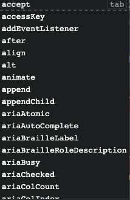

理解 HTML Attributes 和 DOM Properties 之间的差异和关联非常重要，这能够帮助我们合理地设计虚拟节点的结构，更是正确地为元素设置的关键。

我们从最基本的 HTML 说起。给出如下 HTML 代码:

```html
<input id="my-input" type="text" value="foo" />
```

HTML Attributes 指的就是定义在 HTML 标签上的属性，这里指的就是 id="my-input"、 type="text" 和 value="foo"。当浏览器解析 HTML 代码后，会创建一个与之相符的 DOM 元素对象，我们可以通过 JavaScript 代码来读取该 DOM 对象:

```js
const el = document.querySelector("#my-input")
```

这个 DOM 对象包含很多**属性**(properties),如图所示。



这些属性就是所谓的 DOM Properties。很多 HTML Attributes 在 DOM 对象上有与之同名的 DOM Properties，例如 id='my-input'对应 el.id,type='text'对应 el.type，value='foo'对应 el.value 等。但 DOM Properties 与 HTML Attributes 的名字不总是一模一样的，例如:

```html
<div class="foo"></div>
```

class='foo'对应的 DOM Properties 则是 el.className。另外，并不是所有 HTML Attributes 都有与之对应的 DOM Properties，例如:

```html
<div aria-valuenow="75"></div>
```

aria-\*类的 HTML Attributes 就没有与之对应的 DOM Properties。

类似地，也不是所有 DOM Properties 都有与之对应的 HTML Attributes，例如可以用 el.textContent 来设置元素的文本内容，但没有与之对应的 HTML Attributes 来完成同样的工作。

HTML Attributes 的值与 DOM Properties 的值之间是有关联的，例如下面的 HTML 片段：

```js
<div id="foo"></div>
```

这个片段描述了一个具有 id 属性的 div 标签。其中，id='foo'对应的 DOM Properties 是 el.id,并且值为字符串'foo'。我们把这种 HTML Attributes 与 DOM Properties 具有相同名称的属性看做直接映射。但并不是所有 HTML Attributes 与 DOM Properties 之间都是直接映射的关系，例如:

```html
<input value="foo" />
```

这是一个具有 value 属性的 input 标签。如果用户没有修改文本框的内容，那么通过 el.value 读取对应的 DOM Properties 的值就是字符串'foo'。而如果用户修改了文本框的值，那么 el.value 的值就是当前文本框的值。例如，用户将文本框的内容修改为'bar',那么:

```js
console.log(el.value) // 'bar'
```

但如果运行下面的代码，会发生”奇怪“的现象：

```js
console.log(el.getAttribute("value")) // 仍然是 'foo'
console.log(el.value) // 'bar'
```

可以发现，用户对文本框内容的修改并不会影响 el.getAttribute('value')的返回值，这个现象蕴含着 HTML Attributes 所代表的意义。实际上，HTML Attributes 的作用是设置与之对应的 DOM Properties 的初始值。一旦值改变，那么 DOM Properties 始终存储着当前值，而通过 getAttribute 函数得到的仍然是初始值。

但我们仍然可以通过 el.defaultValue 来访问初始值，如下面的代码所示:

```js
el.getAttribute("value") // 仍然是 'foo'
el.value // 'bar'
el.defaultValue // 'foo'
```

这说明一个 HTML Attributes 可能关联多个 DOM Attributes。例如在上例中，value='foo'与 el.value 和 el.defaultValue 都有关联。

虽然我们可以认为 HTML Attributes 是用来设置与之对应的 DOM Properties 的初始值的，但有些值是受限制的，就好像浏览器内部做了默认值校验。如果你通过 HTML Attributes 提供的默认值不合法，那么浏览器会使用内建的合法值作为对应的 DOM Properties 的默认值，例如:

```js
<input type="foo" />
```

我们知道，为`<input/>`标签的 type 属性置顶字符串'foo'时不合法的，因此浏览器会矫正这个不合法的值。所以当我们尝试读取 el.type 时，得到的其实是矫正后的值，即字符换'text',而非字符串'foo':

```js
console.log(el.type) // 'text'
```

从上述分析来看，HTML Attributes 与 DOM Properties 之间的关系很复杂，但我们只需要记住一个核心原则即可: **HTML Attributes 的作用是设置与之对应的 DOM Properties 的初始值**。
