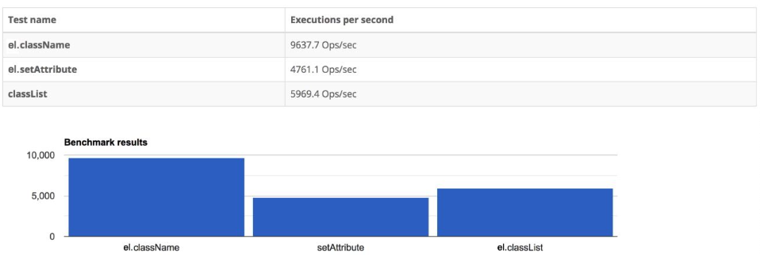

在上一节中，我们讲解了如何正确地把 vnode.props 中定义的属性设置到 DOM 元素上。但在 Vue.js 中，仍然有一些属性需要特殊处理，比如 class 属性。为什么需要对 class 属性进行特殊处理呢？这是因为 Vue.js 对 class 属性做了增强。在 Vues.js 中为元素设置类名有以下几种方式。

方式一: 指定 class 为一个字符串值。

```html
<p class="foo bar"></p>
```

这段模版对应的 vnode 是:

```js
const vnode = {
	type: "p",
	props: {
		class: "foo bar"
	}
}
```

方式二: 指定 class 为一个对象值。

```vue
<p :class="cls"></p>
```

假设对象 cls 的内容如下:

```js
const cls = { foo: true, bar: false }
```

那么，这段模版对应的 vnode 是:

```js
const vnode = {
	type: "p",
	props: {
		class: { foo: true, bar: false }
	}
}
```

方式三: class 是包含上述两种类型的数组。

```vue
<p class="arr"></p>
```

这个数组可以时字符串值域对象值的结合:

```js
const arr = [
	// 字符串
	"foo bar",
	// 对象
	{
		baz: true
	}
]
```

那么，这段模版对应的 vnode 是:

```js
const vnode = {
	type: "p",
	props: ["foo bar", { baz: true }]
}
```

可以看到，因为 class 的值可以是多种类型，所以我们必须在设置元素的 class 之前将值归一化为统一的字符串形式，再把该字符串作为元素的 class 值去设置。因此，我们需要封装 normalizeClass 函数，用它来将不同类型的 class 值正常化为字符串，例如:

```js
const vnode = {
	type: "p",
	props: {
		// 使用 normalizeClass 函数对值进行序列化
		class: normalizeClass(["foo bar", { baz: true }])
	}
}
```

最后的结果等价于:

```js
const vnode = {
	type: "p",
	props: {
		// 序列化后结果
		class: "foo bar baz"
	}
}
```

normalizeClass 函数的实现如下:

```js
function normalizeClass(value) {
	const type = typeof value
	let res = ""
	if (type === "string") {
		res = value
	} else if (Array.isArray(value)) {
		for (let i = 0; i < value.length; i++) {
			const normalized = normalizeClass(value[i])
			if (normalized) {
				res += normalized + " "
			}
		}
	} else if (type === "object") {
		for (const name in value) {
			if (value[name]) {
				res += name + " "
			}
		}
	}
}
```

normalizeClass 本质上就是一个数据结构转换的小算法，实现起来并不复杂。

假设我们现在已经能够对 class 值进行正常化了。接下来，我们将讨论如何将正常化后的 class 值设置到元素上了。其实，我们目前实现的渲染器已经能够完成 class 的渲染了。观察前文中函数的代码，由于 class 属性对应的 DOM Properties 是 el.className，所以表达式`'class' in el`的值将会是 false，因此 patchProps 函数会使用 setAttribute 函数来完成 class 的设置。但是我们知道，在浏览器中为一个元素设置 class 有三种方式，即使用 setAttribute、el.className 或 el.classList。那么哪一种方法的性能更好呢？ 下图对比了三种方式为元素设置 1000 次 class 的性能。



可以看到，el.className 的性能最优。因此，我们需要调整 patchProps 函数的实现，如下面的代码所示:

```js
const renderer = craeteRenderer({
	// 省略其他选项

	patchProps(el, key, preValue, nextValue) {
		// 对 class 进行特殊处理
		if (key === "class") {
			el.className = nextValue || ""
		} else if (shouldSetAsProps(el, key, nextValue)) {
			const type = typeof el[key]
			if (type === "boolean" && nextValue === "") {
				el[key] = true
			} else {
				el[key] = nextValue
			}
		} else {
			el.setAttribute(key, nextValue)
		}
	}
})
```

从上面的代码中可以看到，我们对 class 进行了特殊处理，即使用 el.className 代替 setAttribute 函数。其实除了 class 属性之外，Vue.js 对 style 属性也做了增强，所以我们也需要对 style 做类似的处理。

通过对 class 的处理，我们能够意识到，vnode.props 对象中定义的属性值的类型并不总是与 DOM 元素属性的数据结构保持一致，这取决于上层 API 的设计。Vues.js 允许对象类型的值作为 class 是为了方便开发者，在底层的实现上，必然需要对值进行正常化后再使用。另外，正常化值的过程是有代价的，如果需要进行大量的正常化操作，则会消耗更多性能。
