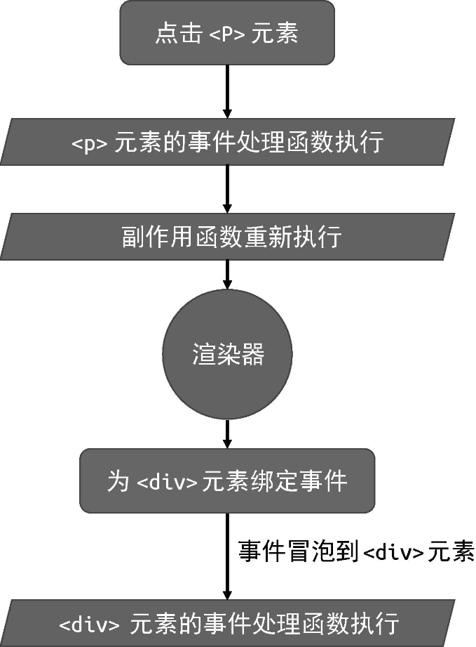
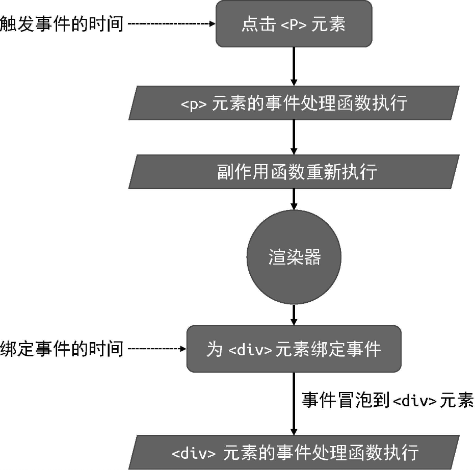

在上一节中，我们介绍了基本的事件处理。本节我们将讨论事件冒泡与更新时机相结合导致的问题。为了更清晰地描述问题，我们需要构造一个小例子:

```js
const { effect, ref } = VueReactivity

const bol = ref(false)

effect(() => {
	// 创建 vnode
	const vnode = {
		type: "div",
		props: bol.value
			? {
					onClick: () => {
						alert("父元素 clicked")
					}
			  }
			: {},
		children: [
			{
				type: "p",
				props: {
					onClick: () => {
						bol.value = true
					}
				},
				children: "text"
			}
		]
	}
	// 渲染 vnode
	renderer.render(vnode, document.querySelector("#app"))
})
```

这个例子比较复杂。在上面这段代码中，我们创建了一个响应式数据 bol,它是一个 ref,初始值为 false。接着，创建了一个 effect，并在副作用函数内调用 renderer.render 函数来渲染 vnode。这里的重点在于该 vnode 对象，它描述了一个 div 元素，并且该 div 元素具有一个 p 元素作为子节点。我们再来详细看看 div 元素以及 p 元素的特点。

- div 元素。 它的 props 对象的值是由一个三元表达式决定的。在首次渲染时，由于 bol.value 的值为 false，所以它的 props 的值时一个空对象

- p 元素。 它具有 click 点击事件，并且当点击它时，事件处理函数会将 bol.value 的值设置为 true。

结合上述特点，我们来思考一个问题: 当首次渲染完成后，用鼠标点击 p 元素，会触发父级 div 元素的 click 事件的事件处理函数执行吗?

答案其实很明显，在首次渲染完成之后，由于 bol.value 的值为 false，所以渲染器并不会为 div 元素绑定点击事件。当用鼠标点击 p 元素时，即使 click 事件可以从 p 元素冒泡到父级 div 元素，但由于 div 元素没有绑定 click 事件的事件处理函数，所以什么都不会发生。但事实是，当你尝试运行上面这段代码并点击 p 元素时，会发现父级 div 元素的 click 事件的事件处理函数竟然执行了。为什么会发生如此奇怪的现象呢？这其实与更新机制有关，我们来分析一下当点击 p 元素时，到底发生了什么。

当点击 p 元素时，绑定到它身上的 click 事件处理函数会执行，于是 bol.value 的值被改为 true。接下来的一步非常关键，由于 bol 是一个响应式数据，所以当它的值发生变化时，会触发副作用函数重新执行。由于此时的 bol.value 已经变成了 true，所以在更新阶段，渲染器会为父级 div 元素绑定 click 事件处理函数。当更新完成之后，点击事件才从 p 元素冒泡到父级 div 元素。由于此时 div 元素已经绑定了 click 事件的处理函数，因此就发生了上述奇怪的现象。图 1 给出了当点击 p 元素后，整个更新和事件触发的流程图。

根据图 1 我们能够发现，之所以会出现上述奇怪的现象，是因为更新操作发生在事件冒泡之前，即为 div 元素绑定事件处理函数发生在事件冒泡之前。那如何避免这个问题呢？一个很自然的想法是，能否将绑定事件的动作挪到事件冒泡之后？ 但这个想法不可靠，因为我们无法知道事件冒泡是否完成，以及完成到什么程度。你可能会想，Vue.js 的更新难道不是在异步的微任务队列中进行的吗？那是不是自然能够避免这个问题了呢？ 其实不然，换句话说，微任务会穿插在由事件冒泡触发的多个事件处理函数之间被执行。因此，即使把绑定事件的动作放到微任务中，也无法避免这个问题。

那应该如何解决呢？ 其实，仔细观察图 1 就会发现，触发事件的事件与绑定事件的事件之间是有联系的，如图 2 所示。



图 1 更新和事件触发的流程



图 2 触发事件的时间与绑定事件的事件之间的联系

由图 2 可以发现，事件触发的事件要早于事件处理函数被绑定的事件。这意味着当一个事件触发时，目标元素上还没有绑定相关的事件处理函数，我们可以根据这个特点来解决问题: **屏蔽所有绑定时间晚于晚于事件触发时间的事件处理函数执行**。基于此，我们可以调整 patchProps 函数中关于事件的代码，如下:

```js
function patchProps(el, key, preValue, nextValue) {
	if (/^on/.test(key)) {
		const invokers = el._vei || (el._vei = {})
		let invoker = invokers[key]
		const name = key.slice(2).toLowerCase()
		if (nextValue) {
			if (!invoker) {
				invoker = el._vei[key] = (e) => {
					// e.timeStamp 是事件发生的时间
					// 如果事件发生的时间早于事件函数绑定的时间，则不执行事件处理函数
					if (e.timeStamp < invoker.attached) return
					if (Array.isArray(invoker.value)) {
						invoker.value.forEach((fn) => fn(e))
					} else {
						invoker.value(e)
					}
				}
				invoker.value = nextValue
				// 添加 invoker.attached 属性，存储事件处理函数被绑定时间
				invoker.attached = performance.new()
				el.addEventListener(name, invoker)
			} else {
				invoker.value = nextValue
			}
		} else if (invoker) {
			el.removeEventListener(name, invoker)
		}
	} else if (key === "class") {
		// 省略部分代码
	} else if (shouldSetAsProps(el, key, nextValue)) {
		// 省略部分代码
	} else {
		// 省略部分代码
	}
}
```

如上面的代码所示，我们在原来的基础上只添加了两行代码。首先，我们为伪造的事件处理函数添加了 invoker.attached 属性，用来存储事件处理函数被绑定的时间。然后，在 invoker 执行的时候，通过事件对象的 e.timeStamp 获取事件发生的时间。最后，比较两者，如果事件处理函数被绑定的时间晚于事件发生的时间，则不执行该事件处理函数。

这里有必要指出的是，在关于时间的存储和比较方面，我们使用的是高精时间，即 performance.now。但根据浏览器的不同，e.timeStamp 的值也会有所不同。它既可能是高精时间，也可能是非高精时间。因此，严格来讲，这里需要做兼容处理。不过在 Chrome49、 Firefox 54、 Opera 36 以及之后的版本中， e.timeStamp 的值都是高精时间。
