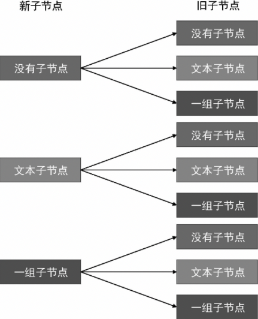

前几节我们讲解了元素属性的更新，包括普通标签属性和事件。接下来，我们将讨论如何更新元素的子节点。首先，回顾一下元素的子节点是如何被挂载的，如下面 mountElement 函数的代码所示:

```js
function mountElement(vnode, container) {
	const el = (vnode.el = createElement(vnode.type))

	// 挂载子节点，首先判断 children 的类型
	// 如果是字符串类型，说明是文本子节点
	if (typeof vnode.children === "string") {
		setElementText(el, vnode.children)
	} else if (Array.isArray(vnode.children)) {
		// 如果是数组, 说明是多个子节点
		vnode.children.forEach((child) => {
			patch(null, child, el)
		})
	}

	if (vnode.props) {
		for (const key in vnode.props) {
			patchProps(el, key, null, vnode.children[key])
		}
	}

	insert(el, conatainer)
}
```

在挂载子节点时，首先要区分其类型:

- 如果 vnode.children 是字符串，则说明元素具有文本子节点
- 如果 vnode.children 是数组， 则说明元素具有多个子节点

这里需要思考的是，为什么要区分子节点的类型呢？ 其实这是一个规范性的问题，因为只有子节点的类型是规范化的，才有利于我们编写更新逻辑。因此，在具体讨论如何更新子节点之前，我们有必要先规范化 vnode.children。 那应该设定怎样的规范呢？ 为了搞清楚这个问题，我们需要先搞清楚一个在 HTML 页面中，元素的子节点有哪些情况，如下面的 HTML 代码所示：

```html
<!-- 没有子节点 -->
<div></div>
<!-- 文本子节点 -->
<div>Some Text</div>
<!-- 多个子节点 -->
<div>
	<p />
	<p />
</div>
```

对于一个元素来说，它的子节点无非以下三种情况。

- 没有子节点，此时 vnode.children 的值为 null。
- 具有文本子节点，此时 vnode.children 的值为字符串，代表文本的内容。
- 其他情况， 无论是单个元素子节点，还是多个子节点(可能是文本和元素的混合)，都可以用数组来表示。

如下面的代码所示:

```js
// 没有子节点
vnode = {
	type: "div",
	children: null
}
// 文本子节点
vnode = {
	type: "div",
	children: "Some Text"
}
// 其他情况，子节点使用数组表示
vnode = {
	type: "div",
	children: [{ type: p }, "Some Text"]
}
```

现在，我们已经规范化了 vnode.children 的类型。既然一个 vnode 的节点可能有三种情况，那么当渲染器执行更新时，新旧子节点都分别是三种情况之一。所以，我们可以总结出更新自己点时全部九种可能，如图 1 所示。



但落实到代码，我们会发现其实并不需要完全覆盖九种可能。接下来我们就开始着手实现，如下面 patchElement 函数的代码所示:

```js
function patchElement(n1, n2) {
	const el = (n2.el = n1.el)
	const oldProps = n1.props
	const newProps = n2.props
	// 第一步： 更新 props
	for (const key in newProps) {
		if (newProps[key] !== oldProps[key]) {
			patchProps(el, key, oldProps[key], newProps[key])
		}
	}

	for (const key in oldProps) {
		if (!(key in newProps)) {
			patchProps(el, key, oldProps[key], null)
		}
	}

	// 第二步： 更新 children
	patchChildren(n1, n2, el)
}
```

如上面的代码所示，更新子节点时对一个元素进行打补丁的最后一步操作。我们将它封装到 patchChildren 函数中，并将新旧 vnode 以及当前正在被打补丁的 DOM 元素 el 作为参数传递给它。

patchChildren 函数的实现如下：

```js
function patchChildren(n1, n2, container) {
	// 判断新子节点的类型是否是文本节点
	if (typeof n2.children === "string") {
		// 旧子节点的类型有三种可能: 没有子节点、文本子节点以及一组子节点
		// 只有当旧子节点为一组子节点时，才需要逐个卸载，其他情况什么都不需要做
		if (Array.isArray(n1.children)) {
			n1.children.forEach((c) => unmount(c))
		}
		// 最后将新的文本节点内容设置给容器元素
		setElement(container, n2.children)
	}
}
```

如上面这段代码所示，首先，我们检测新子节点的类型是否是文本节点，如果是，则还需要检查旧子节点的类型。旧子节点的类型可能有三种轻卡滚，分别是: 没有子节点、文本子节点或一组子节点。如果没有旧子节点或者旧子节点的类型是文本子节点，那么只需要将新的文本内容设置给容器元素即可；如果旧子节点
存在，并且不是文本子节点，则说明它是一组子节点。这是我们需要循环遍历他们，并逐个调用 unmount 函数进行卸载。

如果新子节点的类型不是文本子节点，我们需要再添加一个判断分支，判断它是否是一组子节点，如下面的代码所示:

```js
function patchChildren(n1, n2, container) {
	if (typeof n2.children === "string") {
		// 省略部分代码
	} else if (Array.isArray(n2.children)) {
		// 说明新子节点是一组子节点

		// 判断旧子节点是否也是一组子节点
		if (Array.isArray(n1.children)) {
			// 代码运行到这里，则说明新旧子节点都是一组子节点，这里涉及核心的 Diff 算法
		} else {
			// 此时:
			// 旧子节点要么就是文本子节点，要么不存在
			// 但不论哪种情况，我们都只需要将容器清空，然后将新的一组子节点逐个挂载
			setElementText(container, "")
			n2.children.forEach((c) => patch(null, c, container))
		}
	}
}
```

在上面这段代码中，我们新增了对 n2.childern 类型的判断：检测它是否是一组子节点，如果是，接着再检查旧子节点的类型。同样，旧子节点也有三种可能：没有子节点、文本子节点和一组子节点。对于没有旧子节点或者旧子节点是文本子节点的情况，我们只需要将容器元素清空，然后逐个将新的一组子节点挂载到容器中即可。如果旧子节点也是一组子节点，则涉及新旧两组子节点的比对，这里就涉及我们常说的 Diff 算法。但由于我们目前还没有讲解 Diff 算法的工作方式，因此可以暂时用一种相对傻瓜式的方法来保证功能可用。这个方法很简单，即把旧的一组子节点全部卸载，再将新的一组子节点全部挂载，如下面的代码所示：

```js
function patchChildren(n1, n2, container) {
	if (typeof n2.children === "string") {
		if (Array.isArray(n1.children)) {
			n1.children.forEach((c) => unmount(c))
		}
		setElement(container, n2.children)
	} else if (Array.isArray(n2.children)) {
		if (Array.isArray(n1.children)) {
			// 将旧的一组子节点全部卸载
			n1.children.forEach((c) => unmount(c))
			// 再将新的一组子节点全部挂载到容器中
			n2.children.forEach((c) => patch(null, c, container))
		} else {
			setElementText(container, "")
			n2.children.forEach((c) => patch(null, c, container))
		}
	}
}
```

这样做虽然能够实现需求，但并不是最优解，我们将在下一章讲解如何使用 Diff 算法高效地更新两组子节点。现在，对于新子节点来说，还剩下最后一种情况，即新子节点不存在，如下面的代码所示:

```js
function patchChildren(n1, n2, container) {
	if (typeof n2.children === "string") {
		if (Array.isArray(n1.children)) {
			n1.children.forEach((c) => unmount(c))
		}
		setElement(container, n2.children)
	} else if (Array.isArray(n2.children)) {
		if (Array.isArray(n1.children)) {
			n1.children.forEach((c) => unmount(c))
			n2.children.forEach((c) => patch(null, c, container))
		} else {
			setElementText(container, "")
			n2.children.forEach((c) => patch(null, c, container))
		}
	} else {
		// 代码运行到这里，说明新子节点不存在
		// 就子节点时一组子节点，只需要逐个卸载即可
		if (Array.isArray(n1.children)) {
			n1.children.forEach((c) => unmount(c))
		} else if (typeof n1.children === "string") {
			// 旧子节点是文本子节点， 清空内容即可
			setElementText(container, "")
		}
		// 如果也没有旧子节点，那么什么都不需要做
	}
}
```

可以看到，如果代码走到了 else 分支，则说明新子节点不存在。这时，对于旧子节点来说仍然有三种可能：没有子节点、文本子节点以及一组子节点。如果旧子节点也不存在，则什么都不需要做；如果旧子节点是一组子节点，则逐个卸载即可；如果旧的子节点是文本子节点，则清空文本内容即可。
