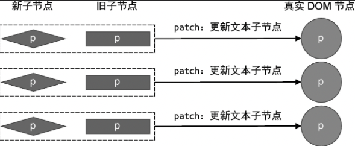
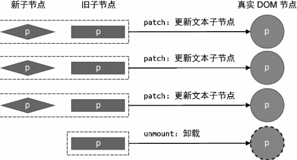
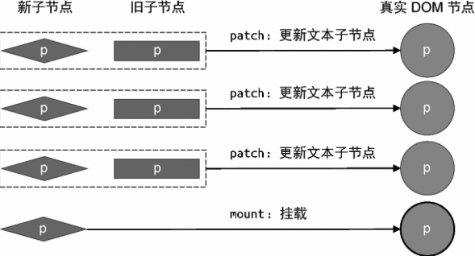

从本章开始，我们将介绍渲染器的核心 Diff 算法。简单来说，当新旧 vnode 的子节点都是一组节点时，为了以最小的性能开销完成更新操作，需要比较两组子节点，用于比较的算法就叫做 Diff 算法。我们知道，操作 DOM 的性能开销通常比较大，而渲染器的核心 Diff 算法就是为了解决这个问题而诞生的。

核心 Diff 只关心新旧虚拟节点都存在一组子节点的情况。在上一章中，我们针对两组子节点的更新，采用了一种简单直接的手段，即卸载全部旧子节点，再挂载全部新子节点。这么做的确可以完成更新，但由于没有复用任何 DOM 元素，所以会产生极大的性能开销。

以下面的新旧虚拟节点为例:

```js
// 旧 vnode
const oldVNode = {
	type: "div",
	children: [
		{ type: "p", children: "1" },
		{ type: "p", children: "2" },
		{ type: "p", children: "3" }
	]
}

// 新 vnode
const newVNode = {
	type: "div",
	children: [
		{ type: "p", children: "4" },
		{ type: "p", children: "5" },
		{ type: "p", children: "6" }
	]
}
```

按照之前的做法，当更新子节点时，我们需要执行 6 次 DOM 操作:

- 卸载所有旧子节点，需要 3 次 DOM 删除操作；
- 挂载所有新子节点，需要 3 次 DOM 添加操作。

但是，通过观察上面新旧 vnode 的子节点，可以发现；

- 更新前后的所有子节点都是 p 标签，即标签元素不变；
- 只有 p 标签的子节点（文本节点）会发生变化。

例如，oldVNode 的第一个子节点是一个 p 标签，且该 p 标签的子节点类型是文本节点，内容是 1。而 newVNode 的第一个子节点也是一个 p 标签，它的子节点的类型也是文本节点，内容是 4。可以发现，更新前后改变的只有 p 标签文本节点的内容。所以，最理想的方式是，直接更新这个 p 标签的文本节点内容。这样只需要一次 DOM 操作，即可完成一个 p 标签更新。新旧虚拟节点都有 3 个 p 标签作为子节点，所以一共只需要 3 次 DOM 操作就可以完成全部节点的更新。相比原来需要执行 6 次 DOM 操作才能完成更新的方式，其性能提升了一倍。

按照这个思路，我们可以重新实现两组子节点的更新逻辑，如下面 patchChildren 函数的代码所示:

```js
function patchChildren(n1, n2, container) {
	if (typeof n2.children === "string") {
		// 省略部分代码
	} else if (Array.isArray(n2.children)) {
		// 重新实现两组子节点的更新方式
		// 新旧 children
		const oldChildren = n1.children
		const newChildren = n2.children
		// 遍历旧的 children
		for (let i = 0; i < oldChildren.length; i++) {
			// 调用 patch 函数逐个更新子节点
			patch(oldChildren[i], newChildren[i], container)
		}
	} else {
		// 省略部分代码
	}
}
```

在这段代码中，oldChildren 和 newChildren 分别是旧的一组子节点和新的一组子节点。我们遍历前者，并将两者中对应位置的节点分别传递给 patch 函数进行更新。patch 函数在执行更新时，发现新旧子节点只是文本内容不同，因此只会更新其文本节点的内容。这样，我们就成功地将 6 次 DOM 操作减少为 3 次。图 1 是整个更新过程的示意图，其中**菱形**代表新子节点，**矩形**代表旧子节点，**圆形**代表真实 DOM 节点。



这种做法虽然能够减少 DOM 操作次数，但问题也很明显。在上面的代码中，我们通过遍历旧的一组子节点，并假设新的一组子节点的数量与之相同，只有在这种情况下，这段代码才能正确地工作。但是，新旧两组子节点的数量未必相同。当新的一组子节点的数量少于旧的一组子节点的数量时，意味着有些节点在更新后应该被卸载，如图 2 所示。



在图 2 中， 旧的一组子节点中一共有 4 个 p 标签，而新的一组子节点中只有 3 个 p 标签。这说明，在更新过程中，需要将不存在的 p 标签卸载。类似地，新的一组子节点的数量也可能比旧的一组子节点的数量多，如图 3 所示。



在图 3 中，新的一组子节点比旧的一组子节点多了一个 p 标签。在这种情况下，我们应该改在新增节点。

通过上面的分析我们意识到，在进行新旧两组子节点的更新时，不应该总是遍历旧的一组子节点或遍历新的一组子节点,而是应该遍历其中长度较短的那一组。这样，我们才能够尽可能多地调用 patch 函数进行更新。接着，再比较新旧两组子节点的长度，如新的一组子节点更长，则说明新子节点需要挂载，否则说明旧子节点需要卸载。最终实现如下：

```js
function patchChildren(n1, n2, container) {
	if (typeof n2.children === "string") {
		//省略部分代码
	} else if (Array.isArray(n2.children)) {
		const oldChildren = n1.children
		const newChildren = n2.children
		// 旧的一组子节点的长度
		const oldLen = oldChildren.length
		// 新的一组子节点的长度
		const newLen = newChildren.length
		// 两组子节点的公共长度，即两者中较短的那一组子节点的长度
		const commonLength = Math.min(oldLen, newLen)
		// 遍历 commonLength 次
		for (let i = 0; i < commonLength; i++) {
			patch(oldChildren[i], newChildren[i], container)
		}
		// 如果 newLen > oldLen， 说明有新子节点需要挂载
		if (newLen > oldLen) {
			for (let i = commonLength; i < newLen; i++) {
				patch(null, newChildren[i], container)
			}
		} else if (oldLen > newLen) {
			// 如果 oldLen > newLen，说明有旧子节点需要卸载
			for (let i = commonLength; i < oldLen; i++) {
				umount(oldChildren[i])
			}
		}
	} else {
		// 省略部分代码
	}
}
```

这样，无论新旧两组子节点的数量关系如何，渲染器都能够正确地挂载或卸载它们。
