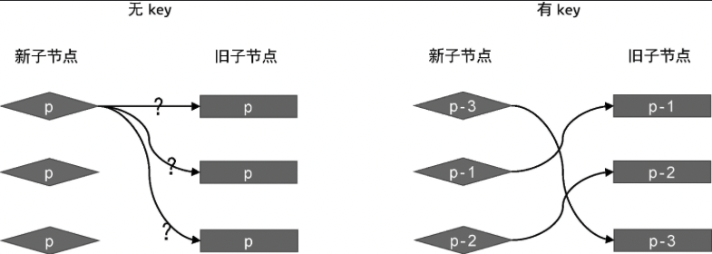

在上一节中，我们通过减少 DOM 操作的次数，提升了更新性能。但这种方式仍然存在可优化的空间。举个例子，假设新旧两组子节点的内容如下：

```js
// oldChildren
[
    {type: 'p'},
    {type: 'div'},
    {type: 'span'},
]

// newChildren
[
    {type: 'span'},
    {type: 'p'},
    {type: 'div'},
]
```

如果使用上一届介绍的算法来完成上述两组子节点的更新，则需要 6 次 DOM 操作。

- 调用 patch 函数在旧子节点`{ type: 'p' }`与新子节点`{ type: 'span' }` 之间打补丁，由于两者是不同的标签，所以 patch 函数会卸载`{ type: 'p' }`，然后在挂载`{ type: 'span' }`,这需要执行 2 次 DOM 操作。

- 与第 1 步类似，卸载旧子节点`{ type: 'div' }`,然后在挂载新子节点`{ type: 'p' }`,这也需要执行 2 次 DOM 操作。

- 与第 1 步类似，卸载旧子节点`{ type: 'span' }`,然后在挂载新子节点`{ type: 'div' }`,同样需要执行 2 次 DOM 操作。

因此，一共进行 6 次 DOM 操作才能完成上述案例的更新。但是，观察新旧两组子节点，很容易发现，二者只是顺序不同。所以最优的处理方式是，通过 DOM 的移动来完成子节点的更新，这要比不断执行子节点的卸载和挂载性能更好。但是，想要通过 DOM 的移动来完成更新，必须要保证一个前提：新旧两组的子节点中的确存在可复用的节点。这个很好理解，如果新的子节点没有在旧的一组子节点中出现，就无法通过移动节点的方式完成更新。所以现在的问题变成了：应该如何确定新的子节点是否出现在旧的一组子节点中呢？拿上面的例子来说，怎么确定新的一组子节点中第 1 个子节点`{ type: 'span' }`与旧的一组子节点中第 3 个子节点相同呢？一种解决方案是，通过 vnode.type 来判断，只要 vnode.type 的值相同，我们就认为两者是相同的节点。但这种方式并不可靠，思考如下的例子:

```js
// oldChildren
[
    {type: 'p', children: '1'},
    {type: 'p', children: '2'},
    {type: 'p', children: '3'},
]

// newChildren
[
    {type: 'p', children: '3'},
    {type: 'p', children: '1'},
    {type: 'p', children: '2'},
]

```

观察上面两组子节点，我们发现，这个案例可以通过移动 DOM 的方式来完成更新。但是所有节点的 vnode.type 属性值都相同，这导致我们无法确定新旧两组子节点中节点的对应关系，也就无法得知应该进行怎样的 DOM 移动才能完成更新。这是，我们就需要引入额外的 key 来作为 vnode 的标识，如下面的代码所示:

```js

// oldChildren
[
    {type: 'p', children: '1', key: 1},
    {type: 'p', children: '2', key: 2},
    {type: 'p', children: '3', key: 3},
]

// newChildren
[
    {type: 'p', children: '3', key: 3},
    {type: 'p', children: '1', key: 1},
    {type: 'p', children: '2', key: 2},
]
```

key 属性就像虚拟节点的“身份证号”，是要两个虚拟节点的 type 属性值和 key 属性值相同，那么我们就认为他们是相同的，即可以进行 DOM 的服用。图 4 展示了有 key 和无 key 时新旧两组子节点的映射情况。



由图 4 可知，如果没有 key，我们无法知道新子节点与旧子节点间的映射关系，也就无法知道应该如何移动节点。由 key 的话情况则不痛，我们根据子节点的 key 属性，能够明确知道新子节点在旧子节点中的位置，这样就可以进行相应的 DOM 移动操作了。

有必要强调的一点是，DOM 可复用并不意味着不需要更新，如下面的两个虚拟节点所示:

```js
const oldVNode = { type: "p", key: 1, children: "text 1" }
const newVNode = { type: "p", key: 1, children: "text 2" }
```

这两个虚拟节点拥有相同的 key 值和 vnode.type 属性值。这意味着，在更新时可以复用 DOM 元素，即只需要通过移动操作来完成更新。但仍需要对这两个虚拟节点进行打补丁操作，因为新的虚拟节点(newVNode)的文字子节点的内容已经改变了。因此，在讨论如何移动 DOM 之前，我们需要先完成打补丁操作，如下面 patchChildren 函数的代码所示:

```js
function patchChildren(n1, n2, container) {
	if (typeof n2.children === "string") {
		// 省略部分代码
	} else if (Array.isArray(n2.children)) {
		const oldChildren = n1.children
		const newChildren = n2.children

		// 遍历新的 children
		for (let i = 0; i < newChildren.length; i++) {
			const newVNode = newChildren[i]
			// 遍历旧的 children
			for (let j = 0; j < oldChildren.length; j++) {
				const oldVNode = oldChildren[j]
				// 如果找到了具有相同 key 值的两个节点，说明可以复用，但仍然需要调用 patch 函数更新
				if (newVNode.key === oldVNode.key) {
					patch(oldVNode, newVNode, container)
					break // 这里需要 break
				}
			}
		}
	} else {
		// 省略部分代码
	}
}
```

在上面这段代码中，我们重新实现了新旧两组子节点的更新逻辑。可以看到，我们使用两层 for 循环，外层循环遍历新的一组子节点，内层循环则遍历旧的一组子节点。在内层循环中，我们逐个对比新旧子节点的 key 值。试图在旧的子节点中找到可复用的节点。一旦找到，则调用 patch 函数进行打补丁。经过这一步操作之后，我们能够保证所有可复用的节点本身已经更新完毕了。以下面的新旧两组子节点为例:

```js
const oldVNode = {
	type: "div",
	children: [
		{ type: "p", children: "1", key: 1 },
		{ type: "p", children: "2", key: 2 },
		{ type: "p", children: "hello", key: 3 }
	]
}

const newVNode = {
	type: "div",
	children: [
		{ type: "p", children: "world", key: 3 },
		{ type: "p", children: "1", key: 1 },
		{ type: "p", children: "2", key: 2 }
	]
}

// 首次挂载
renderer.render(oldVNode, document.querySelector("#app"))
setTimeout(() => {
	// 1 秒后更新
	renderer.render(newVNode, document.querySelector("#app"))
}, 1000)
```

运行上面这段代码，1 秒钟后，key 值为 3 的子节点对应的真实 DOM 的文本内容会由字符串 'hello' 更新为字符串 'world' 。下面我们详细分析上面这段代码在执行更新操作时具体发生了什么。

- 第一步，取新的一组子节点中的第一个子节点，即 key 值为 3 的节点。尝试在旧的一组子节点中寻找具有相同 key 值的节点。我们发现，旧的子节点`oldVNode.children[2]` 的 key 值为 3，于是调用 patch 函数进行打补丁。在这一步操作完成后，渲染器会把 key 值为 3 的虚拟机节点所对应的真实 DOM 的文本内容由字符串 'hello' 更新为字符串 'world'。

- 第二步，取新的一组子节点中的第二个子节点，即 key 的值为 1 的节点。尝试在旧的一组子节点中寻找具有相同 key 值的节点。我们发现，旧的子节点`oldVNode.children[0]`的 key 值为 1，于是调用 patch 函数进行打补丁。由于 key 值等于 1 的新旧子节点没有任何差异，所以什么都不会做。

- 第三步，取新的一组子节点中的最后一个子节点，即 key 值为 2 的节点，最终结果堵第二步相同。

经过上述更新操作后，所有节点对应的真实 DOM 元素都更新完毕了。但真实 DOM 仍然保持旧的一组子节点的顺序，即 key 值为 3 的节点对应的真实 DOM 仍然是最后一个子节点。由于在新的一组子节点中，key 值为 3 的节点已经变为第一个子节点了，因此我们还需要通过移动节点来完成真实 DOM 顺序的更新。
