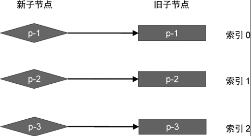
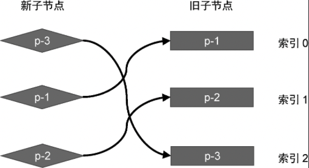

现在，我们已经能够通过 key 值找到可复用的节点了。接下来需要思考的是，如何判断一个节点是否需要移动，以及如何移动。对于第一个问题，我们可以采用逆向思维的方式，先想一想在什么情况下节点不需要移动？答案很简单，当新旧两组子节点的节点顺序不变时，就不要额外的移动操作，如图 5 所示。



在图 5 中，新旧两组子节点的顺序没有发生变化，图中也给出了旧的一组子节点中各个节点的索引:

- key 值为 1 的节点在旧 children 数组中的索引为 0；
- key 值为 2 的节点在旧 children 数组中的索引为 1；
- key 值为 3 的节点在旧 children 数组中的索引为 2；

接着，我们对新旧两组子节点采用上一节介绍的更新算法，看看当新旧两组子节点的顺序没有发生变化时，更新算法具有怎样的特点。

- 第一步：取新的一组子节点中的第一个节点 p-1，它的 key 为 1。尝试在旧的一组子节点中找到具有相同 key 值的可复用节点，发现能够找到，并且该节点在旧的一组子节点中的索引为 0。

- 第二步：取新的一组子节点中的第二个节点 p-2，它的 key 为 2。尝试在旧的一组子节点中找到具有相同 key 值的可复用节点，发现能够找到，并且该节点在旧的一组子节点中的索引为 1。

- 第三步：取新的一组子节点中的第三个节点 p-3，它的 key 为 3。尝试在旧的一组子节点中找到具有相同 key 值的可复用节点，发现能够找到，并且该节点在旧的一组子节点中的索引为 2。

在这个过程中，每一次寻找可复用的节点时，都会记录该可复用节点在旧的一组子节点中的位置索引。如果把这些位置索引值按照先后顺序排列，则可以得到一个序列：0、1、2。这是一个递增的序列，在这种情况下不需要移动任何节点。

我们再来看看另外一个例子，如图 6 所示。



同样，我们根据图 6 给出的例子再次执行更新算法，看看这一次会有什么不同。

- 第一步：取新的一组子节点中的第一个节点 p-3，它的 key 为 3。尝试在旧的一组子节点中找到具有相同 key 值的可复用节点，发现能够找到，并且该节点在旧的一组子节点中的索引为 2。

- 第二步：取新的一组子节点中的第二个节点 p-1，它的 key 为 1。尝试在旧的一组子节点中找到具有相同 key 值的可复用节点，发现能够找到，并且该节点在旧的一组子节点中的索引为 0。

到了这一步我们发现，索引值递增的顺序被打破了。节点 p-1 在旧 children 中的索引值是 0，它小于节点 p-3 在 children 中的索引 2。这说明**节点 p-1 在旧 children 中排在节点 p-3 前面，但在新的 children 中，它排在节点 p-3 后面**。因此，我们能够得出一个结论:**节点 p-1 对应的真实 DOM 需要移动**。

- 第三步：取新的一组子节点中的第三个节点 p-2，它的 key 为 2。尝试在旧的一组子节点中找到具有相同 key 值的可复用节点，发现能够找到，并且该节点在旧的一组子节点中的索引为 1。

到了这一步我们发现，节点 p-2 在旧 children 中索引 1 要小于节点 p-3 在旧 children 的索引 2。这说明，**节点 p-2 在旧 children 中排在节点 p-3 前面，但在新的 children 中，它排在节点 p-3 后面。因此，节点 p-2 对应的真实 DOM 也需要移动。**

以上就是 Diff 算法在执行更新的过程中，判断节点是否需要移动的方式。在上面的例子中，我们得出了节点 p-1 和节点 p-2 需要移动的结论。这是因为它们在旧 children 中的索引节点要小于节点 p-3 在旧 children 中的索引。如果我们按照先后顺序记录在寻找节点过程中所遇到的位置索引，将会得到序列: 2、0、1。
可以发现，这个序列不具有递增的趋势。

其实我们可以将节点 p-3 在旧 children 中的索引定义为：**在旧 children 中寻找具有相同 key 值节点的过程中，遇到的最大索引值。** 如果在后续寻找的过程中，存在索引值比当前遇到的最大索引值还要小的节点，则意味着该节点需要移动。

我们可以用 lastIndex 比那辆存储整个寻找过程中遇到的最大索引值，如下面的代码所示:

```js
function patchChildren(n1, n2, container) {
	if (typeof n2.children === "string") {
		// 省略部分代码
	} else if (Array.isArray(n2.children)) {
		const oldChildren = n1.children
		const newChildren = n2.children

		// 用来存储寻找过程中遇到的最大索引值
		let lastIndex = 0
		// 遍历新的 children
		for (let i = 0; i < newChildren.length; i++) {
			const newVNode = newChildren[i]
			// 遍历旧的 children
			for (let j = 0; j < oldChildren.length; j++) {
				const oldVNode = oldChildren[j]
				// 如果找到了具有相同 key 值的两个节点，说明可以复用，但仍然需要调用 patch 函数更新
				if (newVNode.key === oldVNode.key) {
					patch(oldVNode, newVNode, container)
					if (j < lastIndex) {
						// 如果当前找到的节点在旧 children 中的索引小于最大索引值 lastIndex
						// 说明该节点对应的真实 DOM 需要移动
					} else {
						// 如果当前找到的节点在旧 children 中的索引不小于最大索引值，
						// 则更新 lastIndex 的值
						lastIndex = j
					}
					break // 这里需要 break
				}
			}
		}
	} else {
		// 省略部分代码
	}
}
```

如以上代码及注释所示，如果新旧节点的 key 值相同，说明我们在旧 children 中找到了可复用的 DOM 的节点。此时我们用该节点在旧 children 中的缩影 j 与 lastIndex 进行比较，如果 j 小于 lastIndex ，说明当前 oldVNode 对应的真实 DOM 需要移动，否则说明不需要移动。但此时应该将变量 j 的值赋给 lastIndex，以保证寻找节点的过程中，变量 lastIndex 始终存储着当前遇到的最大索引值。

现在，我们已经找到了需要移动的节点，下一节我们将讨论如何移动节点，从而完成节点顺序的更新。
