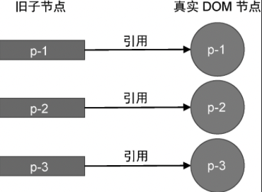

在上一节中，我们讨论了如何判断节点是否需要移动。移动节点指的是，移动一个虚拟节点所对应的真实 DOM 节点，并不是移动虚拟节点本身。既然移动的是真实 DOM 节点，那么就需要取得对它的引用才行。我们知道，当一个虚拟节点被挂载后，其对应的真实 DOM 节点会存储在它的 vnode.el 属性中，如图 7 所示。


因此，在代码中，我们可以用过旧子节点的 vnode.el 属性取得它对应的真实 DOM 节点。

当更新操作发生时，渲染器会调用 patchElement 函数在新旧虚拟节点之间进行打补丁。回顾一下 patchElement 函数的代码，如下:

```js
function patchElement(n1, n2) {
	// 新的 vnode 也引用了真实 DOM 元素
	const el = (n2.el = n1.el)
	// 省略部分代码
}
```

可以看到，patchElement 函数首先将旧节点的 n1.el 属性赋值给新节点的 n2.el 属性。这个赋值语句的真正含义其实就是 DOM 元素的复用。在复用了 DOM 元素之后，新节点也会将持有对真实 DOM 的引用，如图 8 所示。


可以看到，无论是新子节点还是旧子节点，都存在对真实 DOM 的引用，在此基础上，我们就可以进行 DOM 移动操作了。

为了阐述具体应该怎样移动 DOM 节点，我们仍然引用上一节的更新案例，如图 9 所示。


它的更新步骤如下。

- 第一步：取新的一组子节点中第一个节点 p-3，它的 key 为 3，尝试在旧的一组子节点中找到具有相同 key 值的可复用节点。发现能够找到，并且该节点在旧的一组子节点中的索引为 2。此时变量 lastIndex 的值 0，索引 2 不小于 0，所以节点 p-3 对应的真实 DOM 不需要移动，但需要更新变量 lastIndex 的值为 2.

- 第二步：取新的一组子节点中第二个节点 p-1, 它的 key 为 1,尝试在旧的一组子节点中找到具有相同 key 值的可复用节点。发现能够找到，并且该节点在旧的一组子节点中的索引为 0。此时变量 lastIndex 的值为 2，索引 0 小于 2，所以节点 p-1 对应的真实 DOM 需要移动。

到了这一步，我们发现，节点 p-1 对应的真实 DOM 需要移动，但应该移动到哪里呢？我们知道,**新 children 的顺序其实就是跟新后真实 DOM 节点应有的顺序**。所以节点 p-1 在新 children 中的位置就代表了真实 DOM 更新后的位置。由于节点 p-1 在新 children 中排在节点 p-3 后面，所以，**我们应该把节点 p-1 所对应的真实 DOM 移动到节点 p-3 所对应的真实 DOM 后面**。移动后的结果如图 10 所示。

- 第三步：取新的一组子节点中第三个节点 p-2，它的 key 为 2。尝试在旧的一组子节点中找到具有相同 key 值的可复用节点。发现能够找到，并且该节点在旧的一组子节点中的索引为 1。此时变量 lastIndex 的值为 2，索引 1 小于 2，所以节点 p-2 对应的真实 DOM 需要移动。


第三步与第二步类似，节点 p-2 对应的真实 DOM 也需要移动。同样，由于节点 p-2 在新 children 中排在节点 p-1 后面，所以我们应该把节点 p-2 对应的真实 DOM 移动到节点 p-1 对应的真实 DOM 后面。移动后的结果如图 11 所示。


经过这一步移动操作之后，我们发现，真实 DOM 的顺序与新的一组字节点的顺序相同了: p-3、p-1、p-2。至此，更新操作完成。

接下来，我们着手实现代码。其实并不复杂，如下面的 patchChildren 函数的代码所示:

```js
function patchChildren(n1, n2, container) {
	if (typeof n2.children === "string") {
		// 省略部分代码
	} else if (Array.isArray(n2.children)) {
		const oldChildren = n1.children
		const newChildren = n2.children

		// 用来存储寻找过程中遇到的最大索引值
		let lastIndex = 0
		// 遍历新的 children
		for (let i = 0; i < newChildren.length; i++) {
			const newVNode = newChildren[i]
			// 遍历旧的 children
			for (let j = 0; j < oldChildren.length; j++) {
				const oldVNode = oldChildren[j]
				// 如果找到了具有相同 key 值的两个节点，说明可以复用，但仍然需要调用 patch 函数更新
				if (newVNode.key === oldVNode.key) {
					patch(oldVNode, newVNode, container)
					if (j < lastIndex) {
						// 代码运行到这里，说明 newVNode 对应的真实 DOM 需要移动
						// 先获取 newVNode 的前一个 vnode， 即 prevVNode
						const prevVNode = newChildren[i - 1]
						// 如果 prevVNode 不存在，则说明当前 newVNode 是第一个节点，它不需要移动
						if (prevVNode) {
							// 由于我们要将 newVNode 对应的真实 DOM 移动到 prevVNode 所对应真实 DOM 后面，
							// 所以我们需要获取 prevVNode 所对应真实 DOM 的下一个兄弟节点，并将其作为锚点
							const anchor = preVNode.el.nextSibling
							// 调用 insert 方法将 newVNode 对应的真实 DOM 插入到锚点元素前
							// 也就是 prevVNode 对应的真实DOM的后面
							insert(newVNode.el, container, anchor)
						}
					} else {
						// 如果当前找到的节点在旧 children 中的索引不小于最大索引值，
						// 则更新 lastIndex 的值
						lastIndex = j
					}
					break // 这里需要 break
				}
			}
		}
	} else {
		// 省略部分代码
	}
}
```

在上面这段代码中，如果条件 j < lastIndex 成立，则说明当前 newVNode 所对应的真实 DOM 需要移动。根据前文分析可知，如果我们需要获取当前 newVNode 节点的前一个虚拟节点，即 newChildren[i - 1],然后使用 insert 函数完成节点的移动，其中 insert 函数依赖浏览器原生的 insertBefore 函数，如下面的代码所示:

```js
const renderer = createRenderer({
	// 省略部分代码

	insert(el, parent, anchor = null) {
		// insertBefore 需要锚点元素 anchor
		parent.insertBefore(el, anchor)
	}
})
```
