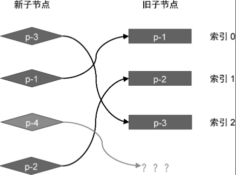
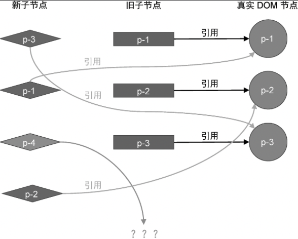
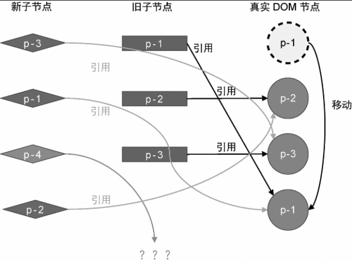
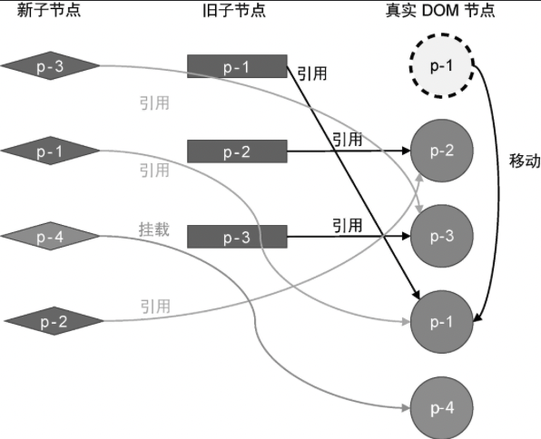
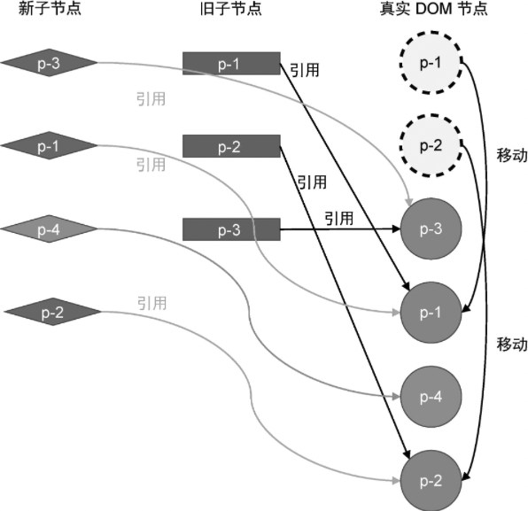

本节我们将讨论添加新节点的情况，如图 12 所示。



观察图 12 可知，在新的一组子节点中，多出来一个节点 p-4，它的 key 值为 4，该节点在旧的一组子节点不存在，因此应该将其视为新增节点。对于新增节点，在更新时我们应该正确地将它挂载，这主要分为两步：

- 想办法找到新增节点；
- 将新增节点挂载到正确位置。

首先，我们来看一下如何找到新增节点。为了搞清楚这个问题，我们需要根据图 12 中给出的例子模拟自行简单 Diff 算法的逻辑。在此之前我们需要弄清除新旧两组子节点与真实 DOM 元素的的当前状态，如图 13 所示。



接着，我们开始模拟执行简单 Diff 算法的更新逻辑。

- 第一步：取新的一组子节点中的第一个节点 p-3，它的 key 值为 3，尝试在旧的一组子节点中寻找可复用的节点。发现能够找到，并且该节点在旧的一组字节中的索引值为 2。此时变量 lastIndex 的值为 0，索引值不小于 lastIndex 的值 0，所以节点 p-3 对应的真实 DOM 不需要移动，但是需要将变量 lastIndex 的值更新为 2.

- 第二步：取新的一组子节点中第二个节点 p-1，它的 key 值为 1，尝试在旧的一组子节点中寻找可复用的节点。发现能够找到，并且该节点在旧的一组子节点的索引值为 0。此时变量 lastIndex 的值为 2，索引值 0 小于 lastIndex 的值 2，所以节点 p-1 对应的真实 DOM 需要移动，并且应该移动到节点 p-3 对应的真实 DOM 后面。经过这一步的移动操作后，真实 DOM 的状态如图 14 所示。



此时真实 DOM 的顺序为 p-2、p-3、p-1。

- 第三步：取新的一组子节点中第三个节点 p-4，它的 key 值为 4，尝试在旧的一组子节点中寻找可复用的节点。由于在旧的一组子节点中，没有 key 值为 4 的节点，因此渲染器会把节点 P-4 看做新增节点并挂载它。那么，应该将它挂载到哪里呢？为了搞清楚这个问题，我们需要观察节点 p-4 在新的一组子节点中的位置。由于节点 p-4 出现在节点 p-1 后面，所以我们应该把节点 p-4 挂载到节点 p-1 所对应的真实 DOM 后面。在经过这一步挂载操作之后，真实 DOM 的状态如图 15 所示。



此时真实 DOM 的顺序为 p-2、p-3、p-1、p-4，其中 p-4 是刚刚挂载的。

- 第四步：取新的一组子节点中第四个节点 p-2，它的 key 值为 2，尝试在旧的一组子节点中寻找可复用的节点。发现能够找到，并且该节点在旧的一组子节点的索引值为 1。此时变量 lastIndex 的值为 2，索引值 1 小于 lastIndex 的值 2，所以节点 p-2 对应的真实 DOM 需要移动，并且应该移动到节点 p-4 对应的真实 DOM 后面。经过这一步的移动操作后，真实 DOM 的状态如图 16 所示。



此时真实 DOM 的顺序为 p-3、p-1、p-4、p-2。至此，真实 DOM 的顺序已经与新的一组子节点的顺序相同了，更新完成。

接下来，我们着手实现代码，如下面 patchChildren 函数的代码所示:

```js
function patchChildren(n1, n2, container) {
	if (typeof n2.children === "string") {
		// 省略部分代码
	} else if (Array.isArray(n2.children)) {
		const oldChildren = n1.children
		const newChildren = n2.children

		let lastIndex = 0
		for (let i = 0; i < newChildren.length; i++) {
			const newVNode = newChildren[i]
			let j = 0
			// 在第一层循环中定义变量 find，代表是否在旧的一组子节点中找到可复用的节点，
			// 初始值为 false， 代表没找到
			let find = false
			for (j; j < oldChildren.length; j++) {
				const oldVNode = oldChildren[j]
				// 一旦找到可复用的节点， 则将变量 find 的值设为 true
				if (newVNode.key === oldVNode.key) {
					find = true
					patch(oldVNode, newVNode, container)
					if (j < lastIndex) {
						const prevVNode = newChildren[i - 1]
						if (prevVNode) {
							const anchor = prevVNode.el.nextSibling
							insert(newVNode.el, container, anchor)
						}
					} else {
						lastIndex = j
					}
					break
				}
			}

			// 如果代码运行到这里，find 仍然为 false，
			// 说明当前 newVNode 没有在旧的一组子节点中找到可复用的节点
			// 也就是说， 当前 newVNode 是新增节点，需要挂载
			if (!find) {
				// 为了将节点挂载到正确为止，我们需要先获取锚点元素
				// 首先获取当前 newVNode 的前一个 vnode 节点
				const prevVNode = newChildren[i - 1]
				let anchor = null
				if (prevVNode) {
					// 如果有前一个 vnode 节点，则使用它的下一个兄弟节点作为锚点元素
					anchor = prevVNode.el.nextSibling
				} else {
					// 如果没有前一个 vnode 节点，说明即将挂载的新节点是第一个子节点
					// 这时我们使用容器元素的 firstChild 作为锚点
					anchor = container.firstChild
				}
				// 挂载 newVNode
				patch(null, newVNode, container, anchor)
			}
		}
	}
}
```

观察上面这段代码。首先，我们在外层循环中定义了名为 find 的变量，它代表渲染器能否在旧的一组子节点中找到可复用的节点。变量 find 的初始值为 false，一旦寻找到可复用的节点，则将变量 find 的值设置为 true。如果内层循环结束后，变量 find 的值仍然为 false，则说明当前 newVNode 是一个全新的节点，需要挂载它。为了将节点挂载到正确位置，我们需要先获取锚点元素：找到 newVNode 的前一个虚拟节点，即 prevVNode，如果存在，则使用它对应的真实 DOM 的下一个兄弟节点作为锚点元素；如果不存在，则说明即将挂载的 newVNode 节点是容器元素的第一个子节点，此时应该使用容器元素的 container.firstChild 作为锚点元素。最后，将锚点元素 anchor 作为 patch 函数的第四个参数，调用 patch 函数完成节点的挂载。

但由于目前实现的 patch 函数还不支持传递第四个参数，所以我们需要调整 patch 函数的代码，如下所示:

```js
// patch 函数需要接收第四个参数，即锚点元素
function patch(n1, n2, container, anchor) {
	// 省略部分代码

	if (typeof type === "string") {
		if (!n1) {
			// 挂载时将锚点元素作为第三个参数传递给 mountElement 函数
			mountElement(n2, container, anchor)
		} else {
			patchElement(n1, n2)
		}
	} else if (type === Text) {
		// 省略部分代码
	} else if (type === Fragment) {
		// 省略部分代码
	}
}

// mountElement 函数需要增加第三个参数，即锚点元素
function mountElement(vnode, container, anchor) {
	// 省略部分代码

	// 在插入节点时，将锚点元素透传给 insert 函数
	insert(el, container, anchor)
}
```
