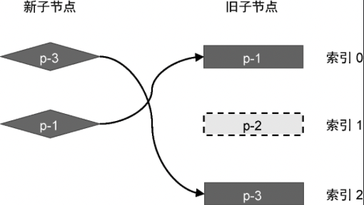
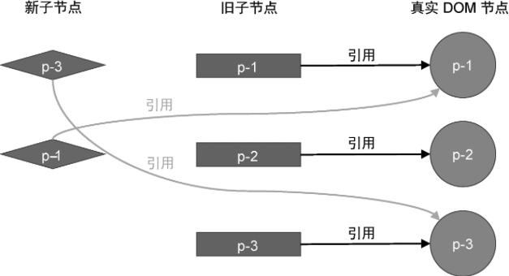
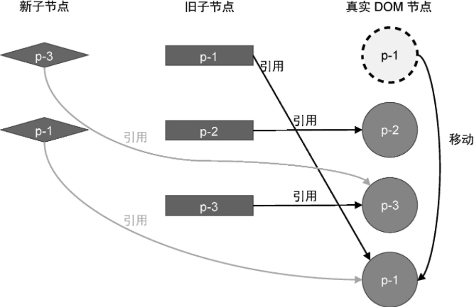

在更新子节点时，不仅会遇到新增元素，还会出现元素被阐述的情况，如图 17 所示。



在新的一组子节点中，节点 p-2 已经不存在了，这说明该节点被删除了。渲染器应该能找到那些需要删除的节点并正确地将其删除。

具体要如何所呢？ 首先，我们来讨论如何找到需要删除的节点。以图 17 为例，我们来分析它的更新步骤。在模拟执行更新逻辑之前，我们需要清楚新旧两组子节点以及真实 DOM 节点的当前状态，如图 18 所示。



接着，我们开始模拟执行更新的过程。

- 第一步：取新的一组子节点中的第一个节点 p-3，它的 key 值为 3。尝试在旧的一组子节点中寻找可复用的节点。发现能够找到，并且该节点在旧的一组子节点中的索引值为 2。此时变量 lastIndex 的值为 0，索引 2 不小于 lastIndex 的值 0，所以节点 p-3 对应的真实 DOM 不需要移动，但需要更新变量 lastIndex 的值为 2。

- 第二步：取新的一组子节点中的第二个节点 p-1，它的 key 值为 1。尝试在旧的一组子节点中寻找可复用的节点。发现能够找到，并且该节点在旧的一组子节点中的索引值为 0。此时变量 lastIndex 的值为 2，索引 0 小于 lastIndex 的值 2，所以节点 p-1 对应的真实 DOM 需要移动，并且应该移动到节点 p-3 对应的真实 DOM 后面。经过这一步的移动操作后，真实 DOM 的状态如图 19 所示。



至此，更新结束，我们发现，节点 p-2 对应的真实 DOM 仍然存在，所以需要增加额外的逻辑来删除遗留节点。思路很简单，当基本的更新结束时，我们需要遍历旧的一组子节点，然后去新的一组子节点找具有相同的 key 值的节点。如果找不到，则说明应该删除该节点，如下面 patchChildren 函数的代码所示：

```js
function patchChildren(n1, n2, container) {
	if (typeof n2.children === "string") {
		// 省略部分代码
	} else if (Array.isArray(n2.children)) {
		const oldChildren = n1.children
		const newChildren = n2.children

		let lastIndex = 0
		for (let i = 0; i < newChildren.length; i++) {
			// 省略部分代码
		}

		// 上一步的更新操作完成后
		// 遍历旧的一组子节点
		for (let i = 0; i < oldChildren.length; i++) {
			const oldVNode = oldChildren[i]
			// 拿旧子节点 oldVNode 取新的一组子节点中寻找具有相同 key 值的节点
			const has = newChildren.find((vnode) => vnode.key === oldVNode.key)

			if (!has) {
				// 如果没有找到具有相同 key 值的节点，则说明需要删除节点
				// 调用 unmount 函数将其卸载
				unmount(oldVNode)
			}
		}
	} else {
		// 省略部分代码
	}
}
```

如以上代码及注释所示，在上一步更新操作完成之后，我们还需要遍历旧的一组子节点，目的是检查旧子节点在新的一组子节点中是否仍然存在，如果已经不存在了，则调用 unmount 函数将其卸载。
