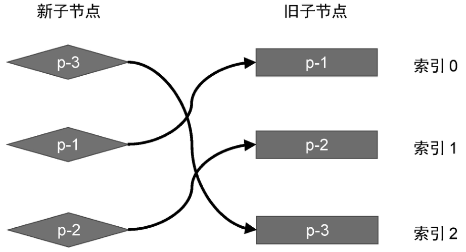
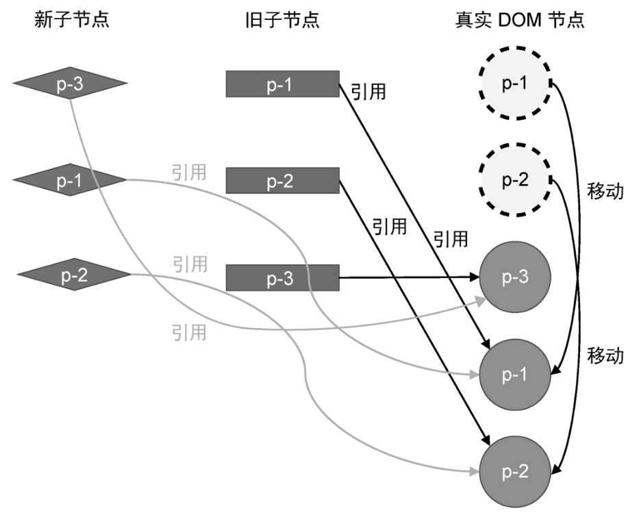
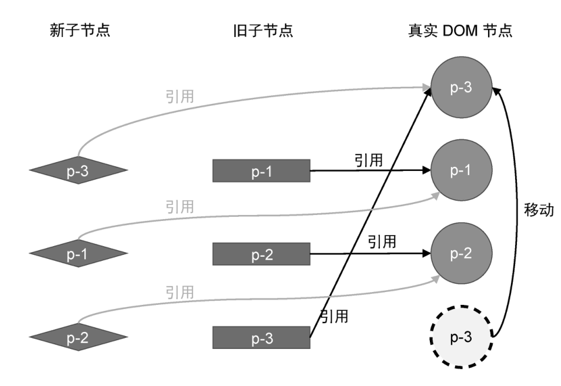
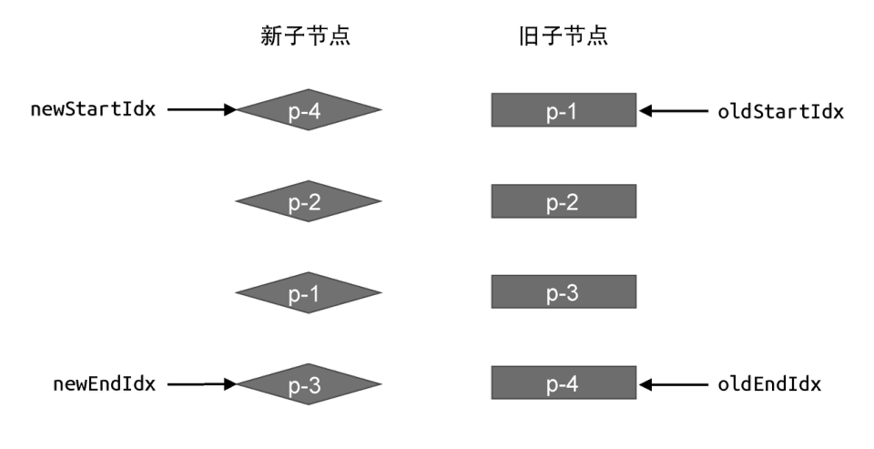
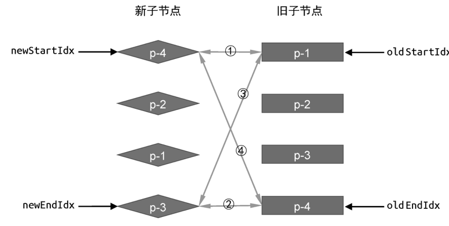
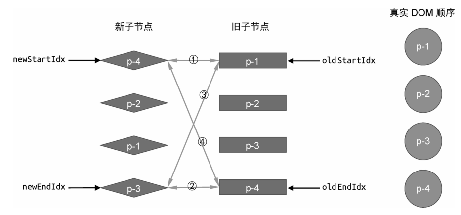
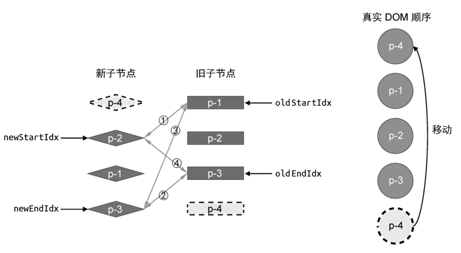
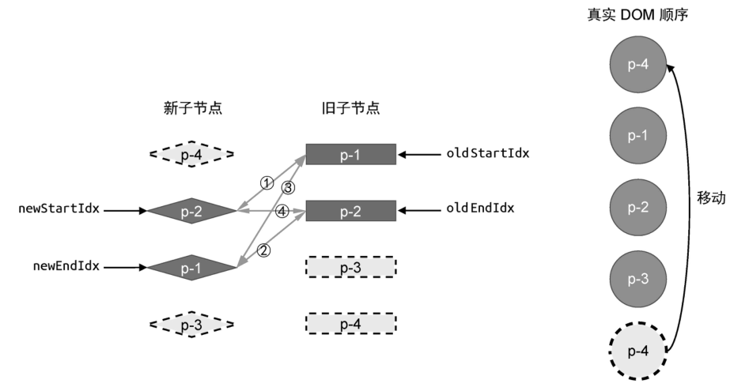
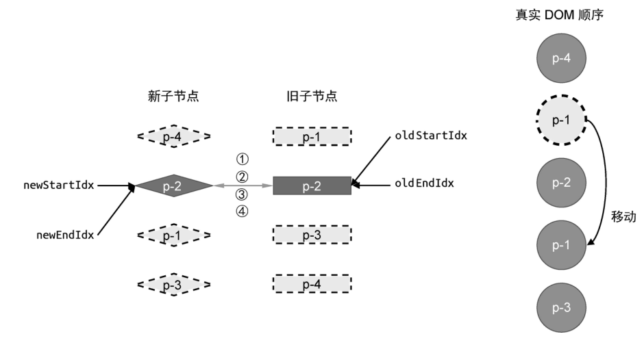
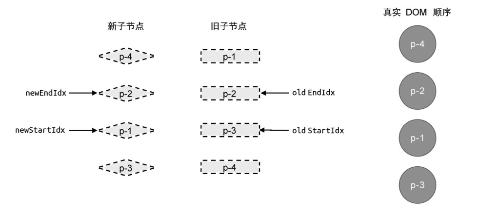

## 前言

上一章，我们介绍了简单 Diff 算法的实现原理。简单 Diff 算法利用虚拟节点的 key 属性，尽可能地复用 DOM 元素，并通过移动 DOM 的方式来完成更新，从而减少不断地创建和销毁 DOM 元素带来的性能开销。但是，简单 Diff 算法仍然存在很多缺陷，这些缺陷可以通过本章将要介绍的双端 Diff 算法解决。

## 原理

简单 Diff 算法的问题在于，它对 DOM 的移动并不是最优的。我们拿上一张的例子来看，如图 1 所示。



在这个例子中，如果使用简单 Diff 算法来更新它，则会发生两次 DOM 移动操作，如图 2 所示。



第一次 DOM 移动操作会将真实 DOM 节点 p-1 移动到真实 DOM 节点 p-3 后面。第二次移动操作会将真实 DOM 节点 p-2 移动到真实 DOM 节点 p-1 后面。最终，真实 DOM 节点的顺序与新的一组子节点一致： p-3、p-2、p-1。

然而，上述更新过程并非最优解。在这个例子中，其实只需要一步 DOM 节点的移动操作即可完成更新，即只需要把真实 DOM 节点 p-3 移动到真实 DOM 节点 p-1 前面，如图 3 所示。



可以看到，理论上只需要一次 DOM 移动操作节课完成更新。但简单 Diff 算法做不到这一点，不过本章我们要介绍的双端 Diff 算法可以做到。接下来，我们就讨论双端 Diff 算法的原理。

顾名思义，双端 Diff 算法是一种同时对新旧两组子节点的两个端点进行比较的算法。因此，我们需要四个索引值，分别指向新旧两组子节点的端点，如图 4 所示。


用代码来表达四个端点，如下面 patchChildren 和 patchKeyedChildren 函数的代码所示：

```js
function patchChildren(n1, n2, container) {
	if (typeof n2.children === "string") {
		// 省略部分代码
	} else if (Array.isArray(n2.children)) {
		// 封装 patchKeyedChildren 函数处理两组子节点
		patchKeyedChildren(n1, n2, container)
	} else {
		// 省略部分代码
	}
}

function patchKeyedChildren(n1, n2, container) {
	const oldChildren = n1.children
	const newChildren = n2.children

	// 四个索引值
	let oldStartIdx = 0
	let oldEndIdx = oldChildren.length - 1
	let newStartIdx = 0
	let newEndIdx = newChildren.length - 1
}
```

在上面这段代码中，我们将两组子节点的打补丁工作封装到了 patchKeyedChildren 函数中。在该函数内，首先获取新旧两组子节点 oldChildren 和 newChildren，接着创建四个索引值，分别指向新旧两组子节点的头和尾，即 oldStartIdx、oldEndIdx、newStartIdx 和 newEndIdx。有了索引后，就可以找到它所指向的虚拟节点了，如下面的代码所示：

```js
function patchKeyedChildren(n1, n2, container) {
	const oldChildren = n1.children
	const newChildren = n2.children

	// 四个索引值
	let oldStartIdx = 0
	let oldEndIdx = oldChildren.length - 1
	let newStartIdx = 0
	let newEndIdx = newChildren.length - 1

	// 四个索引值指向的 vnode 节点
	let oldStartVNode = oldChildren[oldStartIdx]
	let oldEndVNode = oldChildren[oldEndIdx]
	let newStartVNode = newChildren[newStartIdx]
	let oldEndVNode = newChildren[newEndIdx]
}
```

其中，oldStartVNode 和 oldEndVNode 是旧的一组子节点的第一个节点和最后一个节点，newStartVNode 和 newEndVNode 则是新的一组子节点的第一个节点和最后一个节点。有了这些信息之后，我们就可以开始进行双端比较了。怎么比较呢？ 如图 5 所示。



在双端比较重，每一轮比较都分为四个步骤，如图 5 中的连线所示。

- 第一步：比较旧的一组子节点中的第一个子节点 p-1 与新的一组子节点中的第一个子节点 p-4，看看它们是否相同。由于两者的 key 值不同，因此不相同，不可复用，于是什么都不做。

- 第二步：比较旧的一组子节点中的最后一个子节点 p-4 与新的一组子节点中的最后一个子节点 p-3，看看它们是否相同。由于两者的 key 值不同，因此不相同，不可复用，于是什么都不做。

- 第三步：比较旧的一组子节点中的第一个子节点 p-1 与新的一组子节点中的最后一个子节点 p-3，看看它们是否相同。由于两者的 key 值不同，因此不相同，不可复用，于是什么都不做。

- 第四步：比较旧的一组子节点中的最后一个子节点 p-4 与新的一组子节点中的第一个子节点 p-4，看看它们是否相同。由于两者的 key 值相同，因此可以进行 DOM 复用。

可以看到，我们在第四步时找到了相同的节点，这说明它们对应的真实 DOM 节点可以复用。对于可复用的 DOM 节点，我们只需要通过 DOM 移动操作完成更新即可。那么应该如何移动 DOM 元素呢？为了搞清楚这问题，我们需要分析第四步比较过程中的细节。我们注意到，第四步时比较旧的一组子节点的最后一个子节点与新的一组子节点的第一给子节点，发现两者相同。这说明：节点 p-4 原本是最后一个子节点，但在新的顺序中，它变成了第一个子节点。换句话说，节点 p-4 在更新之后应该是第一个子节点。对应到程序的罗技，可以将其翻译：将索引 oldEndIdx 指向的虚拟节点所对应的真实 DOM 移动到索引 oldStartIdx 指向的虚拟节点所对应的真实 DOM 前面。如下面的代码所示：

```js
function patchKeyedChildren(n1, n2, container) {
	const oldChildren = n1.children
	const newChildren = n2.children

	// 四个索引值
	let oldStartIdx = 0
	let oldEndIdx = oldChildren.length - 1
	let newStartIdx = 0
	let newEndIdx = newChildren.length - 1

	// 四个索引值指向的 vnode 节点
	let oldStartVNode = oldChildren[oldStartIdx]
	let oldEndVNode = oldChildren[oldEndIdx]
	let newStartVNode = newChildren[newStartIdx]
	let oldEndVNode = newChildren[newEndIdx]

	if (oldStartVNode.key === newStartVNode.key) {
		// 第一步： oldStartVNode 和 newStartVNode 比较
	} else if (oldEndVNode.key === newEndVNode.key) {
		// 第二步： oldEndVNode 和 newEndVNode 比较
	} else if (oldStartVNode.key === newEndVNode.key) {
		// 第三步： oldStartVNode 和 newEndVNode 比较
	} else if (oldEndVNode.key === newStartVNode.key) {
		// 第四步： oldEndVNode 和 newStartVNode 比较
		// 仍然需要调用 patch 函数 进行打补丁
		patch(oldEndVnode, newStartVNode, container)
		// 移动 DOM 操作
		// oldEndVNode.el 移动到 oldStartVNode.el
		insert(oldEndVNode.el, container, oldStartVNode.el)
	}
}
```

在这段代码中，我们增加了一系列 if...else if ... 语句，用来实现四个索引指向的虚拟节点之间的比较。拿上例来说，在第四步中，我们找到了具有相同 key 值的节点。这说明，原来处于尾部的节点在新的顺序中应该处于头部。于是，我们只需要以头部元素 oldStartVNode.el 作为锚点，将尾部元素 oldEndVNode.el 移动到锚点前面即可。但需要注意的是，在进行 DOM 的移动操作之前，仍然需要调用 patch 函数在新旧虚拟节点之间打补丁。

在这一步 DOM 的移动操作完成后，接下来是比较关键的步骤，即更新索引值。由于第四步中涉及的两个索引值是 oldEndIdx 和 newStartIdx，索引我们需要更新两者的智，让它们各自朝正确的方向前进一步，并指向下一个节点。图 6 给出了更新前新旧两组子节点以及真实 DOM 节点的状态。


图 7 给出了在第四步的比较中，第一步 DOM 移动操作完成后，新旧两组子节点以及真实 DOM 节点的状态。



此时，真实 DOM 节点顺序为 p-4、p-1、p-2、p-3，这与新的一组子节点顺序不一致。这是因为 Diff 算法还没有结束，还需要进行下一轮更新。因此，我们需要将更新逻辑封装到一个 while 循环中，如下面的代码所示：

```js
while (oldStartIdx <= oldEndIdx && newStartIdx <= newEndIdx) {
	if (oldStartVNode.key === newStartVNode.key) {
		// 第一步： oldStartVNode 和 newStartVNode 比较
	} else if (oldEndVNode.key === newEndVNode.key) {
		// 第二步： oldEndVNode 和 newEndVNode 比较
	} else if (oldStartVNode.key === newEndVNode.key) {
		// 第三步： oldStartVNode 和 newEndVNode 比较
	} else if (oldEndVNode.key === newStartVNode.key) {
		// 第四步： oldEndVNode 和 newStartVNode 比较
		// 仍然需要调用 patch 函数 进行打补丁
		patch(oldEndVnode, newStartVNode, container)
		// 移动 DOM 操作
		// oldEndVNode.el 移动到 oldStartVNode.el
		insert(oldEndVNode.el, container, oldStartVNode.el)

		// 移动 DOM 完成后，更新索引值，指向下一个位置
		oldEndVNode = oldChildren[--oldEndIdx]
		newStartVNode = newChildren[++newStartIdx]
	}
}
```

由于在每一轮更新完成之后，紧接着都会更新四个索引中对与当前更新轮次相关联的索引，所以整个 while 的循环条件是：头部索引值要小于等于尾部索引值。

在第一轮更新结束后循环条件仍然成立，因此需要进行下一轮的比较，如图 7 所示。

- 第一步：比较旧的一组子节点中的头部节点 p-1 与新的一组子节点中的头部节点 p-2,看看它们是否相同。由于两者的 key 值不同，不可复用，所以什么都不做。

- 第二步：比较旧的一组子节点的尾部节点 p-3 与新的一组子节点中的尾部节点 p-3，两者的 key 值相同，可以复用。另外，由于两者都处于尾部，因此不需要对真实 DOM 进行移动操作，只需要打补丁即可，如下面的代码所示：

```js
while (oldStartIdx <= oldEndIdx && newStartIdx <= newEndIdx) {
	if (oldStartVNode.key === newStartVNode.key) {
		// 第一步： oldStartVNode 和 newStartVNode 比较
	} else if (oldEndVNode.key === newEndVNode.key) {
		// 第二步： oldEndVNode 和 newEndVNode 比较
		// 节点在新的顺序中仍然处于尾部，不需要移动，但仍需打补丁
		patch(oldEndVNode, newEndVNode, container)
		// 更新索引和头尾部节点变量
		oldEndVNode = oldChildren[--oldEndIdx]
		newEndVNode = newChildren[--newEndIdx]
	} else if (oldStartVNode.key === newEndVNode.key) {
		// 第三步： oldStartVNode 和 newEndVNode 比较
	} else if (oldEndVNode.key === newStartVNode.key) {
		// 第四步： oldEndVNode 和 newStartVNode 比较
		// 仍然需要调用 patch 函数 进行打补丁
		patch(oldEndVnode, newStartVNode, container)
		// 移动 DOM 操作
		// oldEndVNode.el 移动到 oldStartVNode.el
		insert(oldEndVNode.el, container, oldStartVNode.el)

		// 移动 DOM 完成后，更新索引值，指向下一个位置
		oldEndVNode = oldChildren[--oldEndIdx]
		newStartVNode = newChildren[++newStartIdx]
	}
}
```

在这一轮更新完成之后，新旧两组子节点与真实 DOM 节点的状态如图 8 所示。



真实 DOM 的顺序相比上一轮没有变化，因为在这一轮的比较中没有对 DOM 节点进行移动，只是对 p-3 节点打补丁。接下来，我们在根据图 8 所示的状态进行下一轮的比较。

- 第一步：比较旧的一组子节点中的头部节点 p-1 与新的一组子节点中的头部节点 p-2，看看它们是否相同。由于两者的 key 值不同，不可复用，因此什么都不做。

- 第二步：比较旧的一组子节点中的尾部节点 p-2 与新的一组子节点中的尾部节点 p-1,看看它们是否相同，由于两者的 key 值不同，不可复用，因此什么都不做。

- 第三步： 比较旧的一组子节点的头部节点 p-1 与新的一组子节点中的尾部节点 p-1。两者的 key 值相同，可以复用。

在第三步的比较重，我们找到了相同的节点，这说明：节点 p-1 原本是头部节点，但在新的顺序中，变成了尾部节点。因此，我们需要将节点 p-1 对应的真实 DOM 移动到旧的一组子节点的尾部节点 p-2 所对应的真实 DOM 后面，同时还需要更新相应索引到下一个为止，如图 9 所示。



这一步的代码实现如下：

```js
while (oldStartIdx <= oldEndIdx && newStartIdx <= newEndIdx) {
	if (oldStartVNode.key === newStartVNode.key) {
		// 第一步： oldStartVNode 和 newStartVNode 比较
	} else if (oldEndVNode.key === newEndVNode.key) {
		// 第二步： oldEndVNode 和 newEndVNode 比较
		// 节点在新的顺序中仍然处于尾部，不需要移动，但仍需打补丁
		patch(oldEndVNode, newEndVNode, container)
		// 更新索引和头尾部节点变量
		oldEndVNode = oldChildren[--oldEndIdx]
		newEndVNode = newChildren[--newEndIdx]
	} else if (oldStartVNode.key === newEndVNode.key) {
		// 第三步： oldStartVNode 和 newEndVNode 比较
		// 调用 patch 函数 在 oldStartVNode 和 newEndVNode 之间打补丁
		patch(oldStartVNode, newEndVNode, container)
		// 将旧的一组子节点的头部节点对应的这是DOM节点 oldStartVNode.el 移动到
		// 旧的一组子节点的尾部节点对应的真实DOM节点后面
		insert(oldStartVNode.el, container, oldEndVNode.el.nextSibling)
		// 更新相关索引到下一个位置
		oldStartVNode = oldChildren[++oldStartIdx]
		newEndVNode = newChildren[--newEndIdx]
	} else if (oldEndVNode.key === newStartVNode.key) {
		// 第四步： oldEndVNode 和 newStartVNode 比较
		// 仍然需要调用 patch 函数 进行打补丁
		patch(oldEndVnode, newStartVNode, container)
		// 移动 DOM 操作
		// oldEndVNode.el 移动到 oldStartVNode.el
		insert(oldEndVNode.el, container, oldStartVNode.el)

		// 移动 DOM 完成后，更新索引值，指向下一个位置
		oldEndVNode = oldChildren[--oldEndIdx]
		newStartVNode = newChildren[++newStartIdx]
	}
}
```

如上面的代码所示，如果旧的一组子节点的头部节点与新的一组子节点的尾部节点相匹配，则说明该旧节点所对应的真实 DOM 节点需要移动到尾部。因此，我们需要获取当前尾部节点的下一个兄弟节点作为锚点，即 oldEndVNode.el.nextSibling。最后，更新相关索引到下一个位置。

通过图 9 可知，此时，新旧两组子节点的头部索引和尾部索引发生重合，但仍然满足循环的条件，所以还会进行下一轮的更新。而在接下来的这一轮更新中，更新步骤也发生了重合。

- 第一步：比较旧的一组子节点中的头部节点 p-2 与新的一组子节点中的头部节点 p-2.发现两者 key 值相同，可以不用。但两者在新旧两组子节点中都是头部节点，因此不需要移动，只需要调用 patch 函数进行打补丁即可。

代码实现如下：

```js
while (oldStartIdx <= oldEndIdx && newStartIdx <= newEndIdx) {
	if (oldStartVNode.key === newStartVNode.key) {
		// 第一步： oldStartVNode 和 newStartVNode 比较
		// 调用 patch 函数在 oldStartVNode 与 newStartVNode 之间打补丁
		patch(oldStartVNode, newStartVNode, container)
		// 更新相关索引, 指向下一个位置
		oldStartVNode = oldChildren[++oldStartIdx]
		newStartVNode = newChildren[++newStartIdx]
	} else if (oldEndVNode.key === newEndVNode.key) {
		// 第二步： oldEndVNode 和 newEndVNode 比较
		// 节点在新的顺序中仍然处于尾部，不需要移动，但仍需打补丁
		patch(oldEndVNode, newEndVNode, container)
		// 更新索引和头尾部节点变量
		oldEndVNode = oldChildren[--oldEndIdx]
		newEndVNode = newChildren[--newEndIdx]
	} else if (oldStartVNode.key === newEndVNode.key) {
		// 第三步： oldStartVNode 和 newEndVNode 比较
		// 调用 patch 函数 在 oldStartVNode 和 newEndVNode 之间打补丁
		patch(oldStartVNode, newEndVNode, container)
		// 将旧的一组子节点的头部节点对应的这是DOM节点 oldStartVNode.el 移动到
		// 旧的一组子节点的尾部节点对应的真实DOM节点后面
		insert(oldStartVNode.el, container, oldEndVNode.el.nextSibling)
		// 更新相关索引到下一个位置
		oldStartVNode = oldChildren[++oldStartIdx]
		newEndVNode = newChildren[--newEndIdx]
	} else if (oldEndVNode.key === newStartVNode.key) {
		// 第四步： oldEndVNode 和 newStartVNode 比较
		// 仍然需要调用 patch 函数 进行打补丁
		patch(oldEndVnode, newStartVNode, container)
		// 移动 DOM 操作
		// oldEndVNode.el 移动到 oldStartVNode.el
		insert(oldEndVNode.el, container, oldStartVNode.el)

		// 移动 DOM 完成后，更新索引值，指向下一个位置
		oldEndVNode = oldChildren[--oldEndIdx]
		newStartVNode = newChildren[++newStartIdx]
	}
}
```

在这一轮更新之后，新旧两组子节点与真实 DOM 节点的状态如图 10 所示。



此时，真实 DOM 节点的顺序与新的一组子节点的顺序相同了:p-4、p-2、p-1、p-3。另外，在这一轮更新完成之后，索引 newStartIdx 和索引 oldStartIdex 的值都大于 newEndIdx 和 oldEndIdx,所以循环终止，双端 Diff 算法执行完毕。
