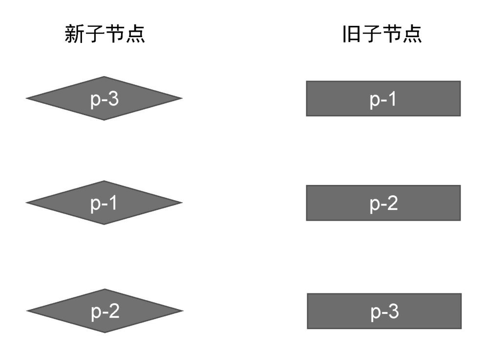
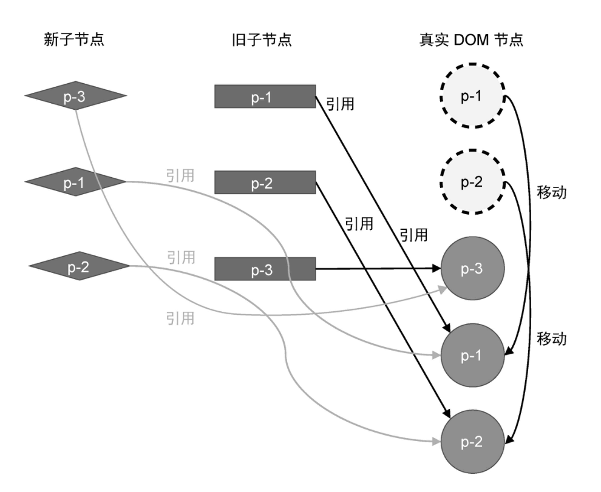
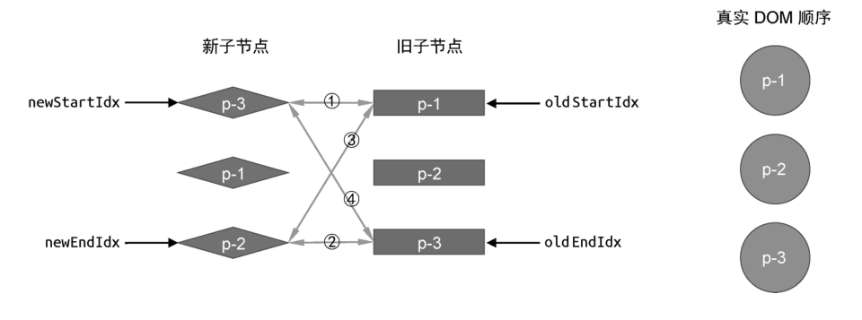
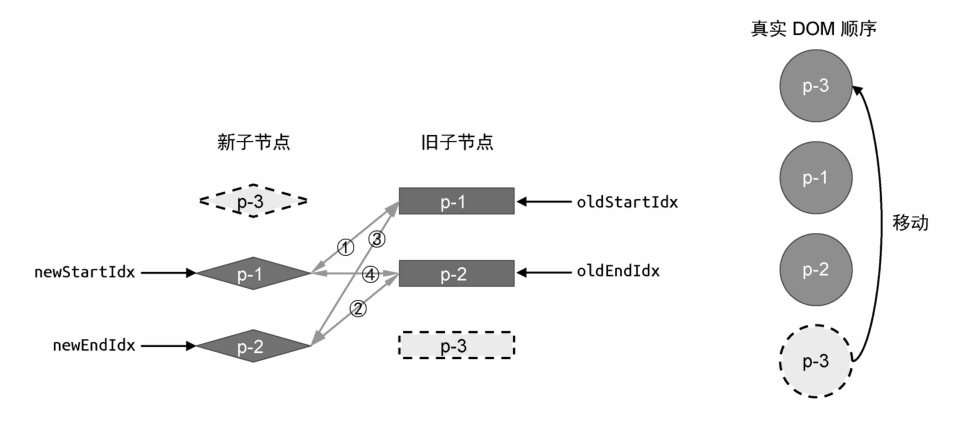

理解了双端比较的原理之后，我们来看看与简单 Diff 算法相比，双端 Diff 算法具有怎样的优势。
我们拿上一章的例子来看，如图 11 所示。

图 11 给出了新旧两组子节点的顺序。当使用简单 Diff 算法对此例进行更新时，会发生两次 DOM 移动操作，如图 12 所示。

如果使用双端 Diff 算法对此例进行更新，会有怎样的表现呢？接下来，我们就以双端比较的思路来完成此例的更新，看一看双端 Diff 算法能否减少 DOM 移动操作次数。

图 13 给出了算法执行之前新旧两组子节点与真实 DOM 节点的状态。

接下来，我们就按照双端比较的步骤执行更新。

- 第一步：比较旧的一组子节点中的头部节点 p-1 与新的一组子节点中的头部节点 p-3,两者 key 值不同，不可复用。

- 第二步：比较旧的一组子节点中的尾部节点 p-3 与新的一组子节点中的尾部节点 p-2，两者 key 值不同，不可复用。

- 第三步：比较旧的一组子节点中的头部节点 p-1 与新的一组子节点中的尾部节点 p-2,两者 key 值不同，不可复用。

- 第四步：比较旧的一组子节点中的尾部节点 p-3 与新的一组子节点中的头部节点 p-3，发现可以复用。

可以看到，在第四步的比较重，我们找到了可复用的节点 p-3。该节点原本处于所有子节点的尾部，但在新的一组子节点中它处于头部。因此，只需要让节点 p-3 对应的真实 DOM 变成新的头部节点即可。在这一步的移动操作之后，新旧两组子节点以及真实 DOM 节点的状态如图 14 所示。

观察图 14 能够发现，在这一轮比较过后，真是 DOM 节点的顺序已经与新的一组子节点的顺序一致了。换句话说，我们完成了更新，不过算法仍然会继续执行。开始下一轮的比较。

- 第一步：比较旧的一组子节点中的头部节点 p-1 与新的一组子节点中的头部节点 p-1，两者的 key 值相同，可以复用。但由于两者都处于头部，因此不需要移动，只需要打补丁即可。

在这一轮的比较后，新旧两组子节点与真实 DOM 节点的状态如图 15 所示。

<!--  -->

此时，双端 DIff 算法仍然没有停止，开始新一轮的比较。

- 第一步：比较旧的一组子节点中的头部节点 p-2 与新的一组子节点中的头部节点 p-2，两者的 key 值相同，可以复用。但由于两者都处于头部，因此不需要移动，只需要打补丁即可。

在这一轮比较过后，新旧两组子节点与真实 DOM 节点的状态如图 16 所示。

到这一步后，索引 newStartIdex 与 oldStartIdx 的值比索引 newEndIdx 和 oldEndIdx 的值大，于是更新结束。可以看到，对于同样的例子，采用简单 DIff 算法需要两次 DOM 移动操作才能完成更新，而使用双端 DIff 算法只需要一次 DOM 移动操作即可完成更新。
