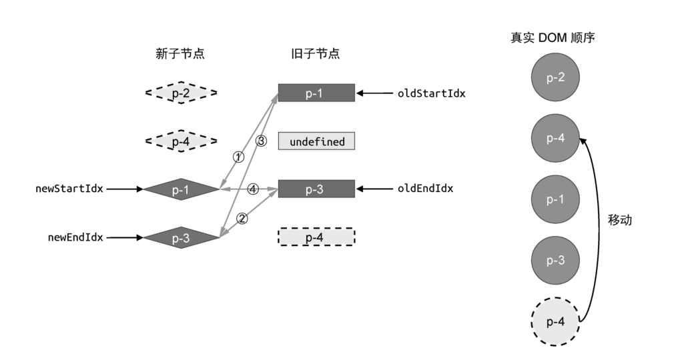

在上一节的讲解中，我们用了一个比较理想的例子。我们知道，双端 Diff 算法的每一轮比较都分为四个步骤。在上一节的例子中，每一轮比较都会命中四个步骤中的一个，这是非常理想的状况。但实际上，并非所有情况都这么理想，如图 17 所示。


第一轮比较都无法命中。

在这个例子中，新旧两组子节点的顺序如下。

- 旧的一组子节点: p-1、p-2、p-3、p-4。
- 新的一组子节点: p-2、p-4、p-1、p-3。

当我们尝试按照双端 Diff 算法的思路进行第一轮比较时，会发现无法命中四个步骤中的任何一步。

- 第一步： 比较旧的一组子节点中的头部节点 p-1 与新的一组子节点中的头部节点 p-2,不可复用。
- 第二步： 比较旧的一组子节点中的尾部节点 p-4 与新的一组子节点中的尾部节点 p-3,不可复用。
- 第三步： 比较旧的一组子节点中的头部节点 p-1 与新的一组子节点中的尾部节点 p-3,不可复用。
- 第四步： 比较旧的一组子节点中的尾部节点 p-4 与新的一组子节点中的头部节点 p-2,不可复用。

在四个步骤的比较过程中，都无法找到可复用的节点，应该怎么办呢？这是，我们只能通过增加额外的处理步骤来处理这种非理想情况。既然两个头部和两个尾部的四个节点中都没有可复用的节点，那么我们就尝试看看非头部、非尾部的节点能否复用。具体做法是，拿新的一组子节点中的头部节点去旧的一组子节点中寻找，如下面的代码所示：

```js
while (oldStartIdx <= oldEndIdx && newStartIdx <= newEndIdx) {
	if (oldStartVNode.key === newStartVNode.key) {
		// 省略部分代码
	} else if (oldEndVNode.key === newEndVNode.key) {
		// 省略部分代码
	} else if (oldStartVNode.key === newEndVNode.key) {
		// 省略部分代码
	} else if (oldEndVNode.key === newStartVNode.key) {
		// 省略部分代码
	} else {
		// 遍历旧的一组子节点，试图寻找与 newStartVNode 拥有相同 key值的节点
		// idxInOld 就是 新的一组子节点的头部节点在旧的一组子节点中的索引
		const idxInOld = oldChildren.findIndex((node) => node.key === newStartVNode.key)
	}
}
```

在上面这段代码中，我们遍历旧的一组子节点，尝试在其中寻找与新的一组子节点的头部节点具有相同 key 值的节点，并将该节点在旧的一组子节点中的索引存储到变量 idxInOld 中。这么做的目的是什么呢？想要搞清楚这个问题，本质上需要我们先搞清楚：在旧的一组子节点中，找到与新的一组子节点的头部节点具有相同 key 值的节点意味着什么？如图 18 所示。


观察图 18，当我们拿次新的一组子节点的头部节点 p-2 去旧的一组子节点中查找时，会在索引为 1 的位置找到可复用的节点。这意味着，节点 p-2 原本不是头部节点，但在更新之后，它应该变成头部节点。索引我们需要将节点 p-2 对应的真实 DOM 节点移动到当前旧的已一组子节点的头部节点 p-1 所对应的真实 DOM 节点之前。具体实现如下：

```js
while (oldStartIdx <= oldEndIdx && newStartIdx <= newEndIdx) {
	if (oldStartVNode.key === newStartVNode.key) {
		// 省略部分代码
	} else if (oldEndVNode.key === newEndVNode.key) {
		// 省略部分代码
	} else if (oldStartVNode.key === newEndVNode.key) {
		// 省略部分代码
	} else if (oldEndVNode.key === newStartVNode.key) {
		// 省略部分代码
	} else {
		// 遍历旧 children，试图寻找与 newStartVNode 拥有相同 key 值的元素
		const idxInOld = oldChildren.findIndex((node) => node.key === newStartVNode.key)
		// idxInOld 大于 0，说明找到了可复用的节点，并且需要将其对应的真实 DOM 移动到头部
		if (idxInOld > 0) {
			// idxInOld 位置对应的 vnode 就是需要移动的节点
			const vnodeToMove = oldChildren[idxInOld]
			// 不要忘记除移动操作外还应该打补丁
			patch(vnodeToMove, newStartVNode, container)
			// 将 vnodeToMove.el 移动到头部节点 oldStartVNode.el 之前，因此使用后者作为锚点
			insert(vnodeToMove.el, container, oldStartVNode.el)
			// 由于位置 idxInOld 处的节点所对应的真实 DOM 已经移动到了别处，因此将其设置为 undefined
			oldChildren[idxInOld] = undefined
			// 最后更新 newStartIdx 到下一个位置
			newStartVNode = newChildren[++newStartIdx]
		}
	}
}
```

在上面这段代码中，首先判断 idxInOld 是否大于 0.如果条件成立，则说明找到了可复用的节点，然后将该节点对应的真实 DOM 移动到头部。为此，我们先要获取需要移动的节点，这里的`oldChildren[idxInOld]`所指向的节点就是需要移动的节点。在移动节点之前，不要忘记调用 patch 函数进行打补丁。接着，调用 insert 函数，并以现在的头部节点对应的真实 DOM 节点 oldStartVNode.el 作为锚点参数来完成节点的移动。当节点移动完成之后，还有两步工作要做。

- 由于处于 idxInOld 处的节点已经处理过了（对应的真实 DOM 移动到了别处），因此我们应该将`oldChildren[idxInOld]`设置为 undefined。
- 新的一组子节点的头部节点已经处理完毕，因此将 newStartIdx 前进到下一个位置。

经过上述的两个步骤的操作后，新旧两组子节点以及真实 DOM 节点的状态如图 19 所示。


此时，真实 DOM 的顺序为:p-2、p-1、p-3、p-4。接着，双端 Diff 算法会继续进行，如图 29 所示。


- 第一步： 比较旧的一组子节点的头部节点 p-1 与新的一组子节点中的头部节点 p-4,两者 key 值不同，可不复用。

- 第二步：比较旧的一组子节点中的尾部节点 p-4 与新的一组子节点中的尾部节点 p-3，两者 key 值不同，不可复用。

- 第三步：比较旧的一组子节点中的头部节点 p-1 与新的一组子节点中的尾部节点 p-3，两者 key 值不同，不可复用。

- 第四步：比较旧的一组子节点中的尾部节点 p-4 与新的一组子节点中的头部节点 p-4，两者的 key 值相同，可以复用。

在这一轮比较的第四步中，我们知道了可复用的节点，因此，按照双端 Diff 算法的逻辑移动真实 DOM，即把节点 p-4 对应的真实 DOM 移动到旧的一组子节点中头部节点 p-1 所对应的真实 DOM 前面，如图 21 所示。



此时，真实 DOM 的顺序为:p-2、p-4、p-1、p-3。接着，开始下一轮的比较。

- 第一步：比较旧的一组子节点中的头部节点 p-1 与新的一组子节点中的头部节点 p-1，两者的 key 值相同，可以复用。

在这一轮比较重，第一步旧找到了可复用的节点。由于两者都处于头部，所以不需要对真实 DOM 进行移动，只需要打补丁即可。在这一步操作过后，新旧两组子节点与真实 DOM 节点的状态如图 22 所示。


此时，真实 DOM 的顺序为:p-2、p-4、p-1、p-3。接着，进行下一轮的比较。需要注意的一点是，此时旧的一组子节点的头部节点是 undefined。这说明节点已经被处理过了，因此不需要再处理它了，直接跳过即可。为此，我们需要补充这部分逻辑代码，具体实现如下：

```js
while (oldStartIdx <= oldEndIdx && newStartIdx <= newEndIdx) {
	// 增加两个判断分支，如果头尾部节点为 undefined，则说明该节点已经被处理过了，直接跳到下一个位置
	if (!oldStartVNode) {
		oldStartVNode = oldChildren[++oldStartIdx]
	} else if (!oldEndVNode) {
		oldEndVNode = oldChildren[--oldEndIdx]
	} else if (oldStartVNode.key === newStartVNode.key) {
		// 省略部分代码
	} else if (oldEndVNode.key === newEndVNode.key) {
		// 省略部分代码
	} else if (oldStartVNode.key === newEndVNode.key) {
		// 省略部分代码
	} else if (oldEndVNode.key === newStartVNode.key) {
		// 省略部分代码
	} else {
		const idxInOld = oldChildren.findIndex((node) => node.key === newStartVNode.key)
		if (idxInOld > 0) {
			const vnodeToMove = oldChildren[idxInOld]
			patch(vnodeToMove, newStartVNode, container)
			insert(vnodeToMove.el, container, oldStartVNode.el)
			oldChildren[idxInOld] = undefined
			newStartVNode = newChildren[++newStartIdx]
		}
	}
}
```

观察上面的代码，在循环开始时，我们优先判断头部节点和尾部节点是否存在。如果不存在，则说明它们已经被处理过了，直接跳到下一个为止节课。在这一轮比较后，新旧两组子节点与真实 DOM 节点的状态如图 23 所示。


现在，四个步骤又重合了，接着进行最后一轮的比较。

- 第一步；比较旧的一组子节点中的头部节点 p-3 与新的一组子节点中的头部节点 p-3，两者的 key 值相同，可以复用。

在第一步中找到了可复用的节点。由于两者都是头部节点，因此不需要进行 DOM 移动操作，直接打补丁即可。在这一轮比较过后，最终状态如图所 24 所示。


这时，满足循环停止的条件，于是更新完成。最终真实 DOM 节点的顺序与新的一组子节点的顺序一致，都是:p-2、p-4、p-1、p-3。
