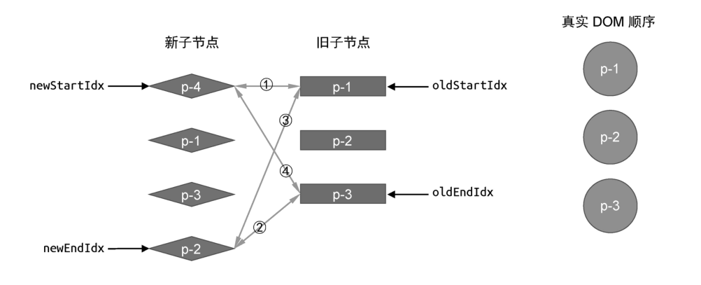
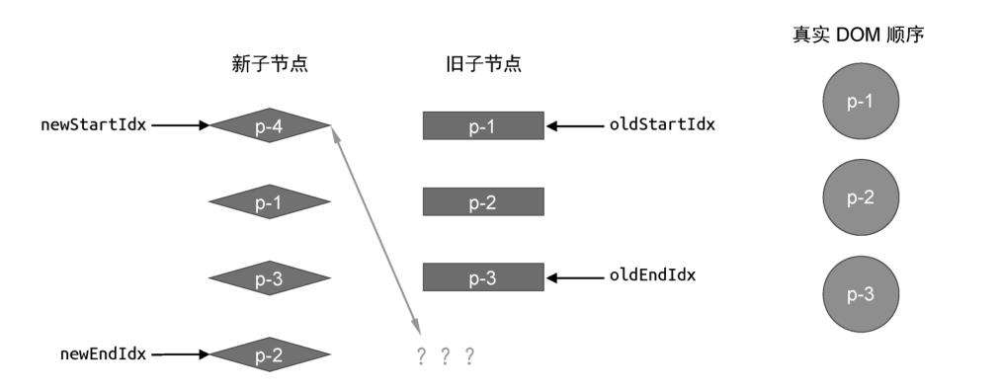
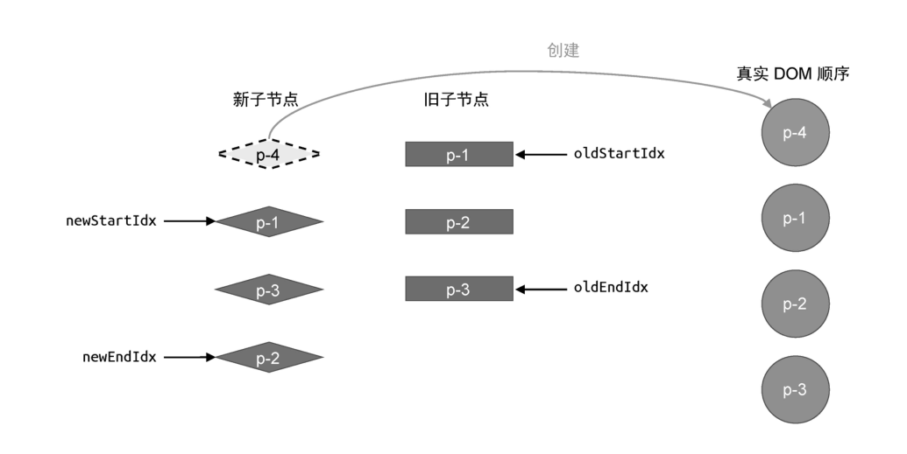
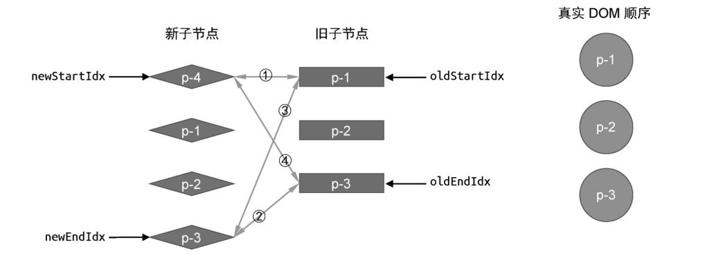
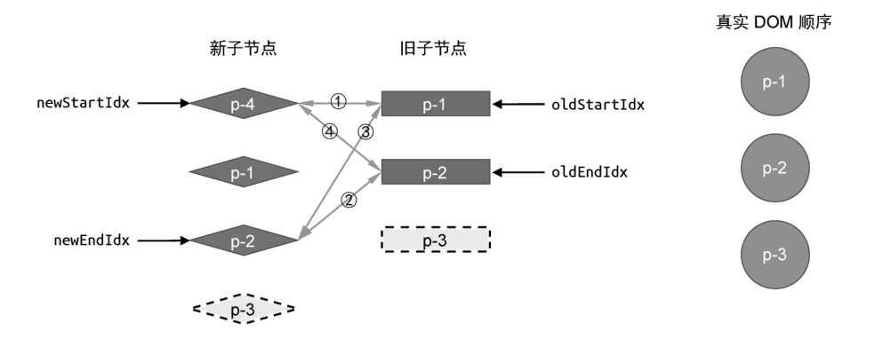
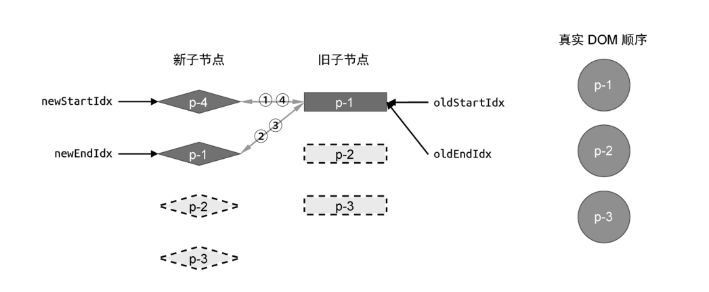
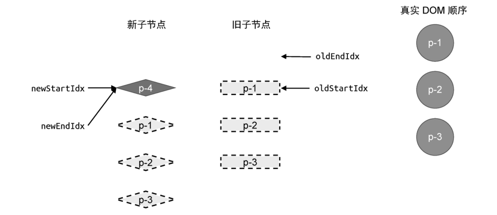

在上一节中，我们讲解了非理想情况的处理，即在一轮比较过程中，不会命中四个步骤中的任何一步。这时，我们会拿新的一组子节点中的头部节点去旧的一组子节点中寻找可复用的节点，然而并非总能找到，如图 25 所示。



在这个例子中，新旧两组子节点的顺序如下。

- 旧的一组子节点: p-1、p-2、p-3。

- 新的一组子节点: p-4、p-1、p-3、p-2。

首先，我们尝试进行第一轮比较，发现在四个步骤的比较重都找不到可复用的几点。于是我们尝试拿新的一组子节点中的头部节点 p-4 去旧的一组子节点中寻找具有相同 key 值的节点，但在旧的一组子节点中根本旧没有 p-4 节点，如图 26 所示。



这说明节点 p-4 是一个新增节点，我们应该将它挂载到正确的位置。那么应该挂载到哪里呢？很简单，因为节点 p-4 是新的一组子节点中的头部节点，所以只需要将它挂载到当前头部节点之前即可。“当前”头部节点指的是，旧的一组子节点中的头部节点所对应的真实 DOM 节点 p-1。下面是用来挂载完成操作的代码。

```js
while (oldStartIdx <= oldEndIdx && newStartIdx <= newEndIdx) {
	// 增加两个判断分支，如果头尾部节点为 undefined，则说明该节点已经被处理过了，直接跳到下一个位置
	if (!oldStartVNode) {
		oldStartVNode = oldChildren[++oldStartIdx]
	} else if (!oldEndVNode) {
		oldEndVNode = newChildren[--oldEndIdx]
	} else if (oldStartVNode.key === newStartVNode.key) {
		// 省略部分代码
	} else if (oldEndVNode.key === newEndVNode.key) {
		// 省略部分代码
	} else if (oldStartVNode.key === newEndVNode.key) {
		// 省略部分代码
	} else if (oldEndVNode.key === newStartVNode.key) {
		// 省略部分代码
	} else {
		const idxInOld = oldChildren.findIndex((node) => node.key === newStartVNode.key)
		if (idxInOld > 0) {
			const vnodeToMove = oldChildren[idxInOld]
			patch(vnodeToMove, newStartVNode, container)
			insert(vnodeToMove.el, container, oldStartVNode.el)
			oldChildren[idxInOld] = undefined
		} else {
			// 将 newStartVNode 作为新节点挂载到头部，使用当前头部节点 oldStartVNode.el 作为锚点
			patch(null, newStartVNode, container, oldStartVNode.el)
		}
		newStartVNode = newChildren[++newStartIdx]
	}
}
```

如上面代码所示，当条件 idxInOld >0 不成立时，说明 newStartVNode 节点是全新的节点。又由于 newStartVNode 节点是头部节点，因此我们应该将其作为新的头部节点进行挂载。所以，在调用 patch 函数挂载节点时，我们使用 oldStartVNode.el 作为锚点。在这一步操作完成之后，新旧两组子节点以及真实 DOM 节点的状态如图 27 所示。



当新节点 p-4 挂载完成后，会进行后续的更新，知道全部更新完成为止。但这样就完美了吗？答案是否定的，我们再来看另外一个例子，如图 28 所示。



这个例子与上一个例子的不同之处在于，我们调整了新的一组子节点的顺序:p-4、p-1、p-2、p-3。西面我们按照双端 Diff 算法的思路来执行更新，看看会发生什么。

- 第一步：比较旧的一组子节点中的头部节点 p-1 与新的一组子节点中的头部节点 p-4，两者的 key 值不同，不可以复用。

- 第二步：比较旧的一组子节点中的尾部节点 p-3 与新的一组子节点中的尾部节点 p-3，两者的 key 值相同，可以复用

在第二步中找到了可复用的节点，因此进行更新。跟新后的新旧两组子节点以及真实 DOM 节点的状态如图 29 所示。



接着进行下一轮的比较。

- 第一步：比较旧的一组子节点中的头部节点 p-1 的头部节点 p-4，两者的 key 值不同，不可以复用。

- 第二步：比较旧的一组子节点中的尾部节点 p-2 与新的一组子节点中的尾部节点 p-2，两者的 key 值相同，可以复用。

我们又在第二步找到了可复用的节点，于是再次进行更新。更新后的新旧两组子节点以及真实 DOM 节点的状态如图 30 所示。



接着，进行下一轮的更新。

- 第一步：比较旧的一组子节点中的头部节点 p-1 与新的一组子节点中的头部节点 p-4，两者的 key 值不同，不可以复用。

- 第二步：比较旧的一组子节点中的尾部节点 p-1 与新的一组子节点中的尾部节点 p-1，两者的 key 值相同，可以复用

还是在第二步找到了可复用的节点，再次进行更新。跟新后的新旧两组子节点以及真实 DOM 节点的状态如图 31 所示。



当这一轮更新完毕后，由于变量 oldStartIdx 的值大于 oldEndIdx 的值，满足更新停止的条件，因此更新停止。但通过观察可知，节点 p-4 在整个更新过程中被遗漏了，没有得到任何处理，这说明我们的算法是有却缺陷的。为了弥补这个缺陷，我们需要添加额外的处理代码，如下所示：

```js
while (oldStartIdx <= oldEndIdx && newStartIdx <= newEndIdx) {
	// 省略部分代码
}

// 循环结束后检查索引值的情况，
if (oldEndIdx < oldStartIdx && newStartIdx <= newEndIdx) {
	// 如果满足条件，则说明有新的节点遗留，需要挂载它们
	for (let i = newStartIdx; i <= newEndIdx; i++) {
		const anchor = newChildren[newEndIdx + 1] ? newChildren[newEndIdx + 1].el : null
		patch(null, newChildren[i], container, anchor)
	}
}
```

我们在 while 循环结束后增加了一个 if 条件语句，检查四个索引值的情况。如图 31 可知，如果条件 oldEndIdx < oldStartIdx && newStartIdx <= newEndIdx 成立，说明新的一组子节点中有遗留的节点需要作为新节点挂载。哪些节点是新节点呢？索引值位于 newStartIdx 和 newEndIdx 这个区间内的节点都是新节点。于是我们开启一个 for 循环来遍历这个区间内的节点并逐一挂载。挂载时的锚点应为 newEndIdx 的所对应的节点之前,这样就完成了对新增元素的处理。
