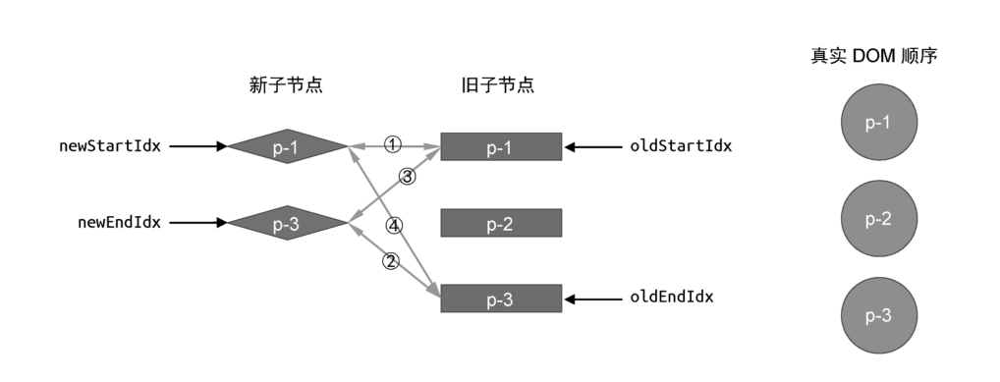
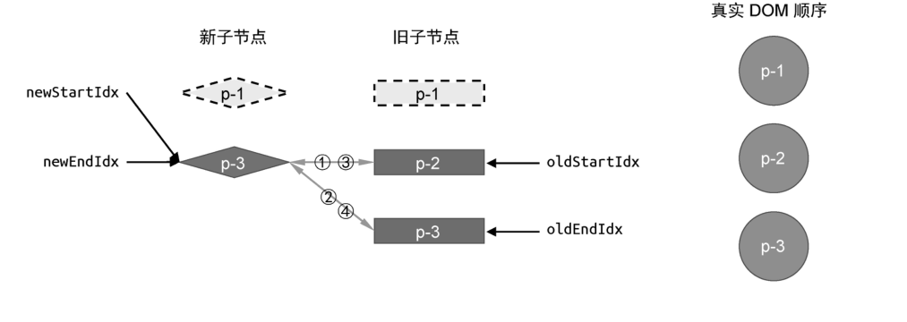
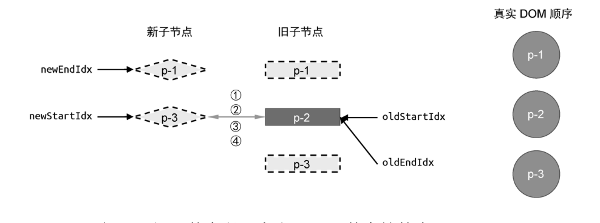

解决了新增节点的问题后，我们再来讨论关于移除元素的清空，如图 32 所示。


在这个例子中，新旧两组子节点的顺序如下。

- 旧的一组子节点：p-1、p-2、p-3。

- 新的一组子节点：p-1、p-3。

可以看到，在新一组子节点中 p-2 节点已经不存在了。为了搞清楚应该如何处理节点被移除的情况，我们还是按照双端 Diff 算法的思路执行更新。

- 第一步:比较旧的一组子节点中的头部节点 p-1 与新的一组子节点中的头部节点 p-1，两者的 key 值相同，可以复用。

在第一步的比较中找到了可复用的节点，于是执行更新。在这一轮比较过后，新旧两组子节点以及真实 DOM 节点的状态如图 33 所示。



接着，执行下一轮更新。

- 第一步：比较旧的一组子节点中的头部节点 p-2 与新的一组子节点中的头部节点 p-3，两者的 key 值不同，不可以复用。

- 第二步：比较旧的一组子节点中的尾部节点 p-3 与新的一组子节点中的尾部节点 p-3，两者的 key 值相同，可以复用。

在第二步中找到了可复用的节点，于是进行更新。更新后的新旧两组子节点以及真实 DOM 节点的状态如图 34 所示。



此时变量 newStartIdx 的值大于变量 newEndIdx 的值，满足更新停止的条件，于是更新结果。但观察图 34 可知，旧的一组子节点中存在未被处理的节点，应该将其移除。因此，我们需要增加额外的代码来处理它，如下所示：

```js
while (oldStartIdx <= oldEndIdx && newStartIdx <= newEndIdx) {
	// 省略部分代码
}

if (oldEndIdx < oldStartIdx && newStartIdx <= newEndIdx) {
	// 添加新节点
	// 省略部分代码
} else if (newEndIdx < newStartIdx && oldStartIdx <= oldEndIdx) {
	// 移除操作
	for (let i = oldStartIdx; i <= oldEndIdx; i++) {
		unmount(oldChildren[i])
	}
}
```

与处理新增节点类似，我们在 while 循环结束后又增加了一个 else...if 分支，用于卸载已经不存在的节点。由图 34 可知，索引值位于 oldStartIdx 和 oldEndIdx 这个区间内的节点都应该被卸载，于是我们开启一个 for 循环将它们逐一卸载。
