不同于简单 Diff 算法和双端 Diff 算法，快速 Diff 算法包含预处理步骤，这其实借鉴了纯文本 Diff 算法的思路。在纯文本 Diff 算法中，存在对两端文本进行预处理的过程。例如，在对两端文本进行 Diff 之前，可以先对它们进行全等比较:

```js
if (text1 === text2) return
```

这也称为快捷路径。如果两端文本全等，那么就无需进入核心 Diff 算法的步骤了。除此之外，预处理过程还会处理两端文本相同的前缀和后缀。假设有如下两端文本:

```js
TEXT 1: I use vue for app development
TEXT 2: I use react for app development
```

通过肉眼可以很容易发现，这两端文本的头部和尾部分别有一段相同的内容，如图 2 所示。

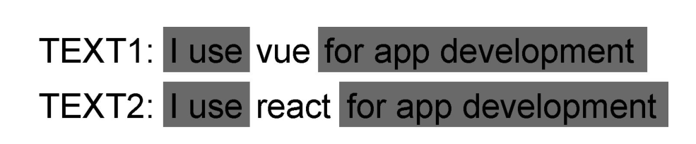

图 2 突出显示了 TEXT1 和 TEXT2 中相同的内容。对于内容相同的问题，是不需要进行核心 Diff 操作的。因此，对于 TEXT1 和 TEXT2 来说，真正需要进行 Diff 操作的部分是：

```js
TEXT 1: vue
TEXT 2: react
```

这实际上是简化问题的一种方式。这么做的好处是，在特定情况下我们能够轻松地判断文本的插入和删除，例如:

```js
TEXT 1: i like you
TEXT 2: i like you too
```

经过预处理，去掉这两段文本中相同的前缀和后缀内容之后，他将变成:

```js
TEXT 1:
TEXT 2: too
```

可以看到，经过预处理后，TEXT1 的内容为空。这说明 TEXT2 在 TEXT1 的基础上增加了字符串 foo。相反，我们还可以在这两段文本的位置互换:

```js
TEXT 1: i like you too
TEXT 2: i like you
```

这两端文本经过预处理后将变成:

```js
TEXT 1: too
TEXT 2:
```

由此可知，TEXT2 是在 TEXT1 的基础上删除了字符串 foo。

快速 Diff 算法借鉴了纯文本 Diff 算法中预处理的步骤。以图 3 给出的两组子节点为例。

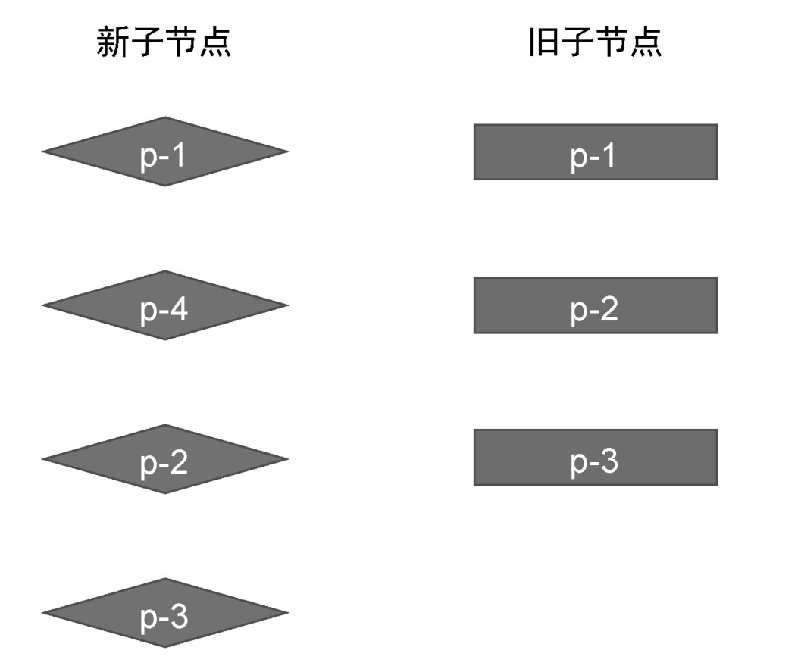

这两组子节点的顺序如下。

- 旧的一组子节点： p-1、p-2、p-3。
- 新的一组子节点： p-1、p-4、p-2、p-3。

通过观察可以发现，两组子节点具有相同的前置节点 p-1,以及相同的后置节点 p-2 和 p-3，如图 4 所示。

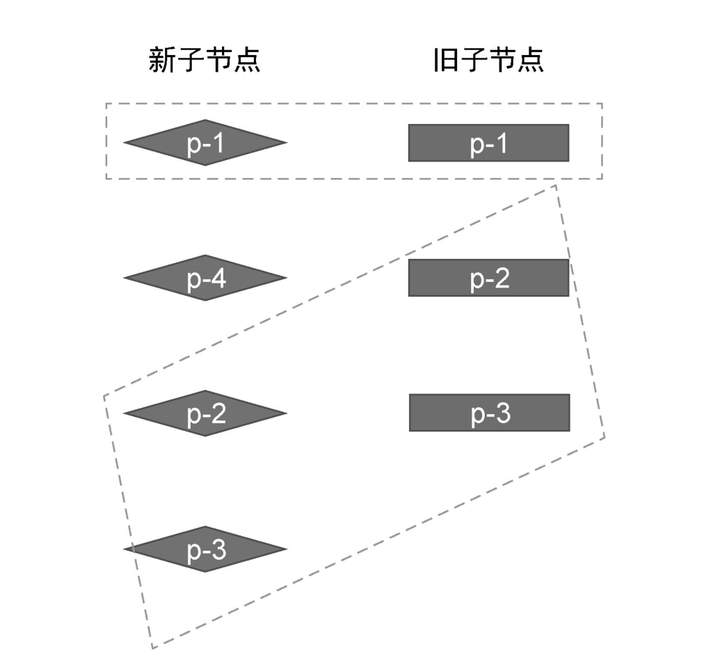

对于相同的前置节点和后置节点，由于它们在新旧两组子节点中的相对位置不变，所以我们无须移动它们，但仍然需要再它们之间打补丁。

对于前置节点，我们可以建立索引 j，其初始值为 0，用来指向两组子节点的开头，如图 5 所示。

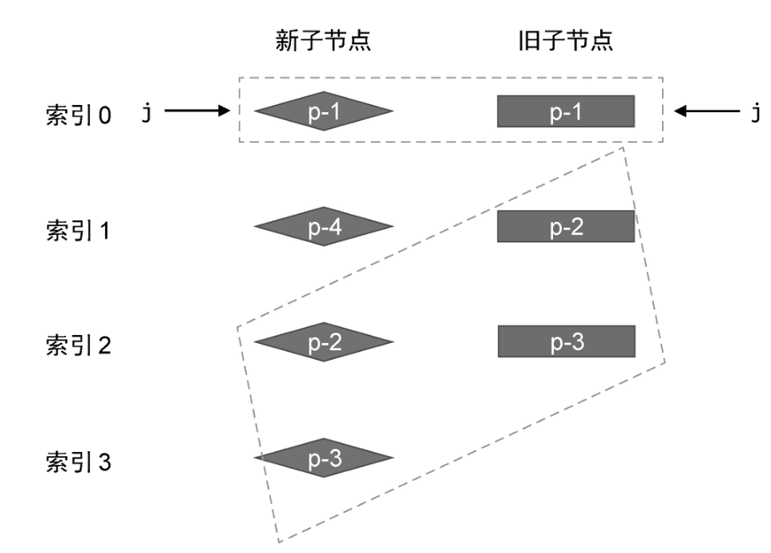

然后开启一个 while 循环，让索引 j 递增，知道遇到不相同的节点为止，如下面 patchKeyedChildren 函数代码所示：

```js
function patchKeyedChildren(n1, n2, container) {
	const newChildren = n2.children
	const oldChildren = n1.children
	// 处理相同的前置节点
	// 索引 j 指向新旧两组子节点的开头
	let j = 0
	let oldVNode = oldChildren[j]
	let newVNode = newChildren[j]

	// while 循环向后遍历，直到遇到拥有不同 key 值的节点为止
	while (oldVNode.key === newVNode.key) {
		// 调用 patch 函数进行更新
		patch(oldVNode, newVNode, container)
		// 更新索引 j, 让其递增
		j++
		oldVNode = oldChildren[j]
		newVNode = newChildren[j]
	}
}
```

在上面这段代码中，我们使用 while 循环查找所有相同的前置节点，并调用 patch 函数进行打补丁，遇到 key 值不相同的节点为止。这样，我们就完成了对前置节点的更新。在这一步更新操作过后，新旧两组子节点的状态如图 6 所示。

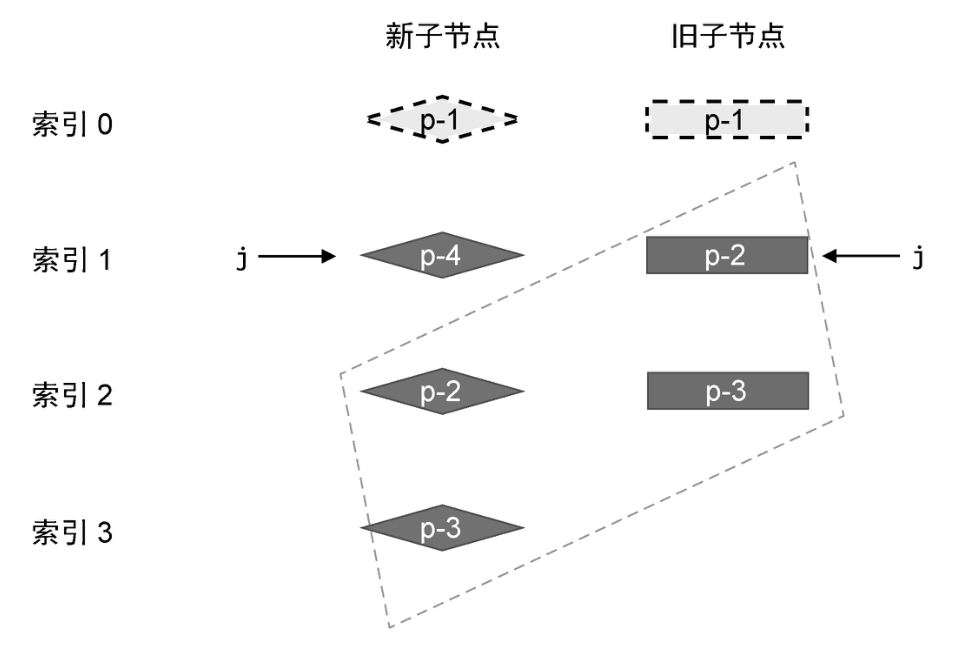

这里需要注意的是，当 while 循环终止时，索引 j 的值为 1.接下来，我们需要处理相同的后置节点。由于新旧两组节点的数量可能不同，所以我们需要两个索引 newEnd 和 oldEnd，分别指向新旧两组子节点中的最后一个节点，如图 7 所示。

然后，再开启一个 while 循环，并从后向前遍历这两组子节点，直到遇到 key 值不同的节点为止，如下面的代码所示：

```js
function patchKeyedChildren(n1, n2, container) {
	const newChildren = n2.children
	const oldChildren = n1.children
	// 更新相同的前置节点
	// 索引 j 指向新旧两组子节点的开头
	let j = 0
	let oldVNode = oldChildren[j]
	let newVNode = newChildren[j]

	// while 循环向后遍历，知道遇到拥有不同 key 值的节点为止
	while (oldVNode.key === newVNode.key) {
		// 调用 patch 函数进行更新
		patch(oldVNode, newVNode, container)
		// 更新索引 j, 让其递增
		j++
		oldVNode = oldChildren[j]
		newVNode = newChildren[j]
	}

	// 更新相同的后置节点
	// 索引 oldEnd指向旧的一组子节点的最后一个节点
	let oldEnd = oldChildren.length - 1
	// 索引 newEnd指向新的一组子节点的最后一个节点
	let newEnd = newChildren.length - 1

	oldVNode = oldChildren[oldEnd]
	newVNode = newChildren[newEnd]

	// while 循环从后向前遍历，直到遇到拥有不同 key 值的节点为止
	while (oldVNode.key === newVNode.key) {
		// 调用 patch 函数进行更新
		patch(oldVNode, newVNode, container)
		// 递减 oldEnd  和 newEnd
		oldEnd--
		newEnd--
		oldVNode = oldChildren[oldEnd]
		newVNode = newChildren[newEnd]
	}
}
```

与处理相同的前置节点一样，在 while 循环内，需要调用 patch 函数进行打补丁，然后递减两个索引 oldEnd、newEnd 的值。在这一步更新操作过后，新旧两组子节点的状态如图 8 所示。

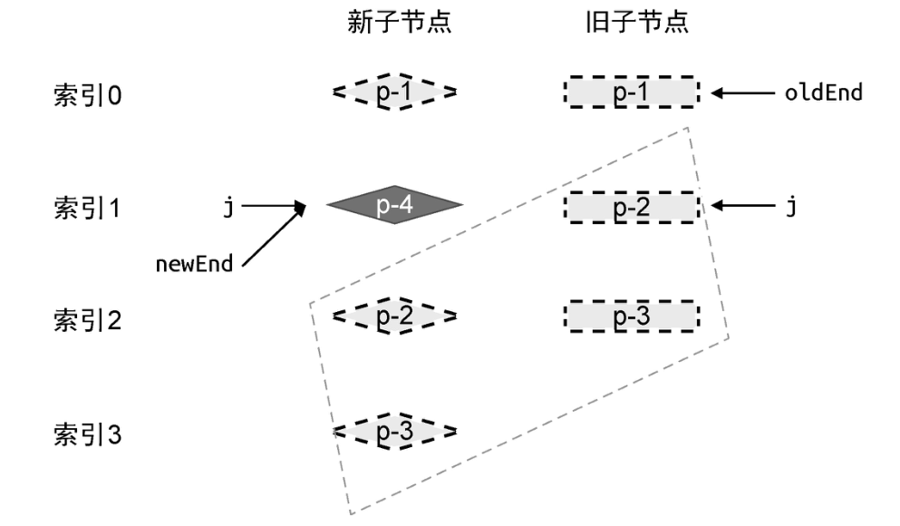

由图 8 可知，当相同的前置节点和后置节点被处理完毕后，旧的一组子节点已经全部被处理了，而在新的一组子节点中，还遗留了一个未被处理的节点 p-4。其实不难发现，节点 p-4 是一个新增节点，那么，如何用程序得出"节点 p-4 是新增节点”这个结论呢？这需要我们观察三个索引 j、newEnd 和 oldEnd 之间的关系。

- 条件一 oldEnd < j 成立：说明在预处理过程中，所有旧子节点都处理完毕了。

- 条件二 newEnd >= j 成立： 说明在预处理过后，在新的一组子节点中，仍然由未被处理的节点，而这些遗留的节点被视作新增节点。

如果条件一和条件二同时成立，说明在新的一组子节点中，存在遗留节点，且这些节点都是新增节点。因此我们需要将它们挂载到正确的位置，如图 9 所示。

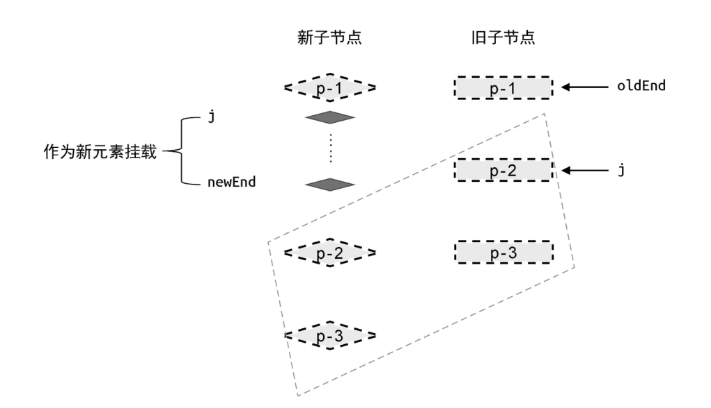

在新的一组子节点中，索引值处于 j 和 newEnd 之间的任何节点都需要作为新的子节点进行挂载。那么，应该怎样将这些节点挂载到正确位置呢？这就要求我们必须找到正确的锚点元素。观察图 9 中的新的一组子节点可知，新增节点应该挂载到节点 p-2 所对应的真实 DOM 前面。所以，节点 p-2 对应的真实 DOM 节点就是挂载操作的锚点元素。有了这些信息，我们就可以给出具体的代码实现了，如下所示：

```js
function patchKeyedChildren(n1, n2, container) {
	const newChildren = n2.children
	const oldChildren = n1.children
	// 更新相同的前置节点
	// 省略部分代码

	// 更新相同的后置节点
	// 省略部分代码

	// 预处理完毕后，如满足如下条件，则说明 j --> newEnd 之间的节点应该作为新节点插入
	if (j > oldEnd && j <= newEnd) {
		// 锚点的索引
		const anchorIndex = newEnd + 1
		// 锚点元素
		const anchor = anchorIndex < newChildren.length ? newChildren[anchorIndex].el : null
		// 采用 while 循环， 调用 patch 函数逐个挂载新增节点
		while (j <= newEnd) {
			patch(null, newChildren[j++], container, anchor)
		}
	}
}
```

在上面这段代码中，首先计算锚点的索引值(即 anchorIndex)为 newEnd + 1。如果小于新的一组子节点的数量，则说明锚点元素在新的一组子节点中，所以直接使用`newChildren[anchorIndex].el`作为锚点元素；否则说明索引 newEnd 对应的节点已经是尾部节点了，这时无需提供锚点元素。有了锚点元素之后，我们开启了一个 while 循环，用来遍历索引 j 和索引 newEnd 之间的节点，并调用 patch 函数挂载它们。

上面的案例展示了新增节点的情况，我们再来看看删除节点的情况，如图 10 所示。

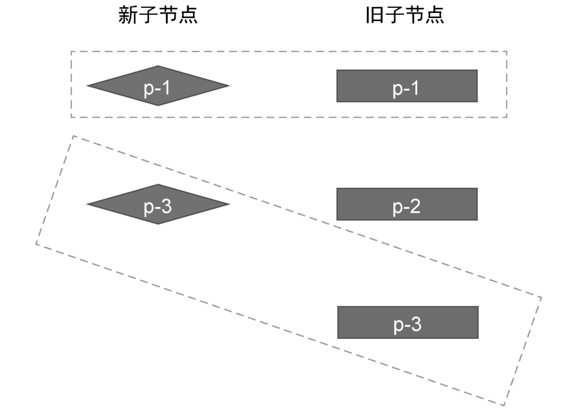
在这个例子中，新旧两组子节点的顺序如下。

- 旧的一组子节点: p-1、p-2、p-3。

- 新的一组子节点: p-1、p-3。

我们同样使用索引 j、oldEnd 和 newEnd 进行标记，如图 11 所示。

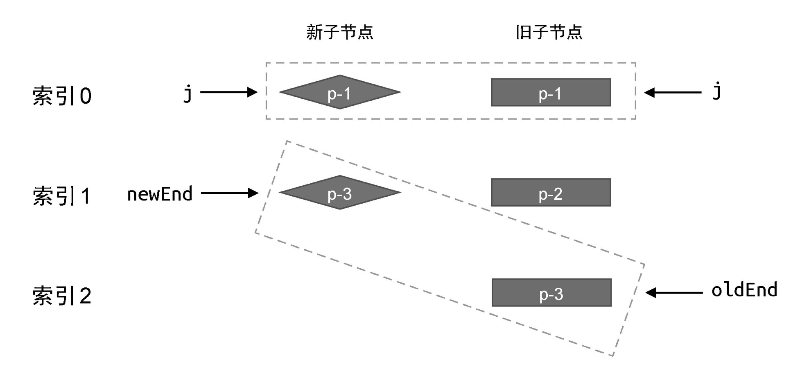

接着，对相同的前置节点进行预处理，处理后的状态如图 12 所示。

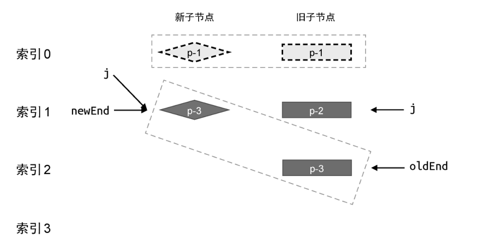

然后，对相同的后置节点进行预处理，处理后的状态如图 13 所示。

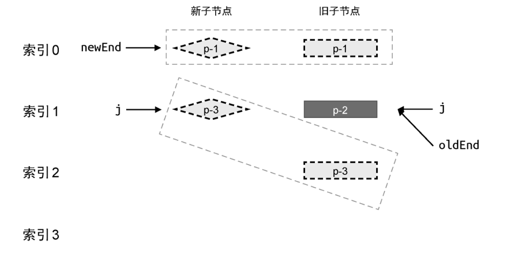

由图 13 可知，当相同的前置节点和后置节点全被处理完毕后，新的一组子节点已经被全部处理完毕了，而旧俄一组子节点中遗留一个节点 p-2。这说明卸载节点 p-2.实际上，遗留的节点可能由很多个，如图 14 所示。

索引 j 和 oldEnd 之间的任何节点都应该被卸载，具体实现如下：

```js
function patchKeyedChildren(n1, n2, container) {
	const newChildren = n2.children
	const oldChildren = n1.children
	// 更新相同的前置节点
	// 省略部分代码

	// 更新相同的后置节点
	// 省略部分代码

	// 预处理完毕后，如满足如下条件，则说明 j --> newEnd 之间的节点应该作为新节点插入
	if (j > oldEnd && j <= newEnd) {
		// 省略部分代码
	} else if (j > newEnd && j <= oldEnd) {
		// j --> oldEnd 之间的节点应该被卸载
		while (j <= oldEnd) {
			unmount(oldChildren[j++])
		}
	}
}
```

在上面这段代码中，我们新增了一个 else...if 分支。当满足条件 j > oldEnd && j <= oldEnd 时，则开启一个 while 循环，并调用 unmount 函数逐个卸载这些遗留节点。
