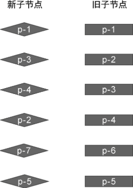
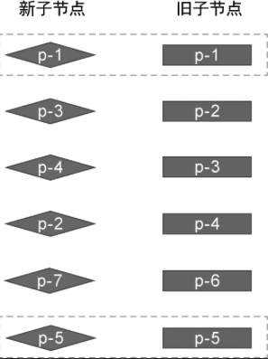
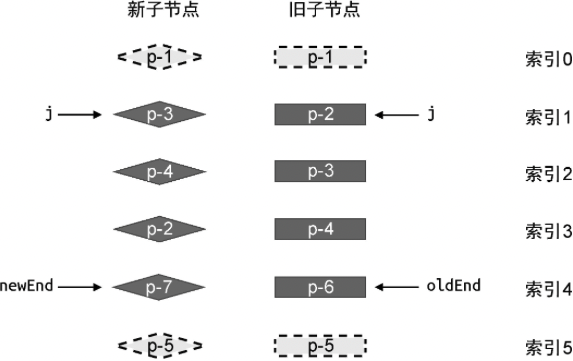
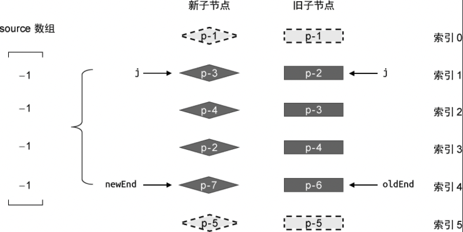
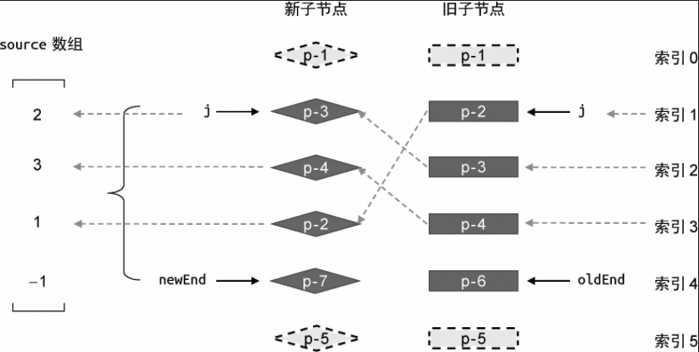

在上一节中，我们讲解了快速 Diff 算法的预处理过程，即处理相同的前置节点和后置节点。但是，上一节给出的例子比较理想化，当处理完相同的前置节点和后置节点后，新旧两组子节点中总会有一组子节点全部被处理完毕。在这种情况下，只需要简单地挂载、卸载节点即可。但有时情况会比较复杂，如图 15 中给出的例子。



在这个例子中，新旧两组子节点的顺序如下。

- 旧的一组子节点： p-1、p-2、p-3、p-4、p-6、p-5。
- 新的一组子节点： p-1、p-3、p-4、p-2、p-7、p-5。

可以看到，与旧的一组子节点相比，新的一组子节点多出了一个新节点 p-7,少了一个节点 p-6。这个例子并不像上一节给出的例子那样理想化，我们无法简单地通过预处理过程完成更新。在这个例子中，相同的前置节点只有 p-1，而相同的后置节点只有 p-5，如图 16 所示。



图 17 给出了经过预处理后两组子节点的状态。



可以看到，经过预处理后，无论是新的一组子节点，还是旧的一组子节点，都有部分节点未经处理。这时就需要我们进一步处理。怎么处理呢？其实无论是简单 Diff 算法，还是双端 Diff 算法，亦或本章介绍的快速 Diff 算法，它们都遵循同样的处理规则：

- 判断是否有节点需要移动，以及应该如何移动。
- 找出那些需要被添加或移除的节点。

所以，接下来我们的任务就是，判断哪些节点需要移动，以及应该如何移动。观察图 17 可知，在这种非理想的情况下，当相同的前置节点和后置节点被处理完毕后，索引 j、newEnd 和 oldEnd 不满足下面两个条件中的任何一个：

- j > oldEnd && j <= newEnd
- j > newEnd && j <= oldEnd

因此，我们需要增加新的 else 分支来处理图 17 所示的情况，如下面的代码所示:

```js
function patchKeydChildren(n1, n2, container) {
	const newChildren = n2.children
	const oldChildren = n2.children

	// 更新相同的前置节点
	// 省略部分代码

	// 更新相同的后置节点
	// 省略部分代码

	if (j > oldEnd && j <= newEnd) {
		// 省略部分代码
	} else if (j > newEnd && j <= oldEnd) {
		// 省略部分代码
	} else {
		// 增加 else 分支来处理非理想情况
	}
}
```

后续的处理逻辑将会编写在这个 else 分支内。知道了在哪里编写处理代码，接下来我们讲解具体的处理思路。首先，我们需要构造一个数组 source，它的长度等于新的一组子节点在经过预处理之后剩余为处理节点的数量，并且 source 中每个元素的初始值都是-1，如图 18 所示。



我们可以通过下面的代码完成 source 数组的构造：

```js
if (j > oldEnd && j <= newEnd) {
	// 省略部分代码
} else if (j > newEnd && j <= oldEnd) {
	// 省略部分代码
} else {
	// 构造 source 数组
	// 新的一组子节点中剩余未处理的数量
	const count = newEnd - j + 1
	const source = new Array(count)
	source.fill(-1)
}
```

如上面的代码所示。首先，我们需要计算新的一组子节点中剩余未处理节点的数量，即 newEnd - j + 1，然后创建一个长度与之相同的数组 source，最后使用 fill 函数完成数组的填充。那么数组 source 的作用是什么呢？观察图 18 可以发现，数组 source 中的每一个元素分别于新的一组子节点中剩余未处理节点对应。实际上，source 数组将用来存储**新的一组子节点中的节点在旧的一组子节点中的位置索引，后面将会使用它计算出每一个最长递增子序列，并用于辅助完成 DOM 移动的操作**,如图 19 所示。



图 19 展示了填充 source 数组的过程。由于 source 数组存储的是新子节点在旧的一组子节点中的位置索引，所以有:

- 新的一组子节点中的节点 p-3 在旧的一组子节点中的索引为 2，因此 source 数组的第一个元素值为 2；
- 新的一组子节点中的节点 p-4 在旧的一组子节点中的索引为 3，因此 source 数组的第一个元素值为 3；
- 新的一组子节点中的节点 p-2 在旧的一组子节点中的索引为 1，因此 source 数组的第一个元素值为 1；
- 新的一组子节点中的节点 p-7 比较特殊，因为在旧的一组子节点中没有与其 key 值相等的节点，所以 source 数组中的第四个元素值保留原来的 -1。

我们还可以通过两层 for 循环来完成 source 数组的填充工作，外层循环用于遍历旧的一组子节点，内层循环用于遍历新的一组子节点：

```js
if (j > oldEnd && j <= newEnd) {
	// 省略部分代码
} else if (j > newEnd && j <= oldEnd) {
	// 省略部分代码
} else {
	// 构造 source 数组
	// 新的一组子节点中剩余未处理的数量
	const count = newEnd - j + 1
	const source = new Array(count)
	source.fill(-1)

	// oldStart 和 newStart 分别为起始索引，即 j
	const oldStart = j
	const newStart = j
	// 遍历旧的一组子节点
	for (let i = oldStart; i < oldEnd; i++) {
		const oldVNode = oldChildren[i]
		// 遍历新的一组子节点
		for (let k = newStart; k < newEnd; k++) {
			const newVNode = newChildren[k]
			// 找到拥有相同 key 值的可复用节点
			if (oldVNode.key === newVNode.key) {
				// 调用 patch 进行更新
				patch(oldVNode, newVNode, container)
				// 最后填充 source 数组
				source[k - newStart] = i
			}
		}
	}
}
```

这里需要注意的是，由于数组 source 的索引是从 0 开始的，而未处理节点的索引未必从 0 开始，所以在填充数组时需要使用表达式 k - newStart 的值作为数组的索引值。外层循环的变量 i 就是当前节点在旧的一组子节点中的位置索引，因此直接将变量 i 的值赋给 source[ k- newStart]即可。
