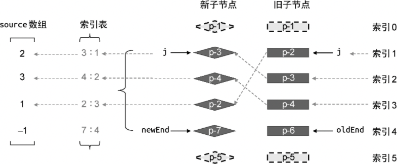
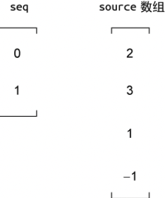
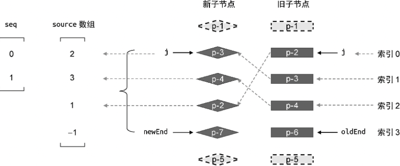
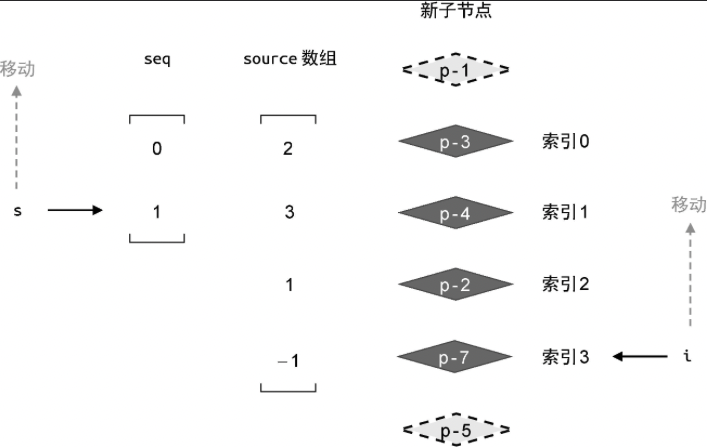
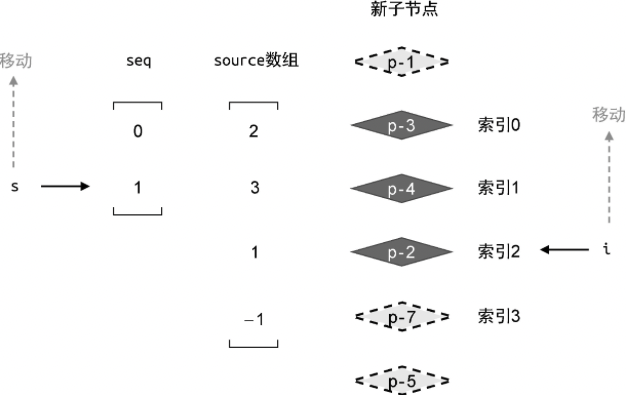
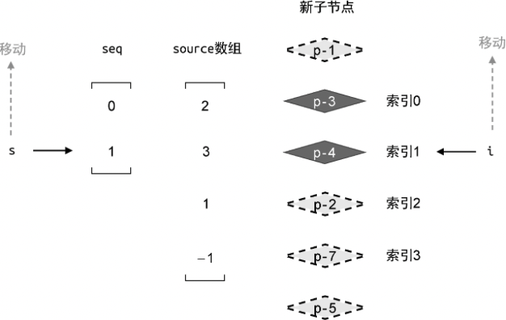
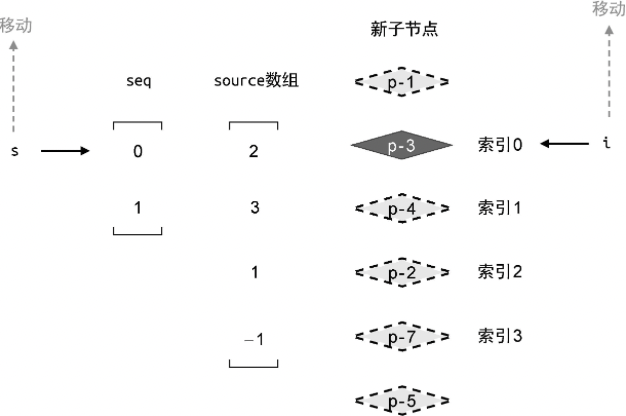

在上一节中，我们实现了两个目标。

- 判断是否需要进行 DOM 移动操作。我们创建了变量 moved 作为标识，当它的值为 true 时，说明需要进行 DOM 移动操作。

- 构建 source 数组。该数组的长度等于新的一组子节点去掉相同的前置/后置节点后，剩余未处理节点的数量。source 数组中存储着新的一组子节点中的节点在旧的一组子节点中的位置，后面我们会根据 source 数组计算出一个**最长递增子序列**，用于 DOM 移动操作。

接下来，我们讨论如何进行 DOM 移动操作，如下面的代码所示：

```js
if (j > oldEnd && j <= newEnd) {
	// 省略部分代码
} else if (j > newEnd && j <= oldEnd) {
	// 省略部分代码
} else {
	// 省略部分代码
	for (let i = oldStart; i <= oldEnd; i++) {
		// 省略部分代码
	}

	if (moved) {
		// 如果 moved 为真，则需要进行 DOM 移动操作
	}
}
```

在上面这段代码中，我们在 for 循环后增加了一个 if 判断分支。如果变量 move 的值我 true，则说明需要进行 DOM 移动操作，所以用于 DOM 移动操作的逻辑将编写在 if 语句块内。

为了进行 DOM 移动操作，我们首先要根据 source 数组计算出它的最长递增子序列。source 数组仍然取用在第二节中给出的例子，如图 21 所示。



在这个例子中，我们计算出 source 数组为[2, 3, 1, -1]。那么，该数组的最长递增子序列是什么呢？这就需要我们了解最长递增子序列的概念。为此，我们先要搞清楚什么是一个序列的递增子序列。简单来说，给定一个数值序列，找到它的一个子序列，并且该子序列的值时递增的，子序列中的元素在原序列中不一定连续。一个序列可能有很多个递增子序列，其中最长的那一个就称为最长递增子序列。举个例子，假设给定数值序列 [0, 8, 4, 12],那么它的最长递增子序列就是 [0, 8, 12]。当然，对于同一个数值序列来说，它的最长递增子序列可能有多个，例如 [0, 4, 12]也是本例的答案之一。

理解了什么是最长递增子序列，接下来我们就可以求解 source 数组的最长递增子序列了，如下面的代码所示：

```js
if (moved) {
	// 计算最长递增子序列
	const seq = lis(source) // [0, 1]
}
```

在上面这段代码中，我们使用 lis 函数计算一个数组的最长递增子序列。lis 函数接收 source 数组作为参数，并返回 source 数组的最长递增子序列之一。在上例中，你可能疑惑为什么通过 list 函数计算到的是 [0, 1]？实际上，source 数组 [2, 3, 1, -1]的最长递增子序列应该是 [2, 3],但我们得到的结果是 [0, 1],这是为什么呢？ 这是因为 lis 函数的返回结果是最长递增子序列中的元素在 source 数组中的位置索引，如图 22 所示。



因为 source 数组的最长递增子序列为 [2, 3],其中元素 2 在该数组中的索引为 0，而元素 3 在该数组中的索引为 1，所以最终结果为[0, 1]。

有了最长递增子序列的索引信息后，下一步要重新对节点进行编号，如图 23 所示。



观察图 23，在编号时，我们忽略了预处理的节点 p-1 和 p-5.所以，索引为 0 的节点是 p-2,而索引为 1 节点是 p-3,以此类推。重新编号时为了子序列 seq 与新的索引值产生对应关系。其实，最长递增子序列 seq 拥有一个非常重要的意义。以上例来说，子序列 seq 的值为 [0, 1],它的含义是: **在新的一组子节点中，重新编号后索引值为 0 和 1 的这两个节点在更新前后顺序没有发生变化**。换句话说，重新编号好，索引值 0 和 1 的节点不需要移动。在新的一组子节点中，节点 p-3 的索引为 0，节点 p-4 的索引为 1，所以节点 p-3 和 p-4 所对应的真实 DOM 不需要移动。换句话说，只有节点 p-2 和 p-7 可能需要移动。

为了完成节点的移动，我们还需要创建两个索引值 i 和 s：

- 用索引 i 指向新的一组子节点中的最后一个节点；

- 用索引 s 指向最长递增子序列中的最后一个元素。

如图 24 所示。



观察图 24，为了简化图示，我们在去掉了旧的一组子节点以及无关的线条和变量，接下来，我们将开启一个 for 循环，让变量 i 和 s 按照图 24 中箭头的方向移动，如下面的代码所示：

```js
if (moved) {
	const seq = lis(source)
	// s 指向最长递增子序列的最后一个元素
	let s = seq.length - 1
	// i 指向新的一组子节点的最后一个元素
	let i = count - 1
	// for 循环使用得 i 递减，即按照图 24 中的箭头方向移动
	for (i; i >= 0; i--) {
		if (i !== seq[s]) {
			// 如果节点的索引i不等于 seq(s)的值，说明该节点需要移动
		} else {
			// 当 i == seq[s] 时， 说明该节点不需要移动
			// 是需要让 s 指向下一个位置
			s--
		}
	}
}
```

其中，for 循环的目的是让变量 i 按照图 24 中箭头的方向移动，以便能够逐个访问新的一组子节点中的节点，这里的变量 i 就是节点的索引。在 for 循环内，判断条件 i !== seq[s]，如果节点的索引 i 不等于 seq[s] 的值，则说明该节点对应的真实 DOM 需要移动，否则说明当前访问的节点不需要移动，但是这时变量 s 需要按照图 24 中箭头的方向移动，即让变量 s 递减。

接下来我们按照上述思路执行更新。初始时索引 i 指向节点 p-7。由于节点 p-7 对应的 source 数组中相同位置的元素值为-1，所以我们应该将节点 P-7 作为全新的节点进行挂载，如下面的代码所示:

```js
if (moved) {
	const seq = lis(source)
	// s 指向最长递增子序列的最后一个元素
	let s = seq.length - 1
	// i 指向新的一组子节点的最后一个元素
	let i = count - 1
	// for 循环使用得 i 递减，即按照图 24 中的箭头方向移动
	for (i; i >= 0; i--) {
		if (source[i] === -1) {
			// 说明索引为 i 的节点是全新的节点，应该将其挂载
			// 该节点在新 children 中的真实位置索引
			const p = i + newStart
			const newVNode = newChildren[pos]
			// 该节点的下一个节点的位置索引
			const nextPos = pos + 1
			// 锚点
			const anchor = nextPos < newChildren.length ? newChildren[nextPos].el : null
			// 挂载
			patch(null, newVNode, container, anchor)
		} else if (i !== seq[s]) {
			// 如果节点的索引i不等于 seq(s)的值，说明该节点需要移动
		} else {
			// 当 i == seq[s] 时， 说明该节点不需要移动
			// 是需要让 s 指向下一个位置
			s--
		}
	}
}
```

如果 source[i] 的值为-1，则说明索引为 i 的节点是全新的节点，于是我们调用 patch 函数将其挂载到容器中。这里需要注意的是，由于索引 i 是重新编号后的，因此为了得到真实索引值，我们需要计算表达式 i + newStart 的值。

新节点创建完毕后，for 循环已经执行了一次，此时索引 i 向上移动异步，指向了节点 p-2，如图 25 所示。



接着，进行下一轮 for 循环，步骤如下。

- 第一步：source[i]是否等于-1？很明显，此时索引 i 的值为 2，source[2] 的值等于 1，因此节点 p-2 不是全新的节点，不需要挂载它，进行下一步判断。

- 第二步：i !== seq[s] 是否成立？ 此时索引 i 的值为 2，索引 s 的值为 1，因此 2 !== seq[1] 成立，节点 p-2 所对应的真实 DOM 需要移动。

在第二步中，我们知道了节点 p-2 所对应的真实 DOM 应该移动。实现代码如下:

```js
if (moved) {
	const seq = lis(source)
	// s 指向最长递增子序列的最后一个元素
	let s = seq.length - 1
	// i 指向新的一组子节点的最后一个元素
	let i = count - 1
	// for 循环使用得 i 递减，即按照图 24 中的箭头方向移动
	for (i; i >= 0; i--) {
		if (source[i] === -1) {
			// 说明索引为 i 的节点是全新的节点，应该将其挂载
			// 该节点在新 children 中的真实位置索引
			const p = i + newStart
			const newVNode = newChildren[pos]
			// 该节点的下一个节点的位置索引
			const nextPos = pos + 1
			// 锚点
			const anchor = nextPos < newChildren.length ? newChildren[nextPos].el : null
			// 挂载
			patch(null, newVNode, container, anchor)
		} else if (i !== seq[s]) {
			// 如果节点的索引i不等于 seq[s]的值，说明该节点需要移动
			// 该节点在新的一组子节点中的真实位置索引
			const pos = i + newStart
			const newVNode = newChildren[pos]
			// 该节点的下一个节点的位置索引
			const nextPos = pos + 1
			// 锚点
			const anchor = nextPos < newChildren.length ? newChildren[nextPos].el : null
			// 移动
			insert(newVNode.el, container, anchor)
		} else {
			// 当 i == seq[s] 时， 说明该节点不需要移动
			// 是需要让 s 指向下一个位置
			s--
		}
	}
}
```

可以看到，移动节点的实现思路类似于挂载全新的节点。不用在于，移动节点是通过 insert 函数来完成的。

接着，进行下一轮的循环，此时索引 i 指向节点 p-4，如图 26 所示。



更新过程仍然分为三个步骤。

- 第一步：判断表达式 source[i] 的值是否等于-1？很明显，此时索引 i 的值为 1，表达式 source[1] 的值等于 3,条件不成立。所以节点 p-4 不是全新的节点，不需要挂载它。接着进行下一步判断。

- 第二步： 判断表达式 i !== seq[s] 是否成立？ 此时索引 i 的值为 1，索引 s 的值为 1.这是表达式 1 === seq[1] 为真，所以条件 i !== seq[s] 也不成立。

- 第三步： 由于第一步和第二步中的条件全都不成立，所以代码会执行最终的 else 分支。这意味着，节点 p-4 所对应的真实 DOM 不需要移动，但我们仍然需要让索引 s 的值递减，即 s--。

经过三步判断之后，我们得出结论： 节点 p-4 不需要移动。于是进行下一轮循环，此时的状态如图 27 所示。



有图 27 可知，此时索引 i 指向节点 p-3。我们继续进行三个步骤的判断。

- 第一步： 判断表达式 source[i] 的值是否等于 -1？ 很明显，此时索引 i 的值为 0，表达式 source[0] 的值等于 2，所以节点 p-3 不是全新的节点，不需要挂载它，接着进行下一步判断。

- 第二步：判断表达式 i !== seq[s] 是否成立？ 此时索引 i 的值为 0，索引 s 的值也为 0，这是表达式 0 === seq[0] 为真，因此条件也不成立，最终执行 else 分支的代码，也就是第三部。

- 第三步： 到了这里，意味着节点 p-3 所对应的真实 DOM 也不需要移动。

在这一轮更新完成之后，循环将会停止，更新完成。

## 最长递增子序列求法

以 Vue.js 3 中的代码为例，我们使用了二分查找法来实现功能。具体步骤如下:

-

如下是用于求解给定序列的最长递增子序列的代码，取自 Vue.js 3:

```js
function getSequence(arr) {
	// 复制原始数组
	const p = arr.slice()
	// 最长递增子序列的结果，默认值为 [0]
	// 这么做是为了方便比较
	const result = [0]
	// i 代表数组中的起始索引
	// j 代表最长递增子序列中最小值的索引，也是最长递增子序列的长度
	// u 代表二分查找中的左侧索引值
	// v 代表二分查找中的右侧索引值
	// c 代表二分查找中的中间索引值
	let i, j, u, v, c
	const len = arr.length
	// 从左向右依次遍历数组中的元素
	for (i = 0; i < len; i++) {
		// 获取数组索引值为 i 的元素值
		const arrI = arr[i]
		// 由于 result 数组中已经存储了值为0的元素，arrI 等于 0 的情况排除
		if (arrI !== 0) {
			// 获取结果数组中的最小值的索引
			j = result[result.length - 1]
			// 如果 result 中的最小值小于 arrI，则代表需要将其添加到 result 数组的末尾
			if (arr[j] < arrI) {
				// 将 p[i] 的值设置为当前最长递增子序列的长度
				p[i] = j
				// 将当前索引添加到 result 数组中
				result.push(i)
				continue
			}

			// 走到这里代表 arr[j] >= arrI，表示数组中当前的值大于最小值了
			// 需要使用二分查找法找到第一个小于 arrI 的值
			u = 0
			v = result.length - 1
			while (u < v) {
				c = ((u + v) / 2) | 0
				if (arr[result[c]] < arrI) {
					u = c + 1
				} else {
					v = c
				}
			}

			// 如果找到了将对应位置的值进行替换
			if (arrI < arr[result[u]]) {
				if (u > 0) {
					p[i] = result[u - 1]
					result[u] = i
				}
			}
		}
	}

	u = result.length
	v = result[u - 1]
	// 由于 result 的索引从后向前的，所以需要反向序列化
	while (u-- > 0) {
		result[u] = v
		v = p[v]
	}
	return result
}
```
