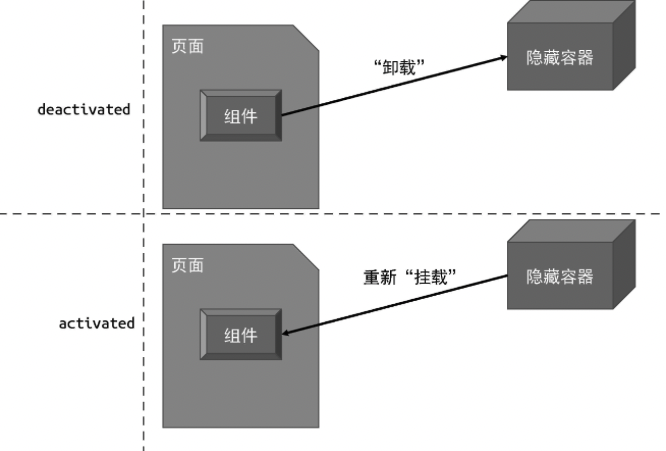

# KeepAlive 组件的实现原理

## 组件的激活与失活

KeepAlive 一次借鉴与 HTTP 协议。在 HTTP 协议中，KeepALive 又称 HTTP 持久链接（HTTP persistent connection）,其左右是允许多个请求或响应公用一个 TCP 链接。在没有 KeepAlive 的情况下，一个 HTTP 链接会在每次请求/响应结束后关闭，当下一次请求发生时，会建立一个新的 HTTP 链接。频繁地下回、创建 HTTP 链接会带来额外的性能开销，KeepALive 就是为了解决这个问题而生的。

HTTP 中的 KeepAlive 可以避免链接频繁地销毁/创建，与 HTTP 中的 KeepAlive 类似，Vue.js 内建的 KeepAlive 组件可以避免一个组件被频繁地销毁/重建。假设我们在页面中有一组`<Tab>`组件，如下面的代码所示:

```vue
<template>
	<Tab v-if="currentTab === 1">...</Tab>
	<Tab v-if="currentTab === 2">...</Tab>
	<Tab v-if="currentTab === 3">...</Tab>
</template>
```

可以看到，根据变量 currentTab 值的不同，会渲染不同的`<Tab>`组件。当用户频繁地切换 Tab 时，会导致不停地卸载并重建对应的`<Tab>`组件。为了避免因此产生的性能开销，可以使用 KeepAlive 组件来解决这个问题，如下面的代码所示:

```vue
<template>
	<!-- 使用 KeepAlive 组件包裹 -->
	<KeepAlive>
		<Tab v-if="currentTab === 1">...</Tab>
		<Tab v-if="currentTab === 2">...</Tab>
		<Tab v-if="currentTab === 3">...</Tab>
	</KeepAlive>
</template>
```

这样，无论用户怎样切换`<Tab>`组件，都不会发生频繁地创建和销毁，因而极大地优化对用户操作的响应，尤其是在大组件场景下，优势会更加明显。那么，KeepAlive 组件的实现原理是怎样的呢？ 其实 KeepAlive 的本质是缓存管理，再加上特殊的挂载/卸载逻辑。

首先，KeepAlive 组件的实现需要渲染器层面的支持。这是因为被 KeepAlive 的组件在卸载时，我们不能真的将其卸载，否则就无法维持组件的当前状态了。正确地做法是，将被 KeepAlive 的组件从原容器搬运到另外一个隐藏的容器中，实现“假卸载”。当被搬运到隐藏容器中的组件需要再次被“挂载”时，我们也不能执行真正的挂载逻辑，而应该把组件从隐藏容器中再搬运到原容器。这个过程对应到组件的生命收起，其实就是 activated 和 deactivated。



如图所示，“卸载”一个被 KeepAlive 的组件时，它并不会真的被卸载，而会被移动到一个隐藏容器中。当重新“挂载”该组件时，它也不会被真的挂载，而会被从隐藏容器中取出，再“放回”原来的容器中，即页面中。

一个最基本的 KeepAlive 组件实现起来并不复杂，如下面的代码所示:

```js
const KeepAlive = {
	// KeepAlive 组件独有的属性，用作标识
	__isKeepAlive: true,
	setup(props, { slots }) {
		// 创建一个缓存对象
		// key: vnode.type
		// value: vnode
		const cache = new Map()
		// 当前 KeepAlive 组件的实例
		const instance = currentInstance
		// 对于 KeepAlive 组件来说， 它的实例上存在特殊的 keepAliveCtx 对象，该对象由渲染器注入
		// 该对象会暴露渲染器的一些内部方法，其中 move 函数用来将一段 DOM 移动到另一个容器中
		const { move, createElement } = instance.keepAliveCtx

		// 创建隐藏容器
		const storageContainer = createElement("div")

		// KeepAlive 组件的实例上会被添加两个内部函数， 分别是 _deActivate 和 _activate
		// 这两个函数会在渲染器中被调用
		instance._deActivate = (vnode) => {
			move(vnode, storageContainer)
		}
		instance._activate = (vnode, container, anchor) => {
			move(vnode, container, anchor)
		}

		return () => {
			// KeepAlive 的默认插槽就是要被 KeepAlive 的组件
			let rawVNode = slots.default()
			// 如果不是组件， 直接渲染即可，因为非组件的虚拟节点无法被 KeepAlive
			if (typeof rawVNode.type !== "object") {
				return rawVNode
			}

			// 在挂载时先获取缓存的组件 vnode
			const cachedVNode = cache.get(rawVNode.type)
			if (cachedVNode) {
				// 如果有缓存内容， 则说明不应该执行挂载， 而应该执行激活
				// 继承组件实例
				rawVNode.component = cachedVNode.component
				// 在 vnode 上添加 keptAlive 属性，标记为 true，避免渲染器重新挂载它
				rawVNode.keptAlive = true
			} else {
				// 如果没有缓存，则将其添加到缓存中，这样下次激活组件时就不会重新执行新的挂载动作了
				cache.set(rawVNode.type, rawVNode)
			}

			// 在组件 vnode 上添加 shouldKeepAlive 属性，并标记为true，避免渲染器真的将组件卸载
			rawVNode.shouldKeepAlive = true
			// 将 KeepAlive 组件的实例也添加到 vnode 上，以便在渲染器中访问
			rawVNode.keepAliveInstance = instance

			// 渲染组件 vnode
			return rawVNode
		}
	}
}
```

从上面的实现中可以看到，与普通组件的一个较大的区别在于，KeepAlive 组件与渲染器的结合非常深。首先，KeepAlive 组件本身并不会渲染额外的内容，它的渲染函数最终只返回需要被 KeepAlive 的组件，我们把这个需要被 KeepAlive 的组件“内部组件”。KeepAlive 组件会对“内部组件”进行操作，主要是在“内部组件”的 vnode 对象上添加一些标记属性，以便渲染器能够据此执行特定的逻辑。这些标记属性包括如下几个:

- shouldKeepAlive: 该属性会添加到“内部组件”的 vnode 对象上，这样当渲染器卸载“内部组件”时，可以通过检查该属性得知“内部组件”需要被 KeepAlive。于是，渲染器就不会真的卸载“内部组件”，而是会调用\_deActivate 函数完成搬运工作，如下面的代码所示:

```js
// 卸载操作
function unmount(vnode) {
	if (vnode.type === Fragment) {
		vnode.children.forEach((c) => unmount(c))
		return
	} else if (typeof vnode.type === "object") {
		// vnode.shouldKeepAlive 是一个布尔值，用来标识该组件是否应该被 KeepAlive
		if (vnode.shouldKeepAlive) {
			// 对于需要被 KeepAlive 的组件，我们不应该真的卸载它，而应该调用该组件的父组件
			// 即 KeepAlive 组件的 _deActivate 函数使其失活
			vnode.keepAliveInstance._deActivate(vnode)
		} else {
			unmount(vnode.component.subTree)
		}
		return
	}
	const parent = vnode.el.parentNode
	if (parent) {
		parent.removeChild(vnode.el)
	}
}
```

可以看到，unmount 函数在卸载组件时，会检查组件是否应该被 KeepAlive，从而执行不同的操作。

- keepAliveInstance: "内部组件"的 vnode 对象会持有 KeepAlive 组件实例，在 unmount 函数中会通过 keepAliveInstance 来访问 \_deActivate 函数

- keptAlive: “内部组件”如果已经被缓存，则还会为其添加一个 keptAlive 标记。这样当“内部组件”需要重新渲染时，渲染器并不会重新挂载它，而会将其激活，如下面 patch 函数的代码所示:

```js
function patch(n1, n2, container, anchor) {
	if (n1 && n1.type !== n2.type) {
		unmount(n1)
		n1 = null
	}

	const { type } = n2

	if (typeof type === "string") {
		// 省略部分代码
	} else if (type === Text) {
		// 省略部分代码
	} else if (type === Fragment) {
		// 省略部分代码
	} else if (typeof type === "object" || typeof type === "function") {
		// component
		if (!n1) {
			// 如果该组件已经被 KeepAlive，则不会重新挂载它, 而是会调用 _activate 来激活它
			if (n2.keptAlive) {
				n2.keepAliveInstance._activate(n2, container, anchor)
			} else {
				mountComponent(n2, container, anchor)
			}
		} else {
			patchComponent(n1, n2, anchor)
		}
	}
}
```

可以看到，如果组件的 vnode 对象中存在 keptAlive 标识，则渲染器不会重新挂载它，而是会通过 keepAliveInstance.\_activate 函数来激活它。

我们再来看一下用于激活组件和失活组件的两个函数:

```js
const { move, createElement } = instance.keepAliveCtx

instance._deActivate = (vnode) => {
	move(vnode, storageContainer)
}
instance._activate = (vnode, container, anchor) => {
	move(vnode, container, anchor)
}
```

可以看到，失活的本质就是将组件所渲染的内容移动到隐藏容器中，而激活的本质是将组件渲染的内容从隐藏容器中搬运回原来的容器。另外，上面这段
代码中涉及的 move 函数是由渲染器注入的，如下面 mountComponent 函数的代码所示:

```js
function mountComponent(vnode, container, anchor) {
	// 省略部分代码

	const instance = {
		state,
		props: shallowReactive(props),
		isMounted: false,
		subTree: null,
		slots,
		mounted: [],
		// 只有 KeepAlive 组件的实例下会有 keepAliveCtx 属性
		keepAliveCtx: null
	}

	// 检查当前要挂载的组件是否是 KeepAlive 组件
	const isKeepAlive = vnode.type.__isKeepAlive
	if (isKeepAlive) {
		// 在 keepAlive 组件实例上添加 keepAliveCtx 对象
		instance.keepAliveCtx = {
			// move 函数用来移动一段 vnode
			move(vnode, container, anchor) {
				// 本质上是将组件渲染的内容移动到执行容器中，即隐藏容器中
				insert(vnode.component.subTree.el, container, anchor)
			},
			createElement
		}
	}

	// 省略部分代码
}
```

至此，一个最基本的 KeepAlive 组件就完成了。
