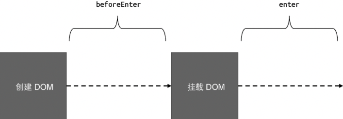

## 原理

通过 KeepAlive 组件和 Teleport 组件的讲解，我们能够意识到，Vue.js 内建的组件通常与渲染器的核心逻辑结合的非常紧密。本节将要讨论的 Transition 组件也不例外，甚至它与渲染器的结合更加紧密。

实际上，Transition 组件的实现比想象中简单得很多，它的核心原理是：

- 当 DOM 元素被挂载时，将动效附加到该 DOM 元素上；
- 当 DOM 元素被卸载时，不要立即卸载 DOM 元素，而是等到附加到该 DOM 元素上的动效执行完成后再卸载它。

当然，规则上主要循序上述两个要素，但具体实现时要考虑的边界情况还有很多。不过，我们只要理解它的核心原理即可，至于细节，可以在基本试点的基础上按需添加或完善。

## 原生 DOM 的过渡

为了更好地理解 Transition 组件的实现原理，我们有必要先讨论如何为原生 DOM 创建过渡动效。过渡效果本质上是一个 DOM 元素在两种状态之间的切换，浏览器会根据过渡效果自行完成 DOM 元素的过渡。这里的过渡效果指的是持续时长、运动曲线、要过渡的属性等。

我们从一个例子开始，假设我们有一个 div 元素，宽高各 100px，如下面的代码所示：

```html
<div class="box"></div>
```

接着，为其添加对应的 CSS 样式：

```css
.box {
	width: 100px;
	height: 100px;
	background-color: red;
}
```

现在，假设我们要为元素添加一个进场动效。我们可以这样描述该动效：从距离左边 200px 的位置在 1 秒内运动到距离左边 0px 的位置。在这句描述中，初始状态是“距离左边 200px”，因此我们可以用下面的样式来描述初始状态：

```css
.enter-from {
	transform: translateX(200px);
}
```

而结束状态是“距离左边 0px”，也就是结束位置，可以用下面的 CSS 代码来描述：

```css
.enter-to {
	transform: translateX(0);
}
```

初始状态和结束装填都已经描述完毕了。最后，我们还要描述运动过程，例如持续时长、运动曲线等。对此，我们可以用如下 CSS 代码来描述：

```css
.enter-active {
	transition: transform 1s ease-in-out;
}
```

这里我们指定了运动的属性是 transform，持续时长为 1s，并且运动曲线是 ease-in-out。

定义好了运动的初始状态、结束状态以及运动过程之后，接下来我们就可以为 DOM 元素添加进场动效了，如下面的代码所示:

```js
// 创建 class 为 box 的 DOM 元素
const el = document.createElement("div")
el.classList.add("box")

// 在 DOM 元素被添加到页面之前，将初始状态和运动过程定义到元素上
el.classList.add("enter-from") // 初始状态
el.classList.add("enter-active") // 运动过程

// 将元素添加到页面
document.body.appendChild(el)
```

上面这段代码主要做了三件事:

- 创建 DOM 元素；
- 将过渡的初始状态和运动过程定义到元素上，即把 enter-from、enter-active 这两个类添加到元素上；
- 将元素添加到页面，即挂载

经过是三个步骤之后，元素的初始状态会生效，页面渲染的时候会将 DOM 元素以初始状态定义的样式进行展示。接下来我们需要切换元素的状态，使得元素开始运动。那么，应该怎么做呢？理论上，我们只需要将 enter-from 类从 DOM 元素上移除，并将 enter-to 这个类添加到 DOM 元素上即可，如下面的代码所示:

```js
// 创建 class 为 box 的 DOM 元素
const el = document.createElement("div")
el.classList.add("box")

// 在 DOM 元素被添加到页面之前，将初始状态和运动过程定义到元素上
el.classList.add("enter-from") // 初始状态
el.classList.add("enter-active") // 运动过程

// 将元素添加到页面
document.body.appendChild(el)

// 切换元素状态
el.classList.remove("enter-from") // 移除 enter-from
el.classList.add("enter-to") // 添加 enter-to
```

然而，上面这段代码无法按照预期执行。这是因为浏览器会在当前帧绘制 DOM 元素，最终结果是，浏览器将 enter-to 这个类所具有的样式绘制出来，而不会绘制 enter-from 类所具有的样式。为了解决这个问题，我们需要在下一帧执行状态切换，如下面的代码所示:

```js
// 创建 class 为 box 的 DOM 元素
const el = document.createElement("div")
el.classList.add("box")

// 在 DOM 元素被添加到页面之前，将初始状态和运动过程定义到元素上
el.classList.add("enter-from") // 初始状态
el.classList.add("enter-active") // 运动过程

// 将元素添加到页面
document.body.appendChild(el)

// 在下一帧切换元素状态
requesetAnimationFrame(() => {
	el.classList.remove("enter-from") // 移除 enter-from
	el.classList.add("enter-to") // 添加 enter-to
})
```

通过嵌套一层 [requestAnimationFrame](https://developer.mozilla.org/zh-CN/docs/Web/API/window/requestAnimationFrame) 函数的调用即可解决上述问题。现在，如果你再次尝试在浏览器中运行代码，会发现进场动效能够正常显示了。

最后我们需要做的是，当过渡完成后，将 enter-to 和 enter-active 这两个类从 DOM 元素上移除，如下面的代码所示：

```js
// 创建 class 为 box 的 DOM 元素
const el = document.createElement("div")
el.classList.add("box")

// 在 DOM 元素被添加到页面之前，将初始状态和运动过程定义到元素上
el.classList.add("enter-from") // 初始状态
el.classList.add("enter-active") // 运动过程

// 将元素添加到页面
document.body.appendChild(el)

// 切换元素状态
el.classList.remove("enter-from") // 移除 enter-from
el.classList.add("enter-to") // 添加 enter-to
```

然而，上面这段代码无法按照预期执行。这是因为浏览器会在当前帧绘制 DOM 元素，最终结果是，浏览器将 enter-to 这个类所具有的样式绘制出来，而不会绘制 enter-from 类所具有的样式。为了解决这个问题，我们需要在下一帧执行状态切换，如下面的代码所示:

```js
// 创建 class 为 box 的 DOM 元素
const el = document.createElement("div")
el.classList.add("box")

// 在 DOM 元素被添加到页面之前，将初始状态和运动过程定义到元素上
el.classList.add("enter-from") // 初始状态
el.classList.add("enter-active") // 运动过程

// 将元素添加到页面
document.body.appendChild(el)

// 在下一帧切换元素状态
requesetAnimationFrame(() => {
	el.classList.remove("enter-from") // 移除 enter-from
	el.classList.add("enter-to") // 添加 enter-to

	// 监听 tarnsition 事件完成收尾工作
	el.addEventListener("transitionend", () => {
		el.classList.remove("enter-to")
		el.classList.remove("enter-active")
	})
})
```

通过监听元素的 transitionend 事件来完成收尾工作。实际上，我们可以对上述为 DOM 添加进场过渡的过程进行抽象，如图所示:



从创建 DOM 元素完成后，到把 DOM 元素添加到 body 前，整个过程可以视作 beforeEnter 阶段。在把 DOM 元素添加到 body 之后，则可以视作 enter 阶段。在不同的阶段执行不同的操作，即可完成整个进场过渡的实现。

- beforeEnter 阶段： 添加 enter-from 和 enter-active 类。
- enter 阶段：在下一帧中移除 enter-from 类，添加 enter-to。
- 进场动效结束：移除 enter-to 和 enter-active 类。

理解了进场过渡的实现原理后，接下来我们讨论 DOM 元素的离场过渡效果。与进场过渡一样，我们需要定义离场过渡的初始状态、结束状态以及过渡过程，如下面的 CSS 代码所示：

```css
/* 初始状态 */
.leave-from {
	transform: translateX(0);
}

/* 结束状态 */
.leave-to {
	transform: translateX(200px);
}

/* 过渡过程 */
.leave-active {
	transition: transform 2s ease-out;
}
```

可以看到，离场过渡的初始状态与结束状态正好对应进场过渡的结束状态与初始状态。当然，我们完全可以打破这种对应关系，你可以采用任意过渡效果。

离场动效一般发生在 DOM 元素被卸载的时候，如下面的代码所示：

```js
// 卸载元素
el.addEventListener("click", () => {
	el.parentNode.removeChild(el)
})
```

当点击元素的时候，该元素会被移除，这样就实现了卸载。然而，从代码中可以看出，元素被点击的瞬间就会被卸载，所以如果仅仅这样做，元素根本就没有执行过渡的机会。因此，一个很自然的思路就产生了：当元素被卸载时，不用将其立即卸载，而是等待过渡效果结束后再卸载它。为了实现这个目标，我们需要把用于卸载 DOM 元素的代码封装到一个函数中，该函数会等待过渡结束后被调用，如下面的代码所示：

```js
el.addEventListener("click", () => {
	// 将卸载动作封装到 performRemove 函数中
	const performRemove = () => el.parentNode.removeChild(el)
})
```

在上面这段代码中，我们将卸载动作封装到 performRemove 函数中，这个函数会等待过渡效果结束后再执行。

具体的离场动效的实现如下：

```js
el.addEventListener("click", () => {
	// 将卸载动作封装到 performRemove 函数中
	const performRemove = () => el.parentNode.removeChild(el)

	// 设置初始状态： 添加 leave-from 和 leave-active 类
	el.classList.add("leave-from")
	el.classList.add("leave-active")

	// 强制 reflow: 使初始状生效
	document.body.offsetHeight

	// 在下一帧切换状态
	requestAnimationFrame(() => {
		requestAnimationFrame(() => {
			// 切换到结束状态
			el.classList.remove("leave-from")
			el.classList.add("leave-to")
		})

		// 监听 transitionend 事件做收尾工作
		el.addEventListener("transitionend", () => {
			el.classList.remove("leave-to")
			el.classList.remove("leave-acitve")
			// 当过渡完成后，记得调用 performRemove 函数将 DOM 元素移除
			performRemove()
		})
	})
})
```

从上面的代码中可以看到，离场过渡的处理与进场过渡的处理方式非常相似，即首先设置初始状态，然后在下一帧中切换为结束状态，从而使得过渡生效。需要注意的是，当离场过渡完成之后，需要执行 performRemove 函数来真正地将 DOM 元素卸载。
