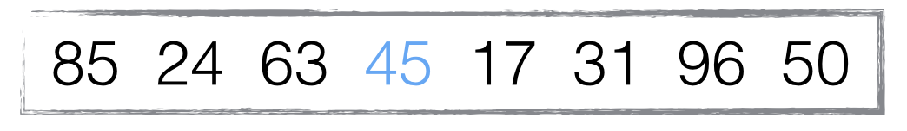
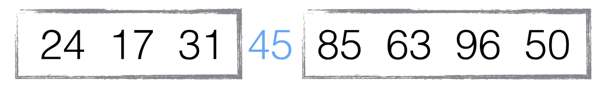
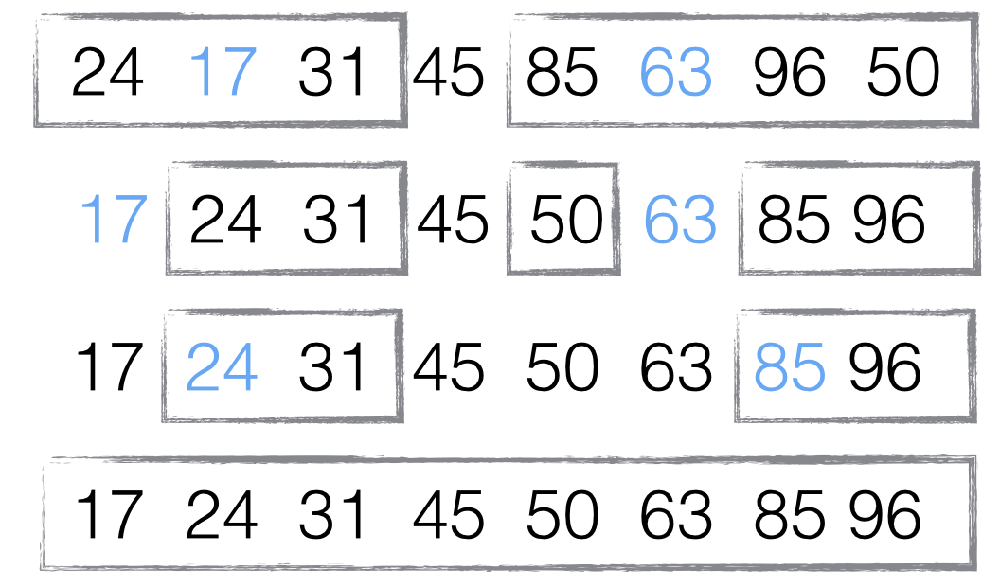

## 前言

v8 是 Chrome 的 JavaScript 引擎，其中关于数组的排序完全采用了 JavaScript 实现

排序采用的算法跟数组的长度有关，当数组长度小于 10 的时候，采用插入排序，大于 10 的时候采用快速排序。(当然了，这种说法并不严谨)

看下插入排序和快速排序

::: info
文中由于写的时间比较早，v8 的具体实现已经发生了变化，但是对于本文中讲述的排序问题并没有影响，正常阅读就可以
:::

## 插入排序

原理: 将第一个元素视为有序序列，遍历数组，将之后的元素依次插入这个构建的有序序列中。


实现:

```js
function insertionSort(arr) {
	// 从第二个开始查，保证有能比较的元素
	for (var i = 1; i < arr.length; i++) {
		var element = arr[i]
		// 从当前元素的位置往前查找元素
		for (var j = i - 1; j >= 0; j--) {
			var tmp = arr[j]
			// 如果tmp比element大，则代表需要往后挪
			var order = tmp - element
			if (order > 0) {
				arr[j + 1] = tmp
			} else {
				break
			}
		}
		// 在往后挪的过程中，element所在的位置会被覆盖掉，所以需要重新复制更改
		arr[j + 1] = element
	}
}
```

时间复杂度:

时间复杂度是指执行算法所需要的计算工作量，它考察当输入值大小趋近无穷时的情况，一般这种情况下，算法中基本操作重复执行的次数是问题规模 n 的某个函数

最好情况: 数组升序排列，时间复杂度为: O(n)
最坏情况: 数组降序排列，时间复杂度为: O(n^2)

稳定性:

稳定性是指相同的元素在排序后是否还保持相对的位置

要注意的是对于不稳定的排序算法，只要举出一个实例，即可说明它的不稳定性，而对于稳定的排序算法，必须对算法进行分析从而得到稳定的特性

比如`[3,3,1]`，排序后还是`[3,3,1]`。但是其实是第二个 3 在第一个 3 钱，那这就是不稳定的排序算法

插入排序是稳定的算法

优势:

当数组是快要排序好的状态或者问题规模比较小的时候，插入排序效率更高。这也是为什么 v8 会在数组长度小于 10 的时候采用插入排序

## 快速排序

原理:

1. 选择一个元素作为"基准"
2. 小于"基准"的元素，都会移动到 "基准"的左边。大于"基准"的元素，都会移动"基准"的右边
3. 对于"基准"左边和右边的两个子集，不断重复第一步和第二步，直到所有子集只剩下一个元素为止

示例:

示例和下面的实现方式来源于阮一峰老师的[《快速排序(QuickSort)的 JavaScript 实现》](http://www.ruanyifeng.com/blog/2011/04/quicksort_in_javascript.html)

以数组 `[85,24,63,45,17,31,96,50]`为例:

第一步，选择中间元素 45 作为"基准"(基准值可以任意选择，但是选择中间的值比较容易理解)



第二步， 按照顺序，将每个元素与"基准"进行比较，形成两个子集，一个`小于45`，另一个`大于45`



第三步，对两个子集不断重复第一步和第二步，直到所有子集只剩下一个元素为止



实现:

```js
var quickSort = function (arr) {
	if (arr.length <= 1) return arr

	// 取数组中间元素为基准
	var pivotIndex = Math.floor(arr.length / 2)
	// 取出删除的元素
	var pivot = arr.splice(pivotIndex, 1)[0]

	var left = []
	var right = []

	for (var i = 0; i < arr.length; i++) {
		if (arr[i] < pivot) {
			left.push(arr[i])
		} else {
			right.push(arr[i])
		}
	}

	return quickSort(left).concat([pivot], quickSort(right))
}
```

然而这种实现方式需要额外的空间用来存储左右子集，所以还有一种原地(in-place)排序的实现方式

原地排序图示：


在这张示意图里，基准的取值规则是取最左边的元素，黄色代表当前基准，绿色代表小于基准的元素，紫色代表大于基准的元素

观察图示会发现，绿色的元素会紧挨在基准的右边，紫色的元素会被移到后面，然后交换基准和绿色的最后一个元素，此时基准处于正确的位置，即前面的元素都小于基准值，后面的元素都大于基准值。然后再对前面的和后面的多个元素取基准，做排序

in-place 实现:

```js
function quickSort(arr) {
	// 交换元素
	function swap(arr, a, b) {
		var temp = arr[a]
		arr[a] = arr[b]
		arr[b] = temp
	}

	function partition(arr, left, right) {
		var pivot = arr[left]
		var storeIndex = left

		for (var i = left + 1; i <= right; i++) {
			if (arr[i] < pivot) {
				swap(arr, ++storeIndex, i)
			}
		}

		swap(arr, left, storeIndex)

		return storeIndex
	}

	function sort(arr, left, right) {
		if (left < right) {
			var storeIndex = partition(arr, left, right)
			sort(arr, left, storeIndex - 1)
			sort(arr, storeIndex + 1, right)
		}
	}

	sort(arr, 0, arr.length - 1)

	return arr
}

console.log(quickSort([6, 7, 3, 4, 1, 5, 9, 2, 8]))
```

稳定性:

快速排序是不稳定的排序。

就以数组`[1,2,3,3,4,5]`为例，因为基准的选择不确定，假如选定了第三个元素(也就是第一个 3)为基准，所有小于 3 的元素在前面，大于等于 3 的在后面，排序的结果没问题。可是如果选择了第四个元素(也就是第二个 3),小于 3 的在基准前面，大于等于 3 的在基准后面，那么第一个 3 就会被移动到第二个 3 后面，所以快速排序是不稳定的排序

时间复杂度:

阮一峰老师的实现中，基准去的是中间元素，而原地排序中基准最左边的元素。快速排序的关键点就在于基准的选择，选取不同的基准时，会有不用的性能表现

快速排序的时间复杂度最好为 O(nlogn)

在最佳情况下，每一次都平分整个数组。假设数组有 n 个元素，其递归的深度就为 log2^n+1,时间复杂度为 O(n)[(log2^n + 1)],因为时间复杂度考察当输入值大小趋近无穷时的情况，所以会忽略低阶项，时间复杂度为 O(nlog2^n)

如果一个程序的运行时间是对数级的，则随着 n 的增大，程序会渐渐慢下来。如果底数是 10，log1000 等于 3，如果 n 为 1000000，logn 等于 6,仅为之前的两倍。如果底数为 2，log
